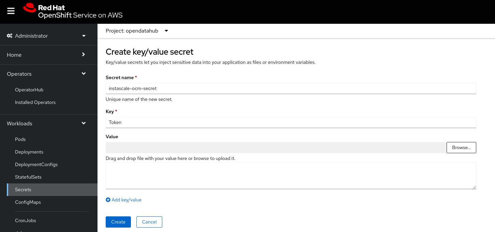

# Quick Start Guide for Distributed Workloads with the CodeFlare Stack

This quick start guide is intended to walk existing Open Data Hub users through installation of the CodeFlare stack and an initial demo using the CodeFlare-SDK from within a Jupyter notebook environment. This will enable users to run and submit distributed workloads.  

The CodeFlare-SDK was built to make managing distributed compute infrastructure in the cloud easy and intuitive for Data Scientists. However, that means there needs to be some cloud infrastructure on the backend for users to get the benefit of using the SDK. Currently, we support the CodeFlare stack, which consists of the Open Source projects, [MCAD](https://github.com/project-codeflare/multi-cluster-app-dispatcher), [Instascale](https://github.com/project-codeflare/instascale), [Ray](https://www.ray.io/), and [Pytorch](https://pytorch.org/).

This stack integrates well with [Open Data Hub](https://opendatahub.io/), and helps to bring batch workloads, jobs, and queuing to the Data Science platform.

## Prerequisites

### Resources

In addition to the resources required by default ODH deployments, you will need the following to deploy the Distributed
Workloads stack infrastructure pods:

```text
Total:
    CPU: 4100m
    Memory: 4608Mi

# By component
Ray:
    CPU: 100m
    Memory: 512Mi
MCAD
    cpu: 2000m
    memory: 2Gi
InstaScale:
    cpu: 2000m
    memory: 2Gi
```

NOTE: The above resources are just for the infrastructure pods. To be able to run actual workloads on your cluster you
will need additional resources based on the size and type of workload.

### OpenShift and Open Data Hub

This Quick Start guide assumes that you have administrator access to an OpenShift cluster and an existing Open Data Hub (ODH) installation with version **~2.Y** is present on your cluster. More information about ODH can be found  [here](https://opendatahub.io/docs/quick-installation/). But the quick step to install ODH is as follows:

   - Using the OpenShift UI, navigate to Operators --> OperatorHub and search for `Open Data Hub Operator` and install it using the `fast` channel.  (It should be version 2.Y.Z)

### CodeFlare Operator

The CodeFlare operator must be installed from the OperatorHub on your OpenShift cluster. The default settings will
suffice.

### NFD and GPU Operators

If you want to run GPU enabled workloads, you will need to install the [Node Feature Discovery Operator](https://github.com/openshift/cluster-nfd-operator) and the [NVIDIA GPU Operator](https://github.com/NVIDIA/gpu-operator) from the OperatorHub. For instructions on how to install and configure these operators, we recommend [this guide](https://docs.nvidia.com/datacenter/cloud-native/gpu-operator/openshift/steps-overview.html#high-level-steps).

## Creating K8s resources

1. Create the opendatahub namespace with the following command:

    ```bash
    oc create ns opendatahub
    ```

1. Create a datascience cluster with CodeFlare and Ray enabled:

    ```bash
    oc apply -f https://raw.githubusercontent.com/opendatahub-io/distributed-workloads/main/codeflare-dsc.yaml
    ```

Applying the above DataScienceCluster will result in the following objects being added to your cluster:

1. KubeRay Operator
1. CodeFlare Notebook Image for the Open Data Hub notebook interface

    This image is managed by project CodeFlare and contains the correct packages of codeflare-sdk, pytorch, torchx, ect required to run distributed workloads.

At this point you should be able to go to your notebook spawner page and select "Codeflare Notebook" from your list of notebook images and start an instance.

You can access the spawner page through the Open Data Hub dashboard. The default route should be `https://odh-dashboard-<your ODH namespace>.apps.<your cluster's uri>`. Once you are on your dashboard, you can select "Launch application" on the Jupyter application. This will take you to your notebook spawner page.

### Using an Openshift Dedicated or ROSA Cluster

If you want to enable cluster auto-scaling with InstaScale on Openshift Dedicated or ROSA, you will need to create a secret, containing your OCM token.
You can find your token [here](https://console.redhat.com/openshift/token).
Navigate to Workloads -> Secrets in the Openshift Console.
Click Create and choose a key/value secret:



Then you'll have to edit the CodeFlare operator ConfigMap, with:

```bash
oc edit -n openshift-operators cm codeflare-operator-config
```

Then update the `instascale` block, e.g.:

```yaml
apiVersion: v1
kind: ConfigMap
data:
  config.yaml: |
    instascale:
      enabled: true
      ocmSecretRef:
        namespace: opendatahub
        name: instascale-ocm-secret
      maxScaleoutAllowed: 5
```

And restart the operator Pod, so it takes the change into account.

## Submit your first job

We can now go ahead and submit our first distributed model training job to our cluster.

This can be done from any python based environment, including a script or a jupyter notebook. For this guide, we'll assume you've selected the "Codeflare Notebook" from the list of available images on your notebook spawner page.

### Clone the demo code

Once your notebook environment is ready, in order to test our CodeFlare stack we will want to run through some of the demo notebooks provided by the CodeFlare community. So let's start by cloning their repo into our working environment.

```bash
git clone https://github.com/project-codeflare/codeflare-sdk
cd codeflare-sdk
```

### Run the Guided Demo Notebooks

There are a number of guided demos you can follow to become familiar with the CodeFlare-SDK and the CodeFlare stack.  Navigate to the path: `codeflare-sdk/demo-notebooks/guided-demos` to see and run the latest demos.

## Cleaning up the CodeFlare Install

To completely clean up all the CodeFlare components after an install, follow these steps:

1.  No appwrappers should be left running:
    ```bash
    oc get appwrappers -A
    ```
     If any are left, you'd want to delete them

2. Remove the notebook and notebook pvc:
   ```bash
   oc delete notebook jupyter-nb-kube-3aadmin -n opendatahub
   oc delete pvc jupyterhub-nb-kube-3aadmin-pvc -n opendatahub
   ```
3. Remove the example datascience cluster: (Removes MCAD, InstaScale, KubeRay and the Notebook image)
    ``` bash
    oc delete dsc example-dsc
    ```

4. Remove the CodeFlare Operator csv and subscription: (Removes the CodeFlare Operator from the OpenShift Cluster)
   ```bash
   oc delete sub codeflare-operator -n openshift-operators
   oc delete csv `oc get csv -n opendatahub |grep codeflare-operator |awk '{print $1}'` -n openshift-operators
   ```

5. Remove the CodeFlare CRDs
   ```bash
   oc delete crd quotasubtrees.quota.codeflare.dev appwrappers.workload.codeflare.dev schedulingspecs.workload.codeflare.dev
   ```

## Next Steps

And with that you have gotten started using the CodeFlare stack alongside your Open Data Hub Deployment to add distributed workloads and batch computing to your machine learning platform.

You are now ready to try out the stack with your own machine learning workloads. If you'd like some more examples, you can also run through the existing demo code provided by the Codeflare-SDK community.

* [Submit batch jobs](https://github.com/project-codeflare/codeflare-sdk/blob/main/demo-notebooks/guided-demos/2_basic_jobs.ipynb)
* [Run an interactive session](https://github.com/project-codeflare/codeflare-sdk/blob/main/demo-notebooks/guided-demos/3_basic_interactive.ipynb)
