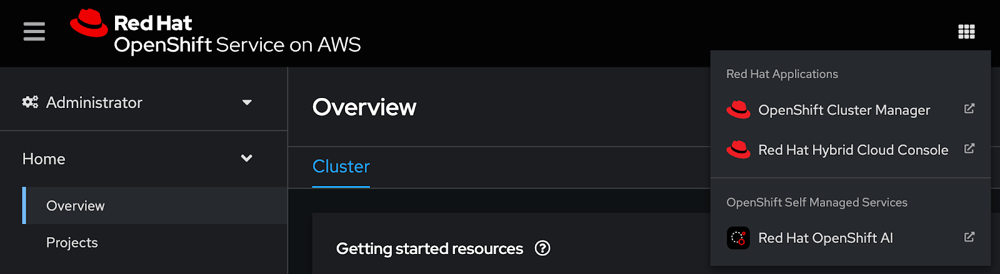
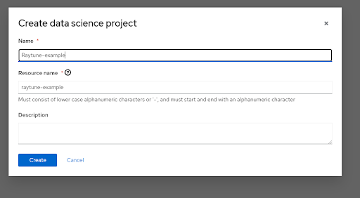
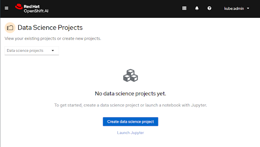
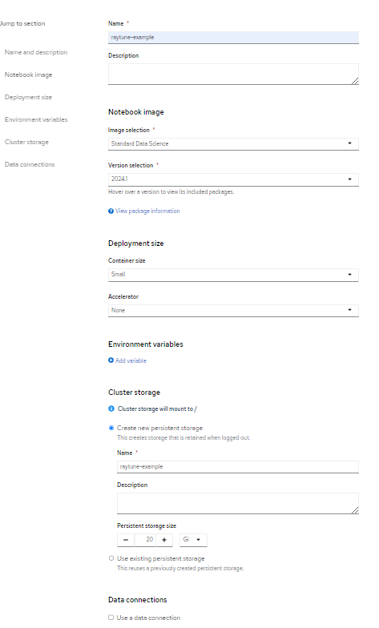
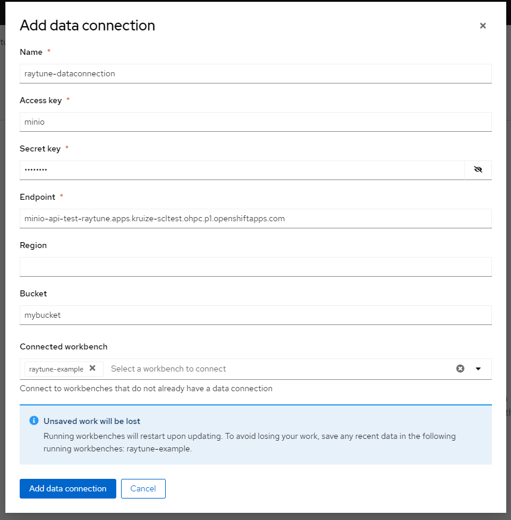
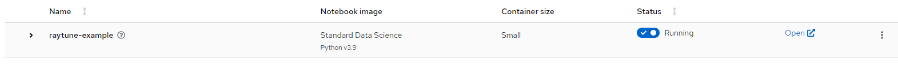
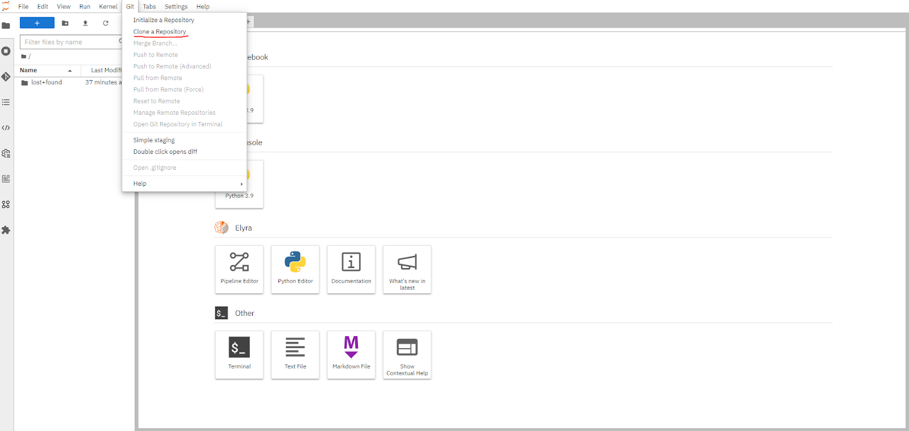
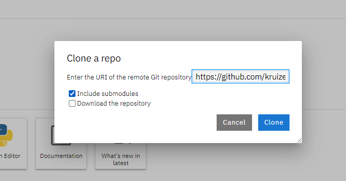
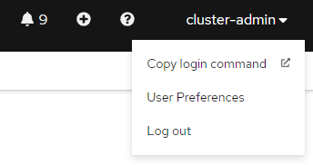
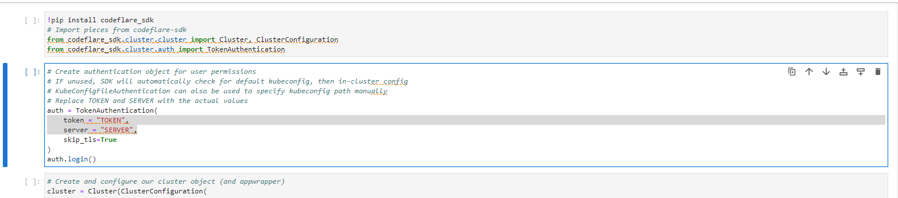

# HPO with raytune POC on OpenShift AI

This example primarily focuses on optimizing machine learning models using RayTune. It demonstrates the process of hyperparameter tuning to find the best-performing model configuration for a given model, leveraging the capabilities of RayCluster and CodeFlare. There are three examples provided, all of these have hidden layer size and learning rate as hyperparameters. The base demo will simply upload the model to the s3 bucket. The mlmd demo creates and stores the model into a mlmd store and the MR-gRPC using the MR API to do the same. 

> [!IMPORTANT]
> This example has been tested with the configurations listed in the [validation](#validation) section.
> Its configuration space is highly dimensional, with application configuration tighly coupled to runtime / hardware configuration.
> It is your responsibility to adapt it, and validate it works as expected, with your configuration(s), on your target environment(s).

## Requirements

* An OpenShift cluster (4.0+) with OpenShift AI (RHOAI) 2.10+ installed:
  * The `codeflare`, `dashboard`, `ray` and `workbenches` components enabled;
* Sufficient worker nodes for your configuration(s) with Nvidia GPUs (Ampere-based recommended);
* An AWS S3 bucket to store experimentation results.

## Setup

* Access the OpenShift AI dashboard, for example from the top navigation bar menu:


* Log in, then go to Data Science Projects and create a project:  


* Once the project is created, click on Create a workbench:<br/><br/>


* Add a cluster storage with the following details:


* Then create a workbench with the following settings:  


* Add data connection with relevant details of your S3 storage bucket:


### Setting Up Model Registry

The MR (Model Registry) is used in the MR-gRPC example. The MR is a mlmd store that provides managment for various different metadata types as well as a gRPC API. You can read further about the MR and its uses here: https://github.com/kubeflow/model-registry 

To install the Model Registry Controller, follow these steps:

1. Clone and navigate to the Model Registry Operator repository:

    ```bash
    git clone https://github.com/opendatahub-io/model-registry-operator.git
    cd model-registry-operator
    ```
2. Use the provided Makefile to deploy the operator. Specify the image location using the `IMG` argument. For example, to deploy from a latest image hosted on Quay.io, run:

    ```bash
    make deploy IMG=quay.io/opendatahub/model-registry-operator
    ```

This command will deploy the Model Registry Controller using the specified image.

### Starting the Model Registry Service

After deploying the Model Registry Controller, you can start the Model Registry service with either PostgreSQL or MySQL as the backend database.
To start the Model Registry service with PostgreSQL, use the following command:

```bash
kubectl apply -k config/samples/postgres
```

### Running the codeflare examples

* Open the workbench:


* Clone the following repository (https://github.com/kruize/hpo-poc.git):



* Navigate to the demos folder (hpo-poc/demos/)

* Repeat the following steps for each of the three files:
    * Raytune-oai-demo.ipynb - base demo
    * Raytune-oai-demo-mlmd.ipynb - stores and retrives all data in a mlmd store
    * Raytune-oai-MR-gRPC-demo.ipynb - stores and retreives all data using the model registry api

* In the openshift console open “copy login token”:  


* Replace the TOKEN and SERVER variables with those from the login command (in order to allow the sdk to access the openshift cluster):


### When running the MR-gRPC example
Make sure to adjust the values provided in the following code snippet when running this example:
```
# Use the default metadata types for Model and other metadata types that are part of the metadata database.
# Replace these values based on the MR database using the code from previous block.
model_type_id = 12
hpo_config_type_id = 22
hpo_experiment_type_id = 23
hpo_trial_type_id = 24
data_type_id = 25
trainer_type_id = 26
metrics_type_id = 27
```

* Restart and run the kernel. The results should be printed at the bottom of the notebook. Depending on which demo was run the data will also be stored via the respective method.
