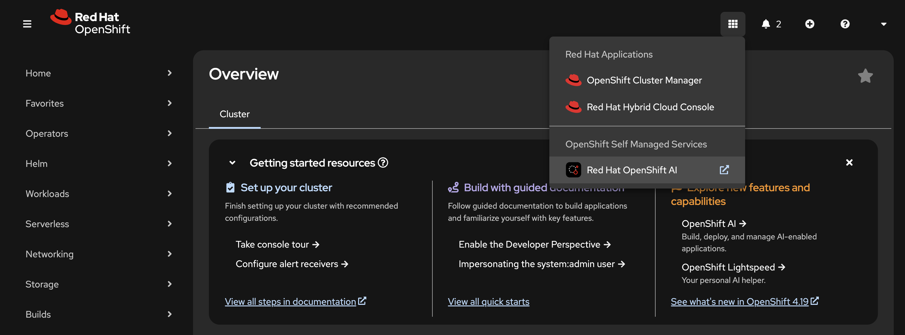
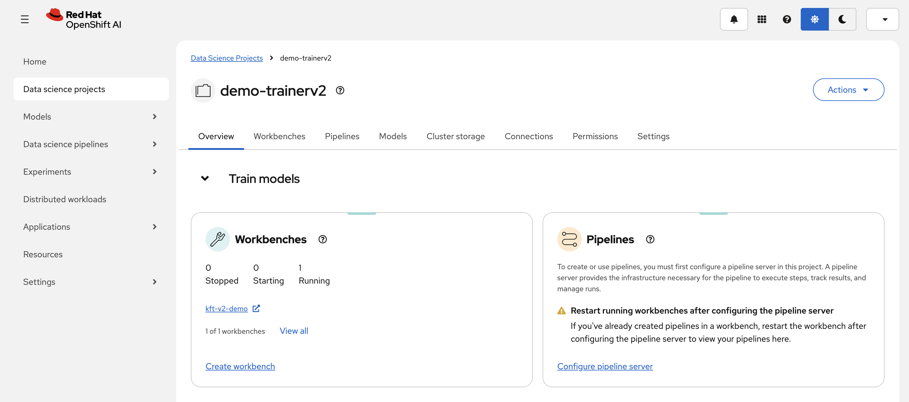
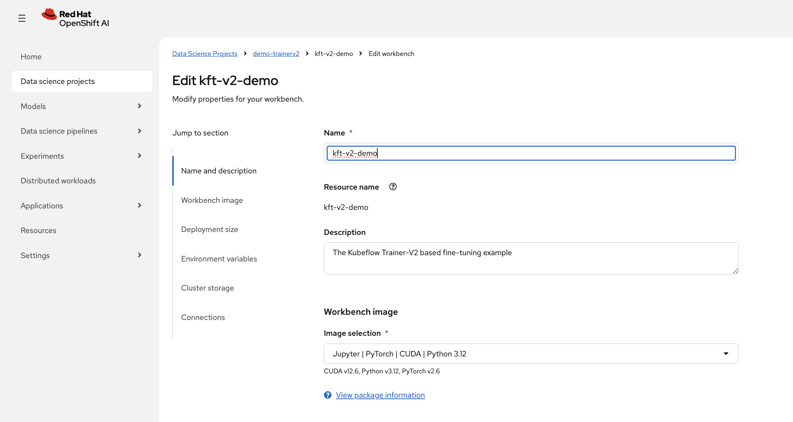
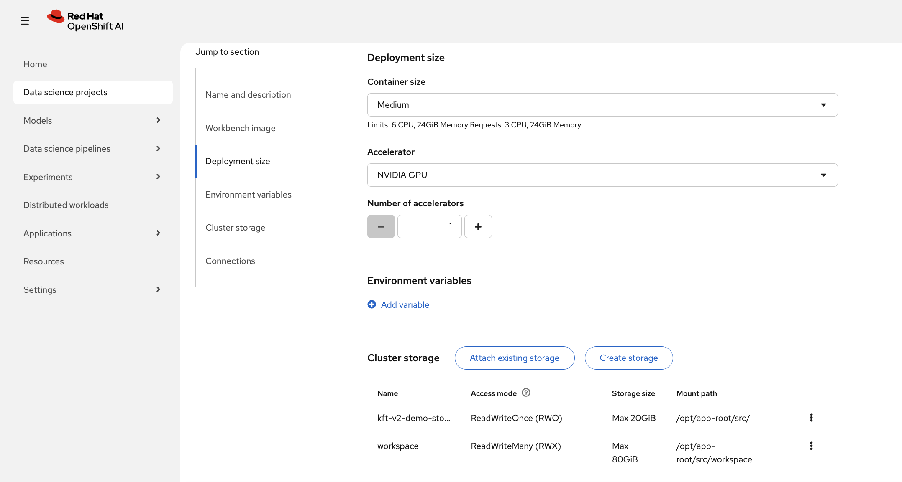
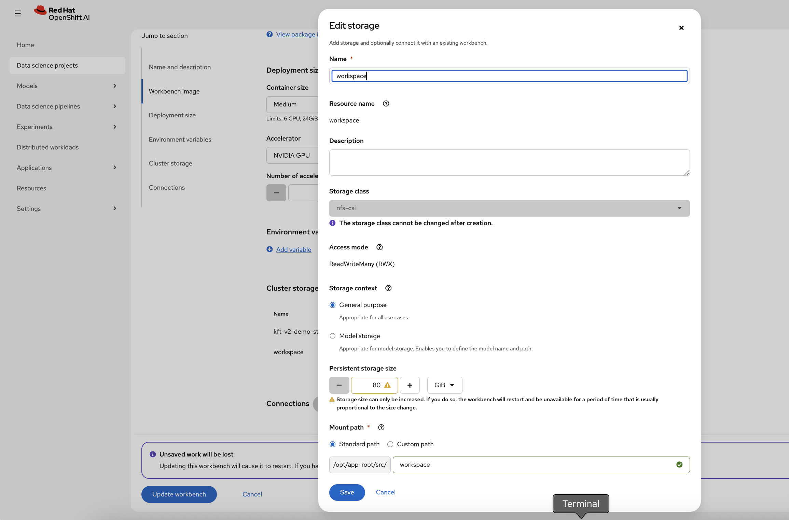
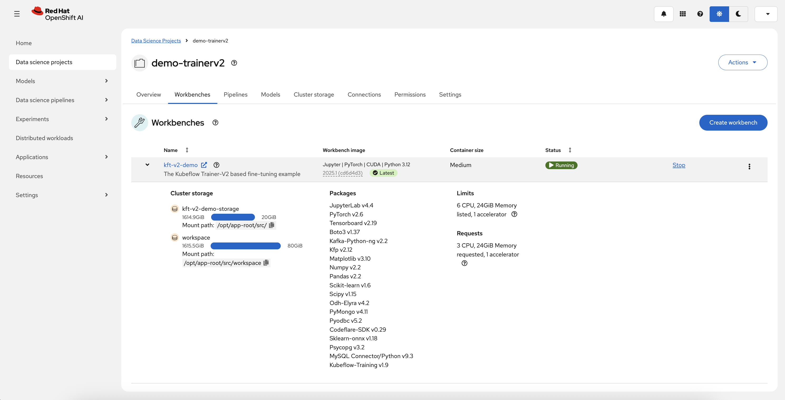
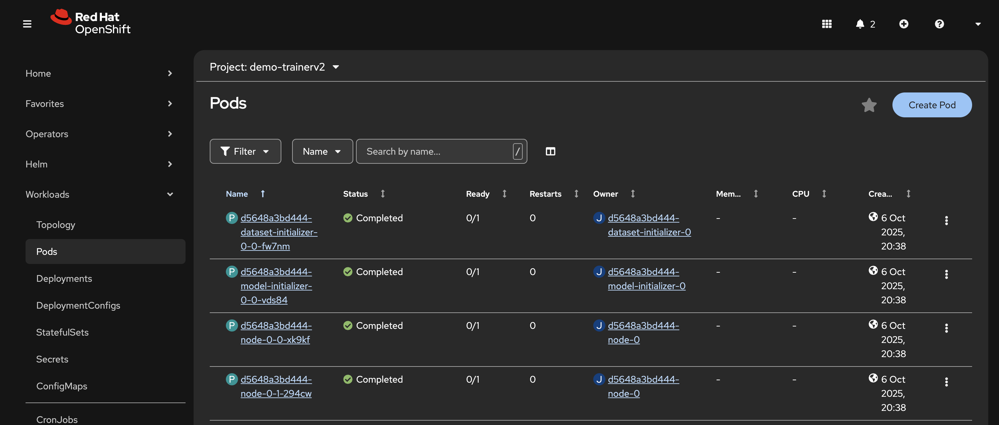

# 🚀 Kubeflow Training V2: Advanced ML Training with Distributed Computing

This directory contains comprehensive examples demonstrating **Kubeflow Training V2** capabilities for distributed training using the Kubeflow Trainer SDK.

## 🎯 **What This Directory Demonstrates**

- **Kubeflow Trainer SDK**: Programmatic TrainJob creation and management
- **Checkpointing**: Controller-managed resume/suspended compatibility for model checkpoints
- **Distributed Training**: Multi-node Multi-CPU/GPU coordination with NCCL/GLOO backends

---
### **TRL (Transformer Reinforcement Learning) Integration**
- **SFTTrainer**: Supervised fine-tuning with instruction following
- **PEFT-LoRA**: Parameter-efficient fine-tuning with Low-Rank Adaptation
- **Model Support**: GPT-2, Llama, and other transformer models
- **Dataset Integration**: Alpaca dataset for instruction-following tasks

### **Distributed Training Capabilities**
- **Multi-Node Support**: Scale training across multiple nodes
- **Multi-GPU Coordination**: NCCL backend CUDA for NVIDIA GPUs, ROCm for AMD GPUs
- **CPU Training**: GLOO backend for CPU-based training
- **Resource Flexibility**: Configurable compute resources per node

---

## 📋 **Prerequisites**

### **Cluster Requirements**
- **OpenShift Cluster**: With OpenShift AI (RHOAI) 2.17+ installed
- **Required Components**: `dashboard`, `trainingoperator`, and `workbenches` enabled
- **Storage**: Persistent volume claim named `workspace` of minimum 50GB with RWX (ReadWriteMany) access mode

---

## 🛠️ **Setup Instructions**

### **1. Repository Setup**

Clone the repository and navigate to the kft-v2 directory:

```bash
git clone https://github.com/opendatahub-io/distributed-workloads.git
cd distributed-workloads/examples/kft-v2
```

### **2. Persistent Volume Setup**

Create a shared persistent volume for checkpoint storage:

```bash
oc apply -f manifests/shared_pvc.yaml
```

### **3. Cluster Training Runtime Setup**

Apply the cluster training runtime configuration:

```bash
oc apply -f manifests/cluster_training_runtime.yaml
```

This creates the necessary ClusterTrainingRuntime resources for PyTorch training.


## Setup

* Access the OpenShift AI dashboard, for example from the top navigation bar menu:



* Log in, then go to _Data Science Projects_ and create a project:



* Once the project is created, click on _Create a workbench_:
  


* Then create a workbench with the following settings:
  
    * Select the `PyTorch` (or the `ROCm-PyTorch`) notebook image:

    * Select the _Medium_ container size and a sufficient persistent storage volume. 

    

    

    > [!NOTE]
    >
    > * Adding an accelerator is only needed to test the fine-tuned model from within the workbench so you can spare an accelerator if needed.
    > * Keep the default 20GB workbench storage, it is enough to run the inference from within the workbench.


    * Review the configuration and click _Create workbench_

* From "Workbenches" page, click on _Open_ when the workbench you've just created becomes ready:



---

## 🚀 **Quick Start Examples**

### **Example 1: Fashion-MNIST Training**

Run the Fashion-MNIST training example:

```python
from scripts.mnist import train_fashion_mnist

# Configure training parameters
config = {
    "epochs": 10,
    "batch_size": 64,
    "learning_rate": 0.001,
    "checkpoint_dir": "/mnt/shared/checkpoints"
}

# Start training
train_fashion_mnist(config)
```

### **Example 2: TRL GPT-2 Fine-tuning**

Run the TRL training example:

```python
from scripts.trl_training import trl_train

# Configure TRL parameters
config = {
    "model_name": "gpt2",
    "dataset_name": "alpaca",
    "lora_r": 16,
    "lora_alpha": 32,
    "max_seq_length": 512
}

# Start TRL training
trl_train(config)
```



---

## 📊 **Training Examples**

### **Fashion-MNIST Classification**

The `mnist.py` script demonstrates:

- **Distributed Training**: Multi-GPU Fashion-MNIST classification
- **Checkpointing**: Automatic checkpoint creation and resumption
- **Progress Tracking**: Real-time training progress monitoring
- **Error Handling**: Robust error handling and recovery

**Key Features:**
- CNN architecture for image classification
- Distributed data loading with DistributedSampler
- Automatic mixed precision (AMP) training
- Comprehensive logging and metrics

### **TRL GPT-2 Fine-tuning**

The `trl_training.py` script demonstrates:

- **Instruction Following**: Fine-tuning GPT-2 on Alpaca dataset
- **PEFT-LoRA**: Parameter-efficient fine-tuning
- **Checkpoint Management**: TRL-compatible checkpointing
- **Distributed Coordination**: Multi-node training coordination

**Key Features:**
- SFTTrainer for supervised fine-tuning
- LoRA adapters for efficient parameter updates
- Instruction-following dataset processing
- Hugging Face model integration

---

## 📚 **References and Documentation**

- **[Kubeflow Trainer SDK](https://github.com/kubeflow/sdk)**: Official SDK documentation
- **[TRL Documentation](https://huggingface.co/docs/trl/)**: Transformer Reinforcement Learning
- **[PEFT Documentation](https://huggingface.co/docs/peft/)**: Parameter-Efficient Fine-Tuning
- **[PyTorch Distributed Training](https://pytorch.org/tutorials/intermediate/ddp_tutorial.html)**: Distributed training guide
- **[OpenShift AI Documentation](https://access.redhat.com/documentation/en-us/red_hat_openshift_ai)**: RHOAI documentation

---
