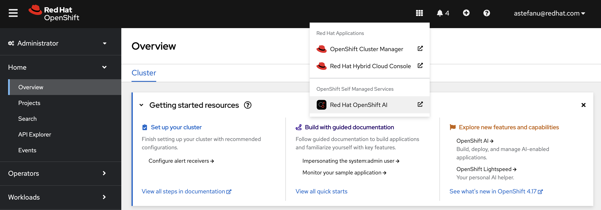
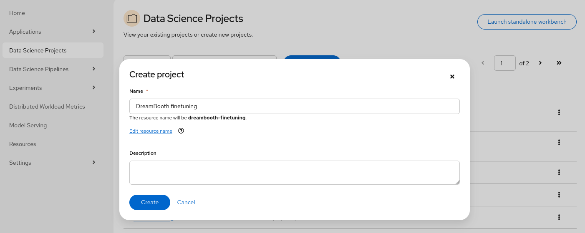
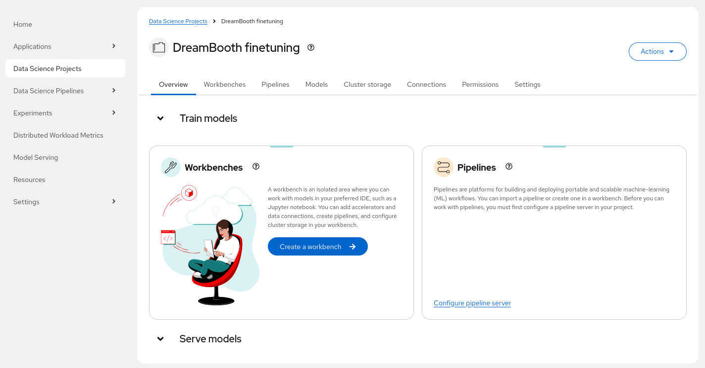
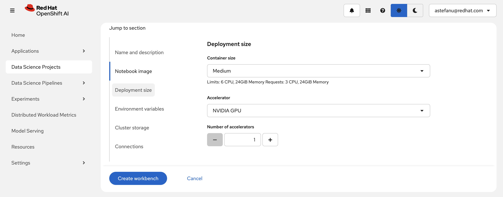
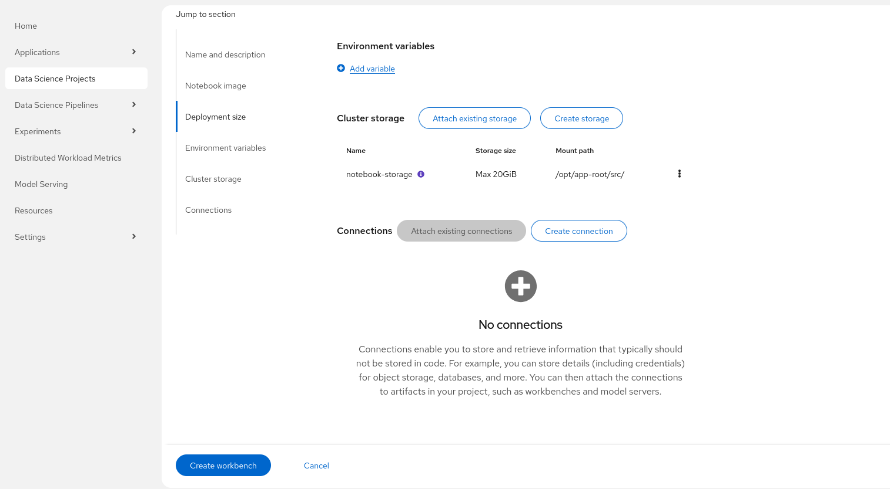
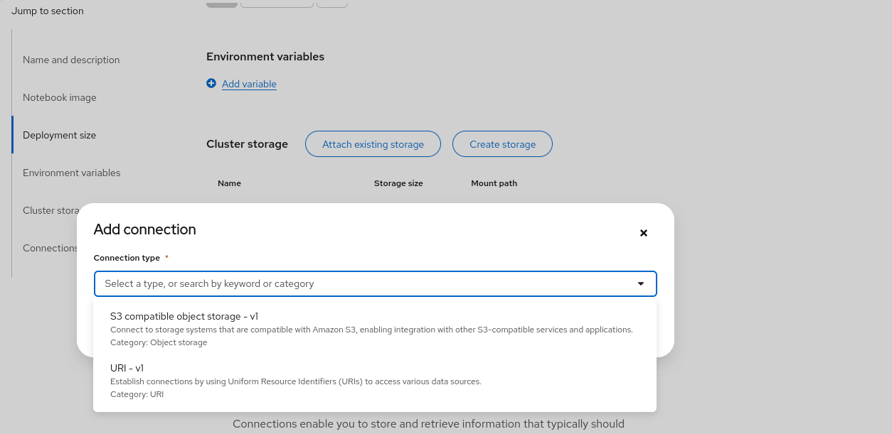
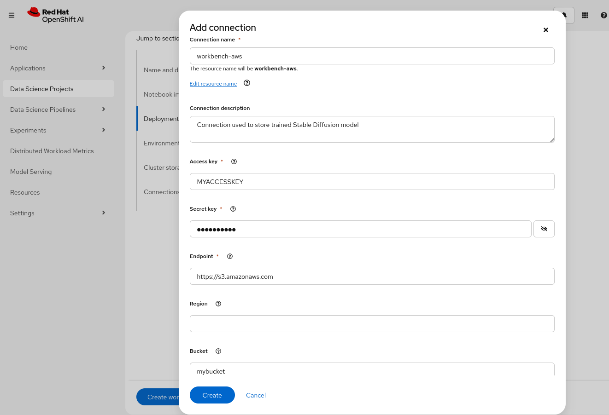
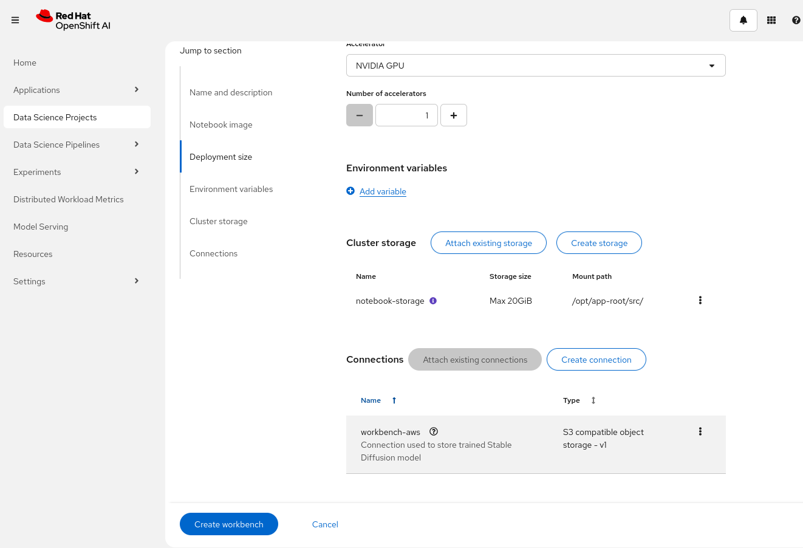
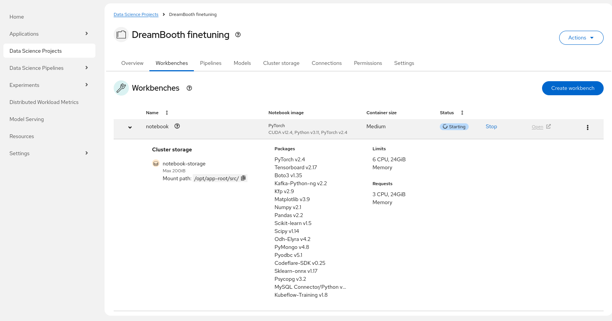

# Finetuning Stable Diffusion model using DreamBooth with Kubeflow Training on OpenShift AI

This example shows how user can finetune Stable Diffusion model using DreamBooth technique.
The finetuning is performed on OpenShift environment using Kubeflow Training operator and OpenShift AI.

This example is based on HuggingFace DreamBooth Hackathon example - https://huggingface.co/learn/diffusion-course/en/hackathon/dreambooth

> [!TIP]
> **Multi-Team Resource Management**: For enterprise scenarios with multiple teams sharing GPU resources, see the [**Kueue Multi-Team Resource Management Workshop**](../../workshops/kueue/README.md). It demonstrates how to use this LLM fine-tuning example with Kueue for fair resource allocation, borrowing policies, and workload scheduling across teams.

## Requirements

* An OpenShift cluster with OpenShift AI (RHOAI) 2.17+ installed:
  * The `dashboard`, `trainingoperator` and `workbenches` components enabled
* Sufficient worker nodes for your configuration(s) with NVIDIA GPUs (Ampere-based or newer recommended) or AMD GPUs (AMD Instinct MI300X or newer recommended)
* AWS S3 storage available


## Setup

* Access the OpenShift AI dashboard, for example from the top navigation bar menu:

* Log in, then go to _Data Science Projects_ and create a project:

* Once the project is created, click on _Create a workbench_:

* Then create a workbench with the following settings:
    * Select the `PyTorch` (or the `ROCm-PyTorch`) notebook image:
    
    * Select the `Medium` container size and add an accelerator:
    
        > [!NOTE]
        > Adding an accelerator is only needed to test the fine-tuned model from within the workbench so you can spare an accelerator if needed.
    * Keep the default 20GB workbench storage, it is enough to run the inference from within the workbench:
    * Click on _Create connection_ to create a workbench connection to your AWS S3 bucket:
    
    * Select _S3 compatible object storage_:
    
    * Fill all the needed fields, also specify _Bucket_ value (it is used in the workbench), then confirm :
    
        > [!NOTE]
        > If you use different connection name than _workbench-aws_ then you need to adjust the _aws_connection_name_ propery in notebook to refer to this new name.
    * Review the configuration and click "Create workbench":
    
* From "Workbenches" page, click on _Open_ when the workbench you've just created becomes ready:

* From the workbench, clone this repository, i.e., `https://github.com/opendatahub-io/distributed-workloads.git`
* Navigate to the `distributed-workloads/examples/kfto-dreambooth` directory and open the `dreambooth` notebook

You can now proceed with the instructions from the notebook. Enjoy!

> [!IMPORTANT]
> **Kueue Integration (RHOAI 2.21+):**
> * If using RHOAI 2.21+, the example supports Kueue integration for workload management:
>   * When using Kueue:
>     * Follow the [Configure Kueue (Optional)](#configure-kueue-optional) section to set up required resources
>     * Add the local-queue name label to your job configuration to enforce workload management
>   * You can skip Kueue usage by:
>     * Disabling the existing `kueue-validating-admission-policy-binding`
>     * Omitting the local-queue-name label in your job configuration
> 
> **Note:** Kueue Enablement via Validating Admission Policy was introduced in RHOAI-2.21. You can skip this section if using an earlier RHOAI release version.

### Configure Kueue (Optional)

> [!NOTE]
> This section is only required if you plan to use Kueue for workload management (RHOAI 2.21+) or Kueue is not already configured in your cluster.
> The Kueue resource YAML files referenced below are located in the [Kueue workshop directory](../../workshops/kueue), specifically in `workshops/kueue/resources/`. You can use these files as templates for your own setup or copy them into your project as needed.

* Update the `nodeLabels` in the `workshops/kueue/resources/resource_flavor.yaml` file to match your AI worker nodes
* Create the ResourceFlavor:
    ```console
    oc apply -f workshops/kueue/resources/resource_flavor.yaml
    ```
* Create the ClusterQueue:
    ```console
    oc apply -f workshops/kueue/resources/team1_cluster_queue.yaml
    ```
* Create a LocalQueue in your namespace:
    ```console
    oc apply -f workshops/kueue/resources/team1_local_queue.yaml -n <your-namespace>
    ```
