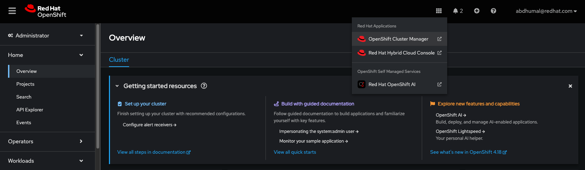
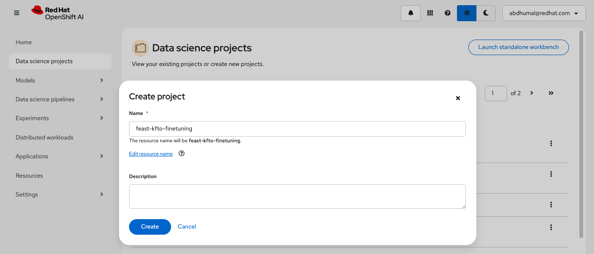
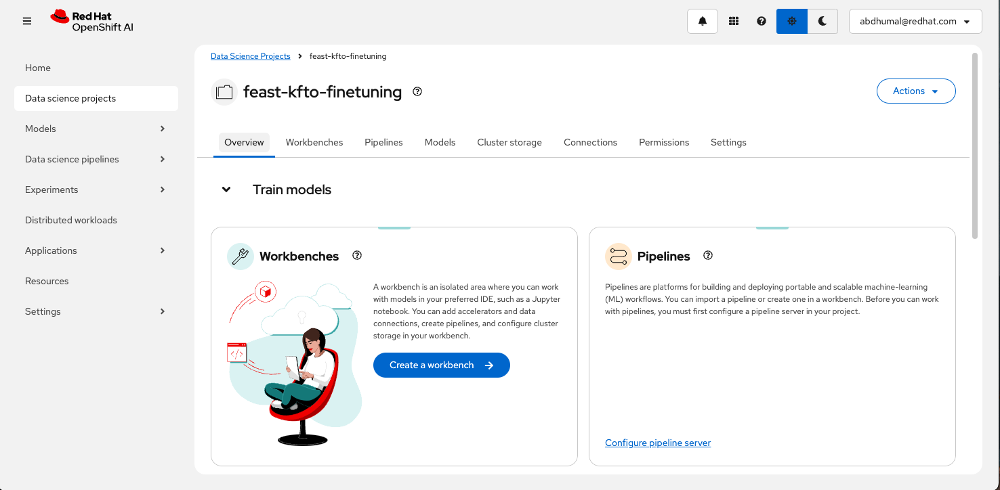
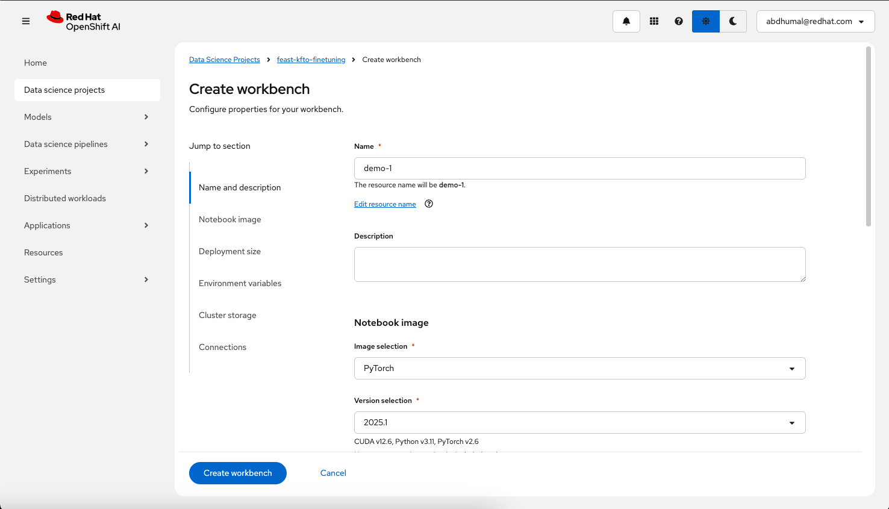
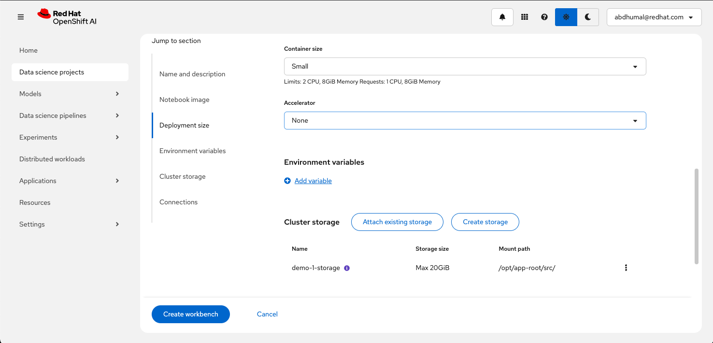
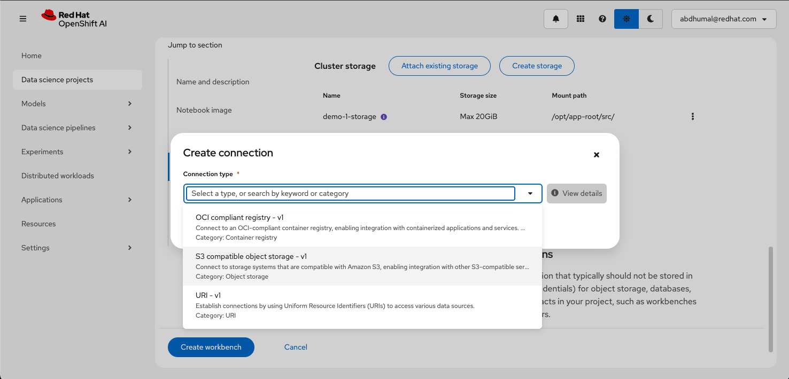
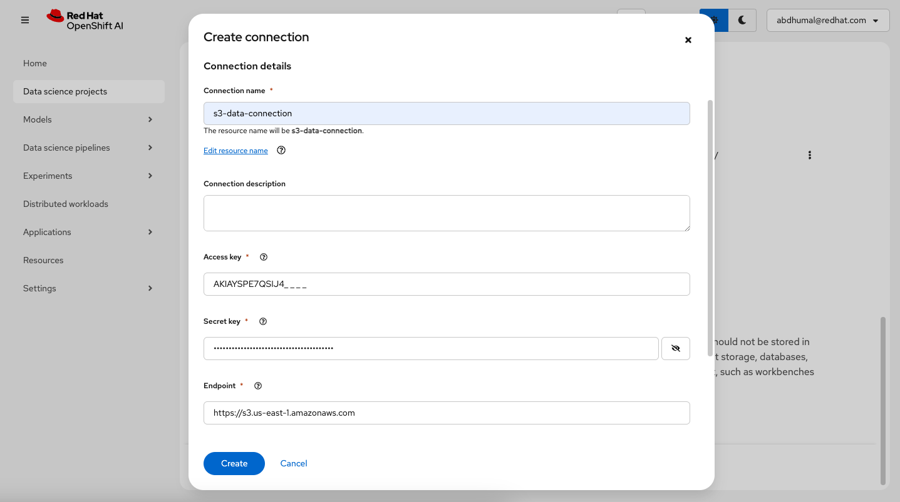
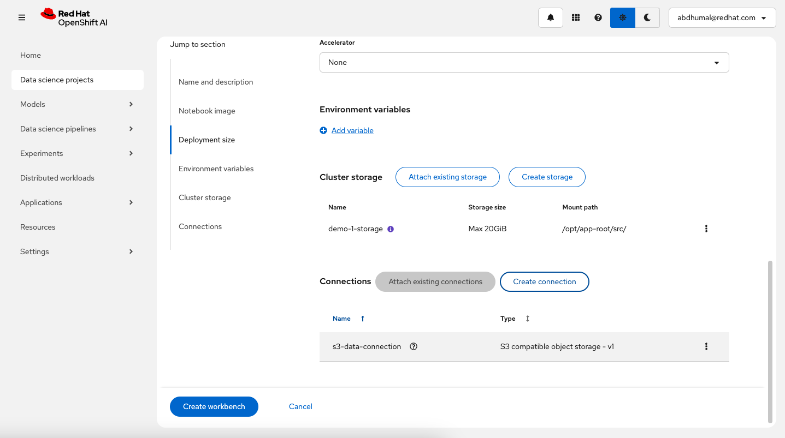
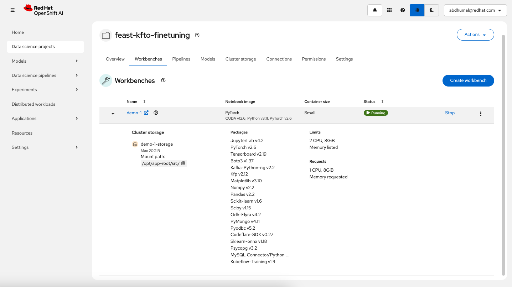

# 🚀 Quickstart: Fine‑Tuning Granite Models with FSDP/DeepSpeed & LoRA/QLoRA Using a Simple FEAST Store example

This notebook guides you through the process of fine-tuning **Large Language Models** using **Feast**, **Kubeflow-Training**, and modern optimization strategies like **FSDP**, **DeepSpeed**, and **LoRA** to boost training performance and efficiency.

In particular, this example demonstrates:
1. How to implement **Fully Sharded Data Parallel (FSDP)** and **DeepSpeed** to distribute training across multiple GPUs, enhancing scalability and speed.
2. How to apply **Low-Rank Adaptation (LoRA)** or **Quantized Low-Rank Adaptation (QLoRA)** via the [PEFT library](https://github.com/huggingface/peft) for parameter-efficient fine-tuning, reducing computational and memory overhead.
3. How to retrieve and manage **training features using Feast**, enabling consistent, scalable, and reproducible ML pipelines.

---

## 🍽️ What is Feast and How Are We Using It?

[Feast (Feature Store)](https://github.com/feast-dev/feast) is a powerful operational data system for machine learning that helps manage, store, and serve features consistently during training and inference. In this workflow, **Feast acts as the centralized source of truth for model features**, decoupling feature engineering from model training.

Specifically, we use Feast to:

- **Define and register feature definitions** for training data using a standardized interface.
- **Ingest and materialize features** from upstream sources (e.g., batch files, data warehouses).
- **Fetch training features** as PyTorch-friendly tensors, ensuring consistency across training and production.
- **Version control feature sets** to improve reproducibility and traceability in experiments.

By integrating Feast into the fine-tuning pipeline, we ensure that the training process is not only scalable but also **robust, modular, and production-ready**.

---

## 💡 Why Use FSDP, DeepSpeed, LoRA, and Feast for Fine-Tuning?

- **Efficient Distributed Training:** Utilize FSDP or DeepSpeed to handle large models by distributing the training process, enabling faster and more scalable training sessions.
- **Parameter Efficiency with LoRA/QLoRA:** Implement LoRA to fine-tune models by updating only a subset of parameters, LoRA’s low‑rank adapters let you adapt a full LLM by training a tiny fraction of parameters, saving compute and storage by ~90% and speeding up training ; QLoRA extends the LoRA technique by loading the model in 4‑bit quantization, freezing the quantized weights, and updating only the adapters to support massive models on limited‑memory GPUs.
- **Feature Management with Feast:** Fetch well-defined, version-controlled features seamlessly into your pipeline, boosting reproducibility and easing data integration.
- **Flexible Configuration Management:** Store DeepSpeed and LoRA settings in separate YAML files, allowing for easy modifications and experimentation without altering the core training script.
- **Mixed-Precision Training:** Leverage automatic mixed precision (AMP) to accelerate training and reduce memory usage by combining different numerical precisions.
- **Model Saving and Uploading:** Save the fine-tuned model and tokenizer locally and upload them to an S3 bucket for persistent storage and easy deployment.

---

> [!TIP]
> **Multi-Team Resource Management**: For enterprise scenarios with multiple teams sharing GPU resources, see the [**Kueue Multi-Team Resource Management Workshop**](../../workshops/kueue/README.md). It demonstrates how to use this LLM fine-tuning example with Kueue for fair resource allocation, borrowing policies, and workload scheduling across teams.

## Requirements

* An OpenShift cluster with OpenShift AI (RHOAI) 2.17+ installed:
  * The `dashboard`, `trainingoperator` and `workbenches` components enabled
* Sufficient worker nodes for your configuration(s) with NVIDIA GPUs (Ampere-based or newer recommended)
  * If using PEFT LoRA/QLoRA techniques, then can use NVIDIA GPUs (G4dn)
* AWS S3 storage available

---


By following this notebook, you'll gain hands-on experience in setting up a **feature-rich, efficient, and scalable** fine-tuning pipeline for **Granite language models**, leveraging tooling across model training and feature engineering.


## Setup

* Access the OpenShift AI dashboard, for example from the top navigation bar menu:



* Log in, then go to _Data Science Projects_ and create a project:



* Once the project is created, click on _Create a workbench_:
  


* Then create a workbench with the following settings:
  
    * Select the `PyTorch` (or the `ROCm-PyTorch`) notebook image:

    

    * Select the _Small_ container size and a sufficient persistent storage volume. 
    * In _'Environment variables'_ section, use variable type as _Secret_ and provide key/value pair to store _HF-TOKEN_ as a kubernetes secret :
  
    

    * Click on _Create connection_ to create a workbench connection to your S3 compatible storage bucket:

        * Select option : _S3 compatible object storage - v1_


        

        * Fill all the needed fields, also specify _Bucket_ value (it is used in the workbench), then confirm:


        

        > [!NOTE]
        >
        > * Adding an accelerator is only needed to test the fine-tuned model from within the workbench so you can spare an accelerator if needed.
        > * Keep the default 20GB workbench storage, it is enough to run the inference from within the workbench.
        > * If you use different connection name than _s3-data-connection_ then you need to adjust the _aws_connection_name_ properly in notebook to refer to this new name.


    * Review the configuration and click _Create workbench_:
 
    

* From "Workbenches" page, click on _Open_ when the workbench you've just created becomes ready:



* From the workbench, clone this repository, i.e., `https://github.com/opendatahub-io/distributed-workloads.git`

* Navigate to the `distributed-workloads/examples/kfto-feast` directory and open the `kfto_feast` notebook


You can now proceed with the instructions from the notebook. Enjoy!

> [!IMPORTANT]
> **Hugging Face Token Requirements:**
> * You will need a Hugging Face token if using gated models:
>   * The examples use gated Llama models that require a token (e.g., https://huggingface.co/meta-llama/Llama-3.1-8B)
>   * Set the `HF_TOKEN` environment variable in your job configuration
>   * Note: You can skip the token if switching to non-gated models
> 
> **Kueue Integration (RHOAI 2.21+):**
> * If using RHOAI 2.21+, the example supports Kueue integration for workload management:
>   * When using Kueue:
>     * Follow the [Configure Kueue (Optional)](#configure-kueue-optional) section to set up required resources
>     * Add the local-queue name label to your job configuration to enforce workload management
>   * You can skip Kueue usage by:
>     * Disabling the existing `kueue-validating-admission-policy-binding`
>     * Omitting the local-queue-name label in your job configuration
> 
> **Note:** Kueue Enablement via Validating Admission Policy was introduced in RHOAI-2.21. You can skip this section if using an earlier RHOAI release version.

### Configure Kueue (Optional)

> [!NOTE]
> This section is only required if you plan to use Kueue for workload management (RHOAI 2.21+) or Kueue is not already configured in your cluster.
> The Kueue resource YAML files referenced below are located in the [Kueue workshop directory](../../workshops/kueue), specifically in `workshops/kueue/resources/`. You can use these files as templates for your own setup or copy them into your project as needed.

* Update the `nodeLabels` in the `workshops/kueue/resources/resource_flavor.yaml` file to match your AI worker nodes
* Create the ResourceFlavor:
    ```console
    oc apply -f workshops/kueue/resources/resource_flavor.yaml
    ```
* Create the ClusterQueue:
    ```console
    oc apply -f workshops/kueue/resources/team1_cluster_queue.yaml
    ```
* Create a LocalQueue in your namespace:
    ```console
    oc apply -f workshops/kueue/resources/team1_local_queue.yaml -n <your-namespace>
    ```
  

