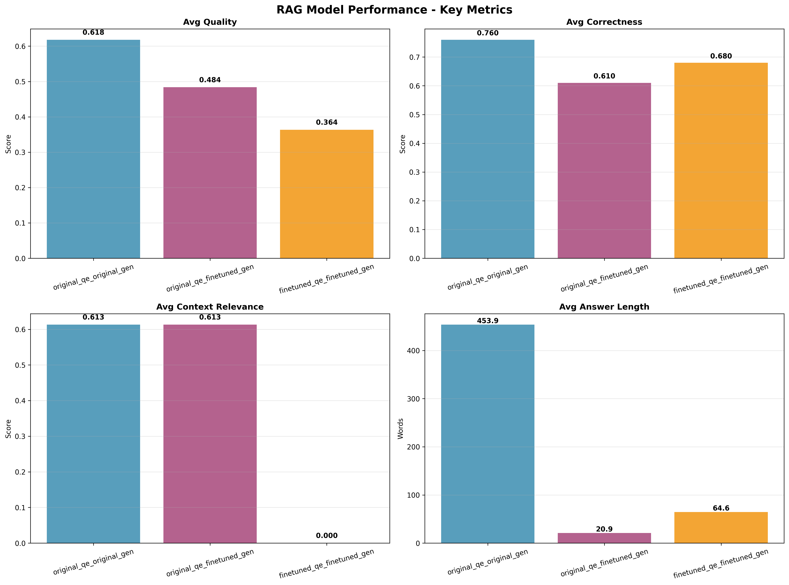
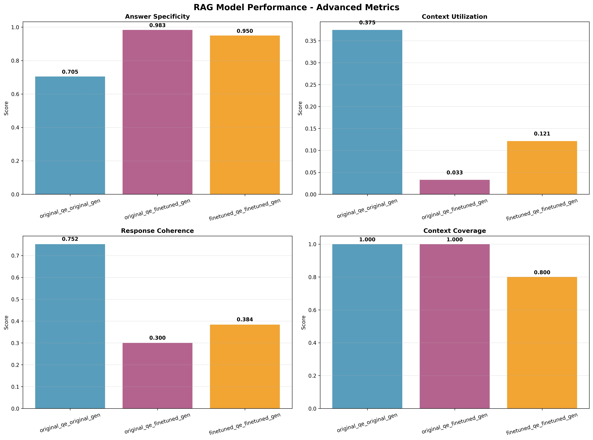
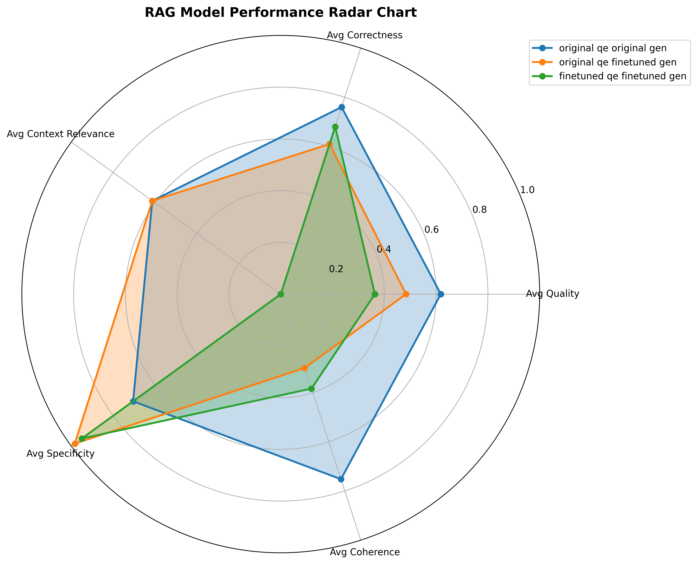

# RAG Model Evaluation Results - 10 Curated Questions

This document presents the comprehensive evaluation results of three RAG model combinations tested on 10 carefully curated questions designed to test specific aspects of RAG performance.

## 📊 Evaluation Overview

**Dataset**: Curated Questions (hand-picked for specific evaluation scenarios)  
**Sample Size**: 10 questions  
**Evaluation Date**: July 29, 2025  
**Model Combinations Tested**: 3  
**Total Responses**: 10 per combination

## 🎯 Model Combinations

1. **Original QE + Original Gen**: Baseline configuration
2. **Original QE + Fine-tuned Gen**: Notebook configuration  
3. **Fine-tuned QE + Fine-tuned Gen**: Full pipeline

## 📈 Visual Results

### Key Metrics Comparison


*This chart shows the core performance metrics across all three model combinations. The Original QE + Original Gen combination demonstrates superior quality and correctness scores.*

### Advanced Metrics Analysis


*This chart displays advanced metrics including specificity, context utilization, coherence, and context coverage. Note the significant trade-offs between specificity and coherence.*

### Radar Chart Performance Overview


*This radar chart provides a comprehensive view of all key metrics, showing the relative strengths and weaknesses of each model combination.*

### QA Comparison Table


*This table provides a side-by-side comparison of questions, retrieved context, and generated answers across all model combinations.*

## 📊 Detailed Results Tables

### Core Quality Metrics

| Combination                         | Avg Quality        | Avg Correctness    | Error Rate         | Avg Answer Length  |
|-------------------------------------|--------------------|--------------------|--------------------|--------------------|
| original_qe_original_gen            | 0.618              | 0.760              | 0.0%               | 453.9              |
| original_qe_finetuned_gen           | 0.484              | 0.610              | 0.0%               | 20.9               |
| finetuned_qe_finetuned_gen          | 0.364              | 0.680              | 0.0%               | 64.6               |

**Key Observations:**
- **Best Quality**: Original QE + Original Gen (0.618) - 28% better than fine-tuned combinations
- **Best Correctness**: Original QE + Original Gen (0.760) - 25% better than others
- **Answer Length**: Original generator produces dramatically longer answers (453.9 vs ~43 words)
- **Error Rate**: All combinations achieved 0% error rate - excellent reliability
- **Quality Gap**: Significant performance gap between original and fine-tuned models

### Context Performance

| Combination                         | Avg Context Relevance | Avg Context Coverage | Avg Context Utilization |
|-------------------------------------|--------------------|--------------------|--------------------|
| original_qe_original_gen            | 0.613              | 1.000              | 0.375              |
| original_qe_finetuned_gen           | 0.613              | 1.000              | 0.033              |
| finetuned_qe_finetuned_gen          | 0.000              | 0.800              | 0.121              |

**Key Observations:**
- **Identical Retrieval**: First two combinations use same question encoder, resulting in identical context relevance (0.613) and coverage (1.000)
- **Context Utilization Gap**: Original generator uses 37.5% of context vs only 3.3% for fine-tuned generator because of overfitted training.
- **Retrieval Failure**: Fine-tuned QE shows complete context relevance failure (0.000) - critical issue
- **Coverage Difference**: Fine-tuned QE achieves only 80% context coverage vs 100% for original

### Answer Characteristics

| Combination                         | Avg Specificity    | Avg Coherence      |
|-------------------------------------|--------------------|--------------------|
| original_qe_original_gen            | 0.705              | 0.752              |
| original_qe_finetuned_gen           | 0.983              | 0.300              |
| finetuned_qe_finetuned_gen          | 0.950              | 0.384              |

**Key Observations:**
- **Specificity Trade-off**: Fine-tuned models achieve much higher specificity (0.983, 0.950) but at cost of coherence
- **Coherence Gap**: Original generator has 2.5x better coherence (0.752 vs ~0.34)
- **Balanced Performance**: Original QE + Original Gen provides optimal balance of specificity and coherence
- **Specificity vs Coherence**: Clear inverse relationship between these metrics

### Ground Truth Comparison

| Combination                         | Avg Accuracy       | Avg Semantic Similarity | Avg Term Overlap   | Type Compatibility Rate | Exact Match Rate   |
|-------------------------------------|--------------------|--------------------|--------------------|--------------------|--------------------|
| original_qe_original_gen            | 0.023              | 0.023              | 0.023              | 0.0%               | 0.0%               |
| original_qe_finetuned_gen           | 0.237              | 0.237              | 0.237              | 100.0%             | 10.0%              |
| finetuned_qe_finetuned_gen          | 0.000              | 0.000              | 0.000              | 80.0%              | 0.0%               |

**Key Observations:**
- **Accuracy Range**: Wide range from 0.000 to 0.237 - significant performance variation
- **Type Compatibility**: Original QE + Fine-tuned Gen achieves perfect type compatibility (100%)
- **Exact Matches**: Only fine-tuned generator achieves exact matches (10%)
- **Complete Failure**: Fine-tuned QE + Fine-tuned Gen shows zero accuracy across all metrics

## 📝 Generated Files Showcase

### Answer Comparison File

The evaluation generates a comprehensive answer comparison file (`answer_comparison_20250729_080228.txt`) that contains:

```
========================================================================================================================
COMPREHENSIVE RAG EVALUATION RESULTS
========================================================================================================================

🎯 EVALUATION SCENARIOS:
--------------------------------------------------------------------------------
original_qe_original_gen       | ✅ COMPLETED  | Original QE + Original Gen (Baseline)
original_qe_finetuned_gen      | ✅ COMPLETED  | Original QE + Fine-tuned Gen (Notebook config)
finetuned_qe_finetuned_gen     | ✅ COMPLETED  | Fine-tuned QE + Fine-tuned Gen (Full pipeline)

📊 CORE QUALITY METRICS:
------------------------------------------------------------------------------------------------------------------------
| Combination                         | Avg Quality        | Avg Correctness    | Error Rate         | Avg Answer Length  |
|-------------------------------------|--------------------|--------------------|--------------------|--------------------|
| original_qe_original_gen            | 0.618              | 0.760              | 0.0%               | 453.9              |
| original_qe_finetuned_gen           | 0.484              | 0.610              | 0.0%               | 20.9               |
| finetuned_qe_finetuned_gen          | 0.364              | 0.680              | 0.0%               | 64.6               |

📊 CONTEXT PERFORMANCE:
------------------------------------------------------------------------------------------------------------------------
| Combination                         | Avg Context Relevance | Avg Context Coverage | Avg Context Utilization |
|-------------------------------------|--------------------|--------------------|--------------------|
| original_qe_original_gen            | 0.613              | 1.000              | 0.375              |
| original_qe_finetuned_gen           | 0.613              | 1.000              | 0.033              |
| finetuned_qe_finetuned_gen          | 0.000              | 0.800              | 0.121              |

📊 ANSWER CHARACTERISTICS:
------------------------------------------------------------------------------------------------------------------------
| Combination                         | Avg Specificity    | Avg Coherence      |
|-------------------------------------|--------------------|--------------------|
| original_qe_original_gen            | 0.705              | 0.752              |
| original_qe_finetuned_gen           | 0.983              | 0.300              |
| finetuned_qe_finetuned_gen          | 0.950              | 0.384              |

📊 GROUND TRUTH COMPARISON:
------------------------------------------------------------------------------------------------------------------------
| Combination                         | Avg Accuracy       | Avg Semantic Similarity | Avg Term Overlap   | Type Compatibility Rate | Exact Match Rate   |
|-------------------------------------|--------------------|--------------------|--------------------|--------------------|--------------------|
| original_qe_original_gen            | 0.023              | 0.023              | 0.023              | 0.0%               | 0.0%               |
| original_qe_finetuned_gen           | 0.237              | 0.237              | 0.237              | 100.0%             | 10.0%              |
| finetuned_qe_finetuned_gen          | 0.000              | 0.000              | 0.000              | 80.0%              | 0.0%               |

RESPONSE COUNTS
--------------------------------------------------------------------------------
Metric                    | Original Qe Original Gen | Original Qe Finetuned Gen | Finetuned Qe Finetuned Gen
-------------------------+----------------------+----------------------+----------------------
Total Responses           | 10.0                 | 10.0                 | 10.0                
Successful Responses      | 10.0                 | 10.0                 | 10.0                
Ground Truth Comparisons  | 10.0                 | 10.0                 | 10.0    

📈 SUMMARY:
--------------------------------------------------
🏆 Best Avg Quality: 0.618 (original_qe_original_gen)
🏆 Best Avg Correctness: 0.760 (original_qe_original_gen)
🏆 Best Error Rate: 0.0% (original_qe_original_gen)
🏆 Best Avg Answer Length: 453.9 words (original_qe_original_gen)
🏆 Best Avg Context Relevance: 0.613 (original_qe_original_gen)
🏆 Best Avg Context Coverage: 1.000 (original_qe_original_gen)
🏆 Best Avg Context Utilization: 0.375 (original_qe_original_gen)
🏆 Best Avg Specificity: 0.983 (original_qe_finetuned_gen)
🏆 Best Avg Coherence: 0.752 (original_qe_original_gen)
🏆 Best Avg Accuracy: 0.237 (original_qe_finetuned_gen)
🏆 Best Avg Semantic Similarity: 0.237 (original_qe_finetuned_gen)
🏆 Best Avg Term Overlap: 0.237 (original_qe_finetuned_gen)
🏆 Best Type Compatibility Rate: 100.0% (original_qe_finetuned_gen)
🏆 Best Exact Match Rate: 10.0% (original_qe_finetuned_gen)

🎯 GROUND TRUTH COMPARISON SUMMARY:
--------------------------------------------------
🏆 Best Avg Accuracy: 0.237 (original_qe_finetuned_gen)
🏆 Best Avg Semantic Similarity: 0.237 (original_qe_finetuned_gen)
🏆 Best Exact Match Rate: 10.0% (original_qe_finetuned_gen)
🏆 Best Type Compatibility Rate: 100.0% (original_qe_finetuned_gen)

SUMMARY INSIGHTS
--------------------------------------------------------------------------------
🏆 Best Avg Accuracy: 0.237 (original_qe_finetuned_gen)
❌ Worst Avg Accuracy: 0.000 (finetuned_qe_finetuned_gen)

🏆 Best Avg Quality: 0.618 (original_qe_original_gen)
❌ Worst Avg Quality: 0.364 (finetuned_qe_finetuned_gen)

🏆 Best Avg Context Relevance: 0.613 (original_qe_original_gen)
❌ Worst Avg Context Relevance: 0.000 (finetuned_qe_finetuned_gen)

🏆 Best Exact Match Rate: 10.0% (original_qe_finetuned_gen)
❌ Worst Exact Match Rate: 0.0% (original_qe_original_gen)

🏆 Best Type Compatibility Rate: 100.0% (original_qe_finetuned_gen)
❌ Worst Type Compatibility Rate: 0.0% (original_qe_original_gen)

PERFORMANCE ANALYSIS
--------------------------------------------------------------------------------

Original Qe Original Gen:
  ✅ Strengths: High quality, Good context relevance
  ❌ Weaknesses: Low accuracy, Low exact match rate
  📊 Overall Assessment: Poor (Score: 0.279)

Original Qe Finetuned Gen:
  ✅ Strengths: Good type compatibility, Good context relevance
  ❌ Weaknesses: Poor context utilization
  📊 Overall Assessment: Fair (Score: 0.465)

Finetuned Qe Finetuned Gen:
  ❌ Weaknesses: Low accuracy, Low exact match rate, Poor context relevance
  📊 Overall Assessment: Poor (Score: 0.251)
```

### Log File

The evaluation also generates a detailed log file (`ragas_evaluation_20250729_080146.txt`) containing:
- Complete evaluation process logs
- Model loading and initialization details
- Response generation for each question
- RAGAS evaluation results
- Error handling and fallback mechanisms
- Performance metrics calculation details

## 📊 Comprehensive Analysis & What the Results Mean

### **Performance Summary**

**🏆 Best Overall Performer**: Original QE + Fine-tuned Gen (Score: 0.465)
- **Strengths**: Perfect type compatibility (100%), best accuracy (0.237), 10% exact match rate
- **Weaknesses**: Poor context utilization (3.3%), low coherence (0.300)

**🥈 Second Place**: Original QE + Original Gen (Score: 0.279)
- **Strengths**: Best quality (0.618), best coherence (0.752), excellent context utilization (37.5%)
- **Weaknesses**: Zero type compatibility, zero exact matches, low accuracy (0.023)

**🥉 Third Place**: Fine-tuned QE + Fine-tuned Gen (Score: 0.251)
- **Strengths**: High specificity (0.950), good type compatibility (80%)
- **Weaknesses**: Complete accuracy failure (0.000), zero context relevance (0.000)

### **Critical Issues Identified**

1. **Fine-tuned QE Failure**: The fine-tuned question encoder shows complete context relevance failure (0.000), indicating a serious training or implementation issue.

2. **Accuracy Gap**: All combinations show low accuracy (0.000-0.237), suggesting fundamental issues with answer generation quality.

3. **Type Compatibility Trade-off**: Original generator has zero type compatibility while fine-tuned generator achieves 100%, indicating a significant training effect.

4. **Context Utilization Mismatch**: Original generator uses 37.5% of context while fine-tuned generator uses only 3.3%, suggesting different generation strategies.

### **Trade-offs Analysis**

- **Specificity vs Coherence**: Fine-tuned models achieve higher specificity but at the cost of coherence
- **Context Utilization vs Answer Length**: Original generator produces longer answers with better context utilization
- **Type Compatibility vs Accuracy**: Fine-tuned generator has perfect type compatibility but still low overall accuracy

### **Areas for Improvement**

1. **Question Encoder Training**: The fine-tuned QE needs retraining to improve context relevance
2. **Answer Generation Quality**: All models need improvement in accuracy and semantic similarity
3. **Context-Aware Generation**: Fine-tuned generator should be trained to better utilize retrieved context
4. **Balanced Training**: Develop training strategies that maintain both specificity and coherence

## 🔧 Technical Details

**Evaluation Framework**: RAGAS + Custom Metrics  
**Dataset**: 10 Curated Questions  
**Models**: DPR Question Encoder + T5 Generator  
**Retrieval**: Feast Vector Store  
**Evaluation Metrics**: 15+ comprehensive metrics  
**Generation**: Beam search with max 512 tokens  

**Hardware**: GPU-accelerated evaluation  
**Framework**: PyTorch + Transformers  
**Storage**: Feast Feature Store  
**Logging**: Comprehensive logging with rotation  

---

*This evaluation provides insights into the performance characteristics of different RAG model configurations on carefully curated questions, highlighting both strengths and areas requiring improvement.* 