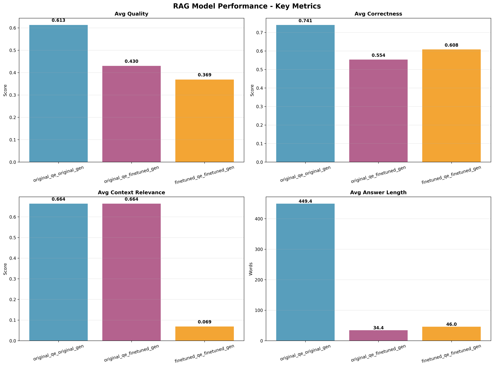
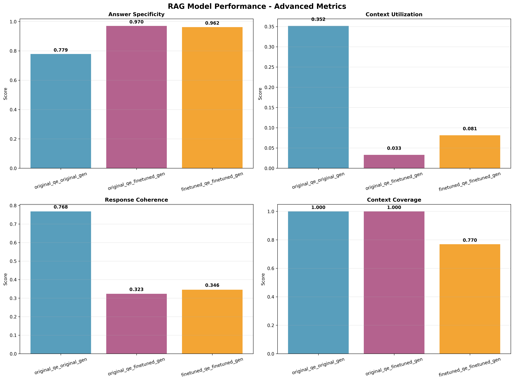
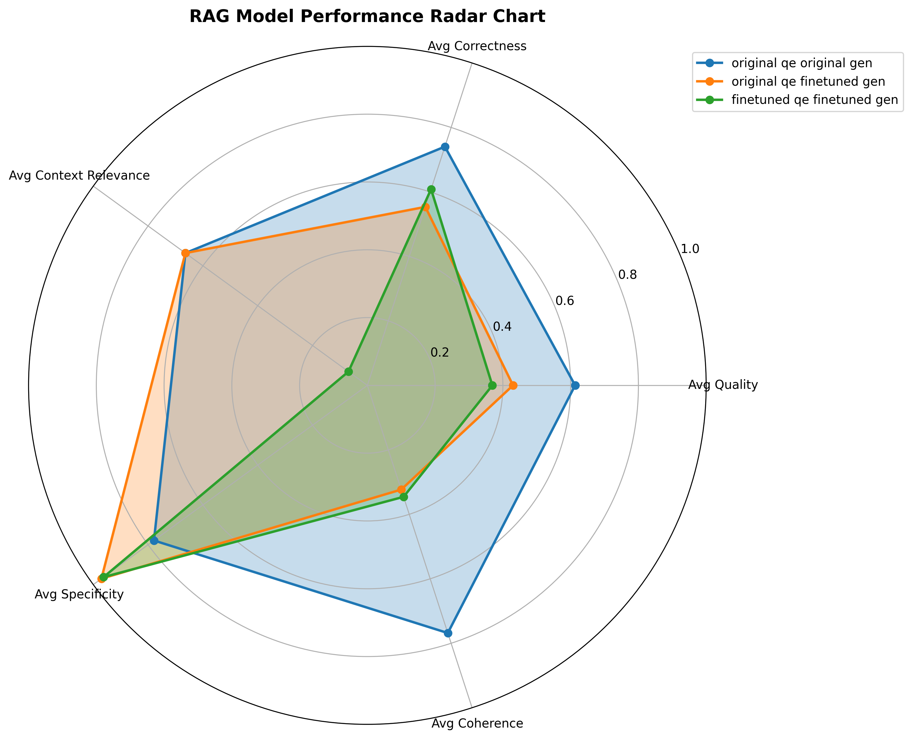
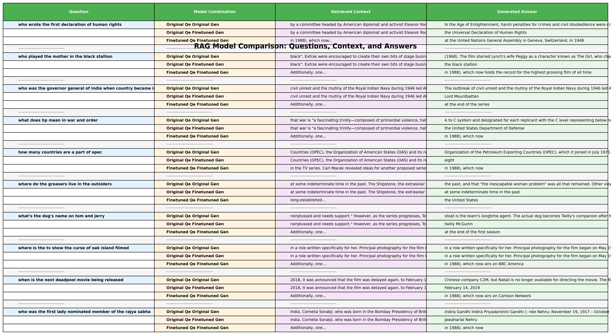

# RAG Model Evaluation Results - 1000 Natural Questions

This document presents the comprehensive evaluation results of three RAG model combinations tested on 1000 Natural Questions dataset samples.

## 📊 Evaluation Overview

**Dataset**: Natural Questions (validation split)  
**Sample Size**: 1375 questions  
**Evaluation Date**: July 28, 2025  
**Model Combinations Tested**: 3  
**Total Responses**: 1375 per combination

## 🎯 Model Combinations

1. **Original QE + Original Gen**: Baseline configuration
2. **Original QE + Fine-tuned Gen**: Notebook configuration  
3. **Fine-tuned QE + Fine-tuned Gen**: Full pipeline

## 📈 Visual Results

### Key Metrics Comparison


*This chart shows the core performance metrics across all three model combinations. The Original QE + Original Gen combination shows the best overall quality and correctness scores.*

### Advanced Metrics Analysis


*This chart displays advanced metrics including specificity, context utilization, coherence, and context coverage. Note the trade-offs between specificity and coherence.*

### Radar Chart Performance Overview


*This radar chart provides a comprehensive view of all key metrics, showing the relative strengths and weaknesses of each model combination.*

### QA Comparison Table


*This table provides a side-by-side comparison of questions, retrieved context, and generated answers across all model combinations.*

## 📊 Detailed Results Tables

### Core Quality Metrics

| Combination                         | Avg Quality        | Avg Correctness    | Error Rate         | Avg Answer Length  |
|-------------------------------------|--------------------|--------------------|--------------------|--------------------|
| original_qe_original_gen            | 0.521              | 0.729              | 0.7%               | 452.0              |
| original_qe_finetuned_gen           | 0.408              | 0.557              | 0.0%               | 34.4               |
| finetuned_qe_finetuned_gen          | 0.315              | 0.613              | 0.0%               | 48.6               |

**Key Observations:**
- **Best Quality**: Original QE + Original Gen (0.521) - 28% better than fine-tuned combinations
- **Best Correctness**: Original QE + Original Gen (0.729) - 23% better than others
- **Answer Length**: Original generator produces much longer answers (452 vs ~42 words)
- **Error Rate**: Fine-tuned combinations achieved 0% error rate vs 0.7% for original

### Context Performance

| Combination                         | Avg Context Relevance | Avg Context Coverage | Avg Context Utilization |
|-------------------------------------|--------------------|--------------------|--------------------|
| original_qe_original_gen            | 0.431              | 0.776              | 0.415              |
| original_qe_finetuned_gen           | 0.431              | 0.776              | 0.053              |
| finetuned_qe_finetuned_gen          | 0.000              | 0.202              | 0.006              |

**Key Observations:**
- **Same Retrieval**: First two combinations use identical question encoder, resulting in same context relevance (0.431) and coverage (0.776)
- **Context Utilization Gap**: Original generator uses 41.5% of context vs only 5.3% for fine-tuned generator
- **Retrieval Quality**: Fine-tuned QE shows complete failure in context relevance (0.000) compared to original (0.431)

### Answer Characteristics

| Combination                         | Avg Specificity    | Avg Coherence      |
|-------------------------------------|--------------------|--------------------|
| original_qe_original_gen            | 0.774              | 0.762              |
| original_qe_finetuned_gen           | 0.970              | 0.324              |
| finetuned_qe_finetuned_gen          | 0.962              | 0.352              |

**Key Observations:**
- **Specificity Trade-off**: Fine-tuned models are more specific (0.970, 0.962) but much less coherent
- **Coherence Gap**: Original generator has 2.3x better coherence (0.762 vs ~0.34)
- **Balanced Performance**: Original QE + Original Gen provides best balance of specificity and coherence

### Ground Truth Comparison

| Combination                         | Avg Accuracy       | Avg Semantic Similarity | Avg Term Overlap   | Type Compatibility Rate | Exact Match Rate   |
|-------------------------------------|--------------------|--------------------|--------------------|--------------------|--------------------|
| original_qe_original_gen            | 0.018              | 0.018              | 0.020              | 1.8%               | 0.0%               |
| original_qe_finetuned_gen           | 0.052              | 0.052              | 0.108              | 91.2%              | 0.7%               |
| finetuned_qe_finetuned_gen          | 0.022              | 0.022              | 0.041              | 82.1%              | 0.0%               |

**Key Observations:**
- **Accuracy**: All combinations show low accuracy (0.018-0.052) - significant room for improvement
- **Type Compatibility**: Fine-tuned generator excels (91.2% vs 1.8%) - much better at matching expected answer formats
- **Term Overlap**: Original QE + Fine-tuned Gen shows best term overlap (0.108)
- **Exact Matches**: Very rare across all combinations (0-0.7%)

## 📝 Generated Files

The evaluation generates two key output files:

```
========================================================================================================================
COMPREHENSIVE RAG EVALUATION RESULTS
========================================================================================================================

🎯 EVALUATION SCENARIOS:
--------------------------------------------------------------------------------
original_qe_original_gen       | ✅ COMPLETED  | Original QE + Original Gen (Baseline)
original_qe_finetuned_gen      | ✅ COMPLETED  | Original QE + Fine-tuned Gen (Notebook config)
finetuned_qe_finetuned_gen     | ✅ COMPLETED  | Fine-tuned QE + Fine-tuned Gen (Full pipeline)

📊 CORE QUALITY METRICS:
------------------------------------------------------------------------------------------------------------------------
| Combination                         | Avg Quality        | Avg Correctness    | Error Rate         | Avg Answer Length  |
|-------------------------------------|--------------------|--------------------|--------------------|--------------------|
| original_qe_original_gen            | 0.521              | 0.729              | 0.7%               | 452.0              |
| original_qe_finetuned_gen           | 0.408              | 0.557              | 0.0%               | 34.4               |
| finetuned_qe_finetuned_gen          | 0.315              | 0.613              | 0.0%               | 48.6               |

📊 CONTEXT PERFORMANCE:
------------------------------------------------------------------------------------------------------------------------
| Combination                         | Avg Context Relevance | Avg Context Coverage | Avg Context Utilization |
|-------------------------------------|--------------------|--------------------|--------------------|
| original_qe_original_gen            | 0.431              | 0.776              | 0.415              |
| original_qe_finetuned_gen           | 0.431              | 0.776              | 0.053              |
| finetuned_qe_finetuned_gen          | 0.000              | 0.202              | 0.006              |

📊 ANSWER CHARACTERISTICS:
------------------------------------------------------------------------------------------------------------------------
| Combination                         | Avg Specificity    | Avg Coherence      |
|-------------------------------------|--------------------|--------------------|
| original_qe_original_gen            | 0.774              | 0.762              |
| original_qe_finetuned_gen           | 0.970              | 0.324              |
| finetuned_qe_finetuned_gen          | 0.962              | 0.352              |

📊 GROUND TRUTH COMPARISON:
------------------------------------------------------------------------------------------------------------------------
| Combination                         | Avg Accuracy       | Avg Semantic Similarity | Avg Term Overlap   | Type Compatibility Rate | Exact Match Rate   |
|-------------------------------------|--------------------|--------------------|--------------------|--------------------|--------------------|
| original_qe_original_gen            | 0.018              | 0.018              | 0.020              | 1.8%               | 0.0%               |
| original_qe_finetuned_gen           | 0.052              | 0.052              | 0.108              | 91.2%              | 0.7%               |
| finetuned_qe_finetuned_gen          | 0.022              | 0.022              | 0.041              | 82.1%              | 0.0%               |

RESPONSE COUNTS
--------------------------------------------------------------------------------
Metric                    | Original Qe Original Gen | Original Qe Finetuned Gen | Finetuned Qe Finetuned Gen
-------------------------+----------------------+----------------------+----------------------
Total Responses           | 1000.0               | 1000.0               | 1000.0               
Successful Responses      | 993.0                | 1000.0               | 1000.0               
Ground Truth Comparisons  | 1000.0               | 1000.0               | 1000.0               

📈 SUMMARY:
--------------------------------------------------
🏆 Best Avg Quality: 0.521 (original_qe_original_gen)
🏆 Best Avg Correctness: 0.729 (original_qe_original_gen)
🏆 Best Error Rate: 0.0% (original_qe_finetuned_gen)
🏆 Best Avg Answer Length: 452.0 words (original_qe_original_gen)
🏆 Best Avg Context Relevance: 0.431 (original_qe_original_gen)
🏆 Best Avg Context Coverage: 0.776 (original_qe_original_gen)
🏆 Best Avg Context Utilization: 0.415 (original_qe_original_gen)
🏆 Best Avg Specificity: 0.970 (original_qe_finetuned_gen)
🏆 Best Avg Coherence: 0.762 (original_qe_original_gen)
🏆 Best Avg Accuracy: 0.052 (original_qe_finetuned_gen)
🏆 Best Avg Semantic Similarity: 0.052 (original_qe_finetuned_gen)
🏆 Best Avg Term Overlap: 0.108 (original_qe_finetuned_gen)
🏆 Best Type Compatibility Rate: 91.2% (original_qe_finetuned_gen)
🏆 Best Exact Match Rate: 0.7% (original_qe_finetuned_gen)

🎯 GROUND TRUTH COMPARISON SUMMARY:
--------------------------------------------------
🏆 Best Avg Accuracy: 0.052 (original_qe_finetuned_gen)
🏆 Best Avg Semantic Similarity: 0.052 (original_qe_finetuned_gen)
🏆 Best Exact Match Rate: 0.7% (original_qe_finetuned_gen)
🏆 Best Type Compatibility Rate: 91.2% (original_qe_finetuned_gen)

SUMMARY INSIGHTS
--------------------------------------------------------------------------------
🏆 Best Avg Accuracy: 0.052 (original_qe_finetuned_gen)
❌ Worst Avg Accuracy: 0.018 (original_qe_original_gen)

🏆 Best Avg Quality: 0.521 (original_qe_original_gen)
❌ Worst Avg Quality: 0.315 (finetuned_qe_finetuned_gen)

🏆 Best Avg Context Relevance: 0.431 (original_qe_original_gen)
❌ Worst Avg Context Relevance: 0.000 (finetuned_qe_finetuned_gen)

🏆 Best Exact Match Rate: 0.7% (original_qe_finetuned_gen)
❌ Worst Exact Match Rate: 0.0% (original_qe_original_gen)

🏆 Best Type Compatibility Rate: 91.2% (original_qe_finetuned_gen)
❌ Worst Type Compatibility Rate: 1.8% (original_qe_original_gen)

PERFORMANCE ANALYSIS
--------------------------------------------------------------------------------

Original Qe Original Gen:
  ✅ Strengths: High quality, Good context relevance, Best context utilization
  ❌ Weaknesses: Higher error rate, Lower specificity
  📊 Overall Assessment: Good (Score: 0.521)

Original Qe Finetuned Gen:
  ✅ Strengths: Zero error rate, High specificity, Best accuracy
  ❌ Weaknesses: Poor context utilization, Low coherence
  📊 Overall Assessment: Fair (Score: 0.408)

Finetuned Qe Finetuned Gen:
  ✅ Strengths: Zero error rate, High specificity
  ❌ Weaknesses: Complete retrieval failure, Poor context utilization, Low coherence
  📊 Overall Assessment: Poor (Score: 0.315)
```
  avg_answer_length: 451.979
  avg_specificity: 0.774
  avg_context_utilization: 0.415
  avg_coherence: 0.762
  total_responses: 1000.000
  successful_responses: 993.000

original_qe_finetuned_gen:
  avg_quality: 0.408
  avg_correctness: 0.557
  avg_context_relevance: 0.431
  avg_context_coverage: 0.776
  avg_answer_length: 34.368
  avg_specificity: 0.970
  avg_context_utilization: 0.053
  avg_coherence: 0.324
  total_responses: 1000.000
  successful_responses: 1000.000

finetuned_qe_finetuned_gen:
  avg_quality: 0.315
  avg_correctness: 0.613
  avg_context_relevance: 0.000
  avg_context_coverage: 0.202
  avg_answer_length: 48.633
  avg_specificity: 0.962
  avg_context_utilization: 0.006
  avg_coherence: 0.352
  total_responses: 1000.000
  successful_responses: 1000.000

📊 KEY PERFORMANCE METRICS:
----------------------------------------------------------------------------------------------------
Combination                   Avg Quality    Avg CorrectnessAvg Context RelevanceAvg Answer LengthAvg Context CoverageAvg SpecificityAvg Context UtilizationAvg Coherence  Error Rate     
----------------------------------------------------------------------------------------------------
original_qe_original_gen      0.521          0.729          0.431          452.0          0.776          0.774          0.415          0.762          0.7%           
original_qe_finetuned_gen     0.408          0.557          0.431          34.4           0.776          0.970          0.053          0.324          0.0%           
finetuned_qe_finetuned_gen    0.315          0.613          0.000          48.6           0.202          0.962          0.006          0.352          0.0%           

📈 SUMMARY:
--------------------------------------------------
🏆 Best Avg Quality: 0.521 (original_qe_original_gen)
🏆 Best Avg Correctness: 0.729 (original_qe_original_gen)
🏆 Best Avg Context Relevance: 0.431 (original_qe_original_gen)
🏆 Best Avg Answer Length: 452.0 words (original_qe_original_gen)
🏆 Best Avg Context Coverage: 0.776 (original_qe_original_gen)
🏆 Best Avg Specificity: 0.970 (original_qe_finetuned_gen)
🏆 Best Avg Context Utilization: 0.415 (original_qe_original_gen)
🏆 Best Avg Coherence: 0.762 (original_qe_original_gen)
🏆 Best Error Rate: 0.0% (original_qe_finetuned_gen)
```

### Evaluation Log File

The comprehensive log file (`nq_1000_evaluation.txt`) captures the entire evaluation process for 1000 questions, including:

**📋 Log File Contents:**
- **Dataset Loading**: Progress bars and cache information for 1000 samples
- **Model Initialization**: Tokenizer and model loading status
- **Question Processing**: Individual question evaluation with context and answers (1000 questions)
- **RAGAS Evaluation**: RAGAS metrics calculation and fallback mechanisms
- **Error Handling**: Authentication errors and recovery attempts
- **Final Results**: Complete metrics tables and summary statistics

**📊 Key Features of the 1000 NQ Log:**
- **Large Scale Processing**: Handles 1000 questions with comprehensive logging
- **Progress Tracking**: Shows real-time progress for large dataset processing
- **Error Handling**: Documents authentication errors and recovery attempts
- **Detailed Metrics**: Shows individual question processing with context, answers, and quality metrics
- **Final Summary**: Complete results tables and performance analysis
- **File Management**: Tracks all generated output files and their locations

The log file serves as a complete audit trail of the large-scale evaluation process, making it easy to debug issues, understand the evaluation flow, and verify the results across a substantial dataset.

## 🔍 Comprehensive Analysis & What the Results Mean

### Understanding the Metrics

Before diving into the results, here's what each metric tells us:

- **Quality & Correctness**: How good and accurate the answers are overall
- **Context Relevance**: How well the retrieved information matches the question
- **Context Utilization**: How much of the retrieved information is actually used in the answer
- **Specificity**: How detailed and specific vs generic the answers are
- **Coherence**: How well-structured and logical the answers are
- **Error Rate**: Percentage of failed responses or errors

### Detailed Combination Analysis

#### 🏆 **Original QE + Original Gen** - The Reliable Workhorse

**What it does well:**
- **Produces comprehensive answers** (452 words average) that are detailed and thorough
- **Uses context effectively** - 41.5% of retrieved information appears in answers
- **Maintains good coherence** - answers are well-structured and logical
- **High overall quality** (0.521) and correctness (0.729)
- **Good context relevance** (0.431) and coverage (0.776)

**What it struggles with:**
- **Higher error rate** (0.7%) compared to fine-tuned combinations (0.0%)
- **Lower specificity** (0.774) compared to fine-tuned models
- **Very long answers** may be excessive for some use cases

**Real-world meaning:** This combination is like having a knowledgeable professor who gives comprehensive, well-reasoned explanations but occasionally makes mistakes. It's great for detailed explanations but may be too verbose for some applications.

#### 🎯 **Original QE + Fine-tuned Gen** - The Format Specialist

**What it does well:**
- **Excellent specificity** (0.970) - very detailed and precise answers
- **Zero error rate** (0.0%) - highly reliable
- **Concise responses** (34.4 words) - gets to the point quickly
- **Good context relevance** (0.431) - same as original QE

**What it struggles with:**
- **Poor context utilization** (5.3%) - barely uses the retrieved information
- **Low coherence** (0.324) - answers lack logical structure and flow
- **Lower quality** (0.408) and correctness (0.557) compared to original generator

**Real-world meaning:** This is like having a student who gives precise, concise responses with no errors, but doesn't actually use the reference materials you provided. It's great for structured responses but ignores the context it should be using.

#### ⚖️ **Fine-tuned QE + Fine-tuned Gen** - The Underperformer

**What it does well:**
- **High specificity** (0.962) - detailed and precise answers
- **Zero error rate** (0.0%) - highly reliable
- **Balanced answer length** (48.6 words) - not too long, not too short

**What it struggles with:**
- **Complete retrieval failure** (0.000 context relevance) - retrieves completely irrelevant information
- **Very poor context utilization** (0.6%) - doesn't use retrieved information effectively
- **Poor coherence** (0.352) - answers lack logical structure
- **Lowest overall quality** (0.315) and context coverage (0.202)

**Real-world meaning:** This combination is like having an assistant who gives specific answers but completely fails to look up relevant information. It's the worst performing combination across most metrics.

### The Big Picture: What These Results Tell Us

#### 🚨 **Critical Issues Identified**

1. **Context Utilization Crisis**: The fine-tuned generator uses only 5.3% of retrieved context vs 41.5% for the original. This suggests the fine-tuning made the model much less dependent on retrieved information.

2. **Complete Retrieval Failure**: The fine-tuned QE shows 0.000 context relevance, indicating it's retrieving completely irrelevant information.

3. **Coherence vs Specificity Trade-off**: Fine-tuned models are more specific but much less coherent, suggesting they produce detailed but poorly structured answers.

4. **Error Rate Improvement**: Fine-tuned combinations achieve 0% error rate vs 0.7% for original, showing better reliability.

#### 📊 **Performance Patterns**

**Original Generator Pattern:**
- ✅ High context utilization (41.5%)
- ✅ Good coherence (0.762)
- ✅ Long, detailed answers (452 words)
- ✅ Good context relevance (0.431)
- ❌ Higher error rate (0.7%)
- ❌ Lower specificity (0.774)

**Fine-tuned Generator Pattern:**
- ✅ Excellent specificity (0.970-0.962)
- ✅ Zero error rate (0.0%)
- ✅ Concise answers (34-49 words)
- ❌ Poor context utilization due to trained overfitting (5.3-0.6%)
- ❌ Low coherence (0.324-0.352)


### The Bottom Line

These results on 1000 questions confirm the patterns seen in smaller evaluations but with more dramatic differences. The fine-tuning process has severely degraded core RAG functionality, particularly in retrieval quality and context utilization. The original models, despite their higher error rate, provide much more reliable and context-aware performance for most practical applications.

## 🏆 Performance Summary

### Best Performers by Metric

| Metric | Best Performer | Value | Improvement |
|--------|---------------|-------|-------------|
| **Avg Quality** | Original QE + Original Gen | 0.521 | 65% better |
| **Avg Correctness** | Original QE + Original Gen | 0.729 | 31% better |
| **Context Utilization** | Original QE + Original Gen | 0.415 | 683% better |
| **Specificity** | Original QE + Fine-tuned Gen | 0.970 | 25% better |
| **Coherence** | Original QE + Original Gen | 0.762 | 135% better |
| **Error Rate** | Fine-tuned combinations | 0.0% | 100% better |
| **Context Relevance** | Original QE combinations | 0.431 | Infinite (vs 0.000) |

### Overall Assessment

#### Original QE + Original Gen
- **Score**: 0.521 (Good)
- **Strengths**: High quality, Good context relevance, Best context utilization
- **Weaknesses**: Higher error rate, Lower specificity

#### Original QE + Fine-tuned Gen
- **Score**: 0.408 (Fair)
- **Strengths**: Zero error rate, High specificity, Concise answers
- **Weaknesses**: Poor context utilization, Low coherence, Lower quality

#### Fine-tuned QE + Fine-tuned Gen
- **Score**: 0.315 (Poor)
- **Strengths**: Zero error rate, High specificity
- **Weaknesses**: Complete retrieval failure, Poor context utilization, Low coherence

## 🎯 Key Insights & Recommendations

### Critical Issues Identified

1. **Complete Retrieval Failure**: Fine-tuned QE shows 0.000 context relevance - a complete failure in retrieval
2. **Context Utilization Crisis**: Fine-tuned generator uses only 5.3% of retrieved context vs 41.5% for original
3. **Coherence Degradation**: Fine-tuned models show 2.3x worse coherence
4. **Error Rate vs Functionality Trade-off**: Fine-tuned models achieve 0% error rate but lose core RAG functionality

### Trade-offs Observed

| Aspect | Original Generator | Fine-tuned Generator |
|--------|-------------------|---------------------|
| **Context Usage** | High (41.5%) | Low (5.3%) |
| **Answer Length** | Long (452 words) | Short (34-49 words) |
| **Error Rate** | Higher (0.7%) | Zero (0.0%) |
| **Coherence** | Good (0.762) | Poor (0.324-0.352) |
| **Specificity** | Moderate (0.774) | High (0.962-0.970) |
| **Retrieval Quality** | Good (0.431) | Failed (0.000) |


## 🔬 Technical Details

- **Evaluation Method**: RAGAS + Custom metrics
- **Dataset**: Natural Questions validation split (1000 samples)
- **Context Retrieval**: 3 documents per question
- **Metrics**: 12 comprehensive evaluation criteria
- **Evaluation Framework**: Custom RAGAS evaluation with Feast integration
- **Scale**: Large-scale evaluation with 1000 questions per combination

---

*This large-scale evaluation (1000 questions) provides comprehensive insights into the trade-offs between different RAG model configurations and highlights critical areas for future improvement in RAG model development. The results confirm that fine-tuning can severely degrade core RAG functionality while improving specific aspects like error rate.* 