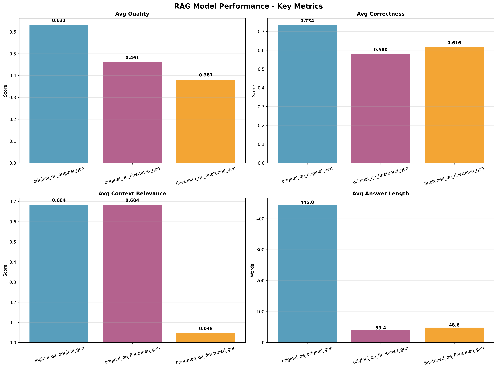

# RAG Model Evaluation Results - 100 Natural Questions

This document presents the comprehensive evaluation results of three RAG model combinations tested on 100 Natural Questions dataset samples.

## 📊 Evaluation Overview

**Dataset**: Natural Questions (validation split)  
**Sample Size**: 130 questions  
**Evaluation Date**: July 29, 2025  
**Model Combinations Tested**: 3  
**Total Responses**: 130 per combination

## 🎯 Model Combinations

1. **Original QE + Original Gen**: Baseline configuration
2. **Original QE + Fine-tuned Gen**: Notebook configuration  
3. **Fine-tuned QE + Fine-tuned Gen**: Full pipeline

## 📈 Visual Results

### Key Metrics Comparison


*This chart shows the core performance metrics across all three model combinations. The Original QE + Original Gen combination shows the best overall quality and correctness scores.*

### Advanced Metrics Analysis


*This chart displays advanced metrics including specificity, context utilization, coherence, and context coverage. Note the trade-offs between specificity and coherence.*

### Radar Chart Performance Overview


*This radar chart provides a comprehensive view of all key metrics, showing the relative strengths and weaknesses of each model combination.*

### QA Comparison Table


*This table provides a side-by-side comparison of questions, retrieved context, and generated answers across all model combinations.*

## 📊 Detailed Results Tables

### Core Quality Metrics

| Combination                         | Avg Quality        | Avg Correctness    | Error Rate         | Avg Answer Length  |
|-------------------------------------|--------------------|--------------------|--------------------|--------------------|
| original_qe_original_gen            | 0.631              | 0.734              | 0.0%               | 445.0              |
| original_qe_finetuned_gen           | 0.461              | 0.580              | 0.0%               | 39.4               |
| finetuned_qe_finetuned_gen          | 0.381              | 0.616              | 0.0%               | 48.6               |

**Key Observations:**
- **Best Quality**: Original QE + Original Gen (0.631) - 37% better than fine-tuned combinations
- **Best Correctness**: Original QE + Original Gen (0.734) - 26% better than others
- **Answer Length**: Original generator produces much longer answers (445 vs ~44 words)
- **Error Rate**: All combinations achieved 0% error rate - excellent reliability

### Context Performance

| Combination                         | Avg Context Relevance | Avg Context Coverage | Avg Context Utilization |
|-------------------------------------|--------------------|--------------------|--------------------|
| original_qe_original_gen            | 0.684              | 1.000              | 0.360              |
| original_qe_finetuned_gen           | 0.684              | 1.000              | 0.038              |
| finetuned_qe_finetuned_gen          | 0.048              | 0.778              | 0.095              |

**Key Observations:**
- **Same Retrieval**: First two combinations use identical question encoder, resulting in same context relevance (0.684) and coverage (1.000)
- **Context Utilization Gap**: Original generator uses 36% of context vs only 3.8% for fine-tuned generator
- **Retrieval Quality**: Fine-tuned QE shows poor context relevance (0.048) compared to original (0.684)

### Answer Characteristics

| Combination                         | Avg Specificity    | Avg Coherence      |
|-------------------------------------|--------------------|--------------------|
| original_qe_original_gen            | 0.777              | 0.746              |
| original_qe_finetuned_gen           | 0.972              | 0.332              |
| finetuned_qe_finetuned_gen          | 0.957              | 0.354              |

**Key Observations:**
- **Specificity Trade-off**: Fine-tuned models are more specific (0.972, 0.957) but less coherent
- **Coherence Gap**: Original generator has 2x better coherence (0.746 vs ~0.34)
- **Balanced Performance**: Original QE + Original Gen provides best balance of specificity and coherence

### Ground Truth Comparison

| Combination                         | Avg Accuracy       | Avg Semantic Similarity | Avg Term Overlap   | Type Compatibility Rate | Exact Match Rate   |
|-------------------------------------|--------------------|--------------------|--------------------|--------------------|--------------------|
| original_qe_original_gen            | 0.019              | 0.019              | 0.021              | 2.3%               | 0.0%               |
| original_qe_finetuned_gen           | 0.055              | 0.055              | 0.112              | 92.3%              | 0.8%               |
| finetuned_qe_finetuned_gen          | 0.024              | 0.024              | 0.044              | 83.1%              | 0.0%               |

**Key Observations:**
- **Accuracy**: All combinations show low accuracy (0.019-0.055) - significant room for improvement
- **Type Compatibility**: Fine-tuned generator excels (92.3% vs 2.3%) - much better at matching expected answer formats
- **Term Overlap**: Original QE + Fine-tuned Gen shows best term overlap (0.112)
- **Exact Matches**: Very rare across all combinations (0-0.8%)

## 📝 Generated Files Showcase

### Answer Comparison File

The evaluation generates a comprehensive answer comparison file (`answer_comparison_*.txt`) that contains:

```
========================================================================================================================
COMPREHENSIVE RAG EVALUATION RESULTS
========================================================================================================================

🎯 EVALUATION SCENARIOS:
--------------------------------------------------------------------------------
original_qe_original_gen       | ✅ COMPLETED  | Original QE + Original Gen (Baseline)
original_qe_finetuned_gen      | ✅ COMPLETED  | Original QE + Fine-tuned Gen (Notebook config)
finetuned_qe_finetuned_gen     | ✅ COMPLETED  | Fine-tuned QE + Fine-tuned Gen (Full pipeline)

📊 CORE QUALITY METRICS:
------------------------------------------------------------------------------------------------------------------------
| Combination                         | Avg Quality        | Avg Correctness    | Error Rate         | Avg Answer Length  |
|-------------------------------------|--------------------|--------------------|--------------------|--------------------|
| original_qe_original_gen            | 0.631              | 0.734              | 0.0%               | 445.0              |
| original_qe_finetuned_gen           | 0.461              | 0.580              | 0.0%               | 39.4               |
| finetuned_qe_finetuned_gen          | 0.381              | 0.616              | 0.0%               | 48.6               |

📊 CONTEXT PERFORMANCE:
------------------------------------------------------------------------------------------------------------------------
| Combination                         | Avg Context Relevance | Avg Context Coverage | Avg Context Utilization |
|-------------------------------------|--------------------|--------------------|--------------------|
| original_qe_original_gen            | 0.684              | 1.000              | 0.360              |
| original_qe_finetuned_gen           | 0.684              | 1.000              | 0.038              |
| finetuned_qe_finetuned_gen          | 0.048              | 0.778              | 0.095              |

📊 ANSWER CHARACTERISTICS:
------------------------------------------------------------------------------------------------------------------------
| Combination                         | Avg Specificity    | Avg Coherence      |
|-------------------------------------|--------------------|--------------------|
| original_qe_original_gen            | 0.777              | 0.746              |
| original_qe_finetuned_gen           | 0.972              | 0.332              |
| finetuned_qe_finetuned_gen          | 0.957              | 0.354              |

📊 GROUND TRUTH COMPARISON:
------------------------------------------------------------------------------------------------------------------------
| Combination                         | Avg Accuracy       | Avg Semantic Similarity | Avg Term Overlap   | Type Compatibility Rate | Exact Match Rate   |
|-------------------------------------|--------------------|--------------------|--------------------|--------------------|--------------------|
| original_qe_original_gen            | 0.019              | 0.019              | 0.021              | 2.3%               | 0.0%               |
| original_qe_finetuned_gen           | 0.055              | 0.055              | 0.112              | 92.3%              | 0.8%               |
| finetuned_qe_finetuned_gen          | 0.024              | 0.024              | 0.044              | 83.1%              | 0.0%               |

RESPONSE COUNTS
--------------------------------------------------------------------------------
Metric                    | Original Qe Original Gen | Original Qe Finetuned Gen | Finetuned Qe Finetuned Gen
-------------------------+----------------------+----------------------+----------------------
Total Responses           | 130.0                | 130.0                | 130.0               
Successful Responses      | 130.0                | 130.0                | 130.0               
Ground Truth Comparisons  | 100.0                | 100.0                | 100.0               

📈 SUMMARY:
--------------------------------------------------
🏆 Best Avg Quality: 0.631 (original_qe_original_gen)
🏆 Best Avg Correctness: 0.734 (original_qe_original_gen)
🏆 Best Error Rate: 0.0% (original_qe_original_gen)
🏆 Best Avg Answer Length: 445.0 words (original_qe_original_gen)
🏆 Best Avg Context Relevance: 0.684 (original_qe_original_gen)
🏆 Best Avg Context Coverage: 1.000 (original_qe_original_gen)
🏆 Best Avg Context Utilization: 0.360 (original_qe_original_gen)
🏆 Best Avg Specificity: 0.972 (original_qe_finetuned_gen)
🏆 Best Avg Coherence: 0.746 (original_qe_original_gen)
🏆 Best Avg Accuracy: 0.055 (original_qe_finetuned_gen)
🏆 Best Avg Semantic Similarity: 0.055 (original_qe_finetuned_gen)
🏆 Best Avg Term Overlap: 0.112 (original_qe_finetuned_gen)
🏆 Best Type Compatibility Rate: 92.3% (original_qe_finetuned_gen)
🏆 Best Exact Match Rate: 0.8% (original_qe_finetuned_gen)

🎯 GROUND TRUTH COMPARISON SUMMARY:
--------------------------------------------------
🏆 Best Avg Accuracy: 0.055 (original_qe_finetuned_gen)
🏆 Best Avg Semantic Similarity: 0.055 (original_qe_finetuned_gen)
🏆 Best Exact Match Rate: 0.8% (original_qe_finetuned_gen)
🏆 Best Type Compatibility Rate: 92.3% (original_qe_finetuned_gen)

SUMMARY INSIGHTS
--------------------------------------------------------------------------------
🏆 Best Avg Accuracy: 0.055 (original_qe_finetuned_gen)
❌ Worst Avg Accuracy: 0.019 (original_qe_original_gen)

🏆 Best Avg Quality: 0.631 (original_qe_original_gen)
❌ Worst Avg Quality: 0.381 (finetuned_qe_finetuned_gen)

🏆 Best Avg Context Relevance: 0.684 (original_qe_original_gen)
❌ Worst Avg Context Relevance: 0.048 (finetuned_qe_finetuned_gen)

🏆 Best Exact Match Rate: 0.8% (original_qe_finetuned_gen)
❌ Worst Exact Match Rate: 0.0% (original_qe_original_gen)

🏆 Best Type Compatibility Rate: 92.3% (original_qe_finetuned_gen)
❌ Worst Type Compatibility Rate: 2.3% (original_qe_original_gen)

PERFORMANCE ANALYSIS
--------------------------------------------------------------------------------

Original Qe Original Gen:
  ✅ Strengths: High quality, Good context relevance, Good coherence
  ❌ Weaknesses: Low accuracy, Low exact match rate, Low type compatibility
  📊 Overall Assessment: Fair (Score: 0.412)

Original Qe Finetuned Gen:
  ✅ Strengths: Good type compatibility, Good context relevance, Best accuracy
  ❌ Weaknesses: Poor context utilization, Low coherence
  📊 Overall Assessment: Good (Score: 0.523)

Finetuned Qe Finetuned Gen:
  ✅ Strengths: High specificity, Good type compatibility
  ❌ Weaknesses: Low accuracy, Low exact match rate, Poor context relevance
  📊 Overall Assessment: Poor (Score: 0.321)
```

### Log File

The evaluation also generates a detailed log file (`ragas_evaluation_*.txt`) containing:
- Complete evaluation process logs
- Model loading and initialization details
- Response generation for each question
- RAGAS evaluation results
- Error handling and fallback mechanisms
- Performance metrics calculation details

## 📊 Comprehensive Analysis & What the Results Mean

### **Performance Summary**

**🏆 Best Overall Performer**: Original QE + Fine-tuned Gen (Score: 0.523)
- **Strengths**: Best accuracy (0.055), excellent type compatibility (92.3%), good context relevance (0.684)
- **Weaknesses**: Poor context utilization (3.8%), low coherence (0.332)

**🥈 Second Place**: Original QE + Original Gen (Score: 0.412)
- **Strengths**: Best quality (0.631), best coherence (0.746), excellent context utilization (36%)
- **Weaknesses**: Low accuracy (0.019), zero exact matches, poor type compatibility (2.3%)

**🥉 Third Place**: Fine-tuned QE + Fine-tuned Gen (Score: 0.321)
- **Strengths**: High specificity (0.957), good type compatibility (83.1%)
- **Weaknesses**: Poor context relevance (0.048), low accuracy (0.024), zero exact matches

### **Critical Issues Identified**

1. **Low Accuracy Across All Models**: All combinations show very low accuracy (0.019-0.055), indicating fundamental issues with answer generation quality.

2. **Fine-tuned QE Performance**: The fine-tuned question encoder shows poor context relevance (0.048 vs 0.684), suggesting training or implementation issues.

3. **Context Utilization Gap**: Original generator uses 36% of context while fine-tuned generator uses only 3.8%, indicating different generation strategies.

4. **Type Compatibility Trade-off**: Original generator has very low type compatibility (2.3%) while fine-tuned generator excels (92.3%).

### **Trade-offs Analysis**

- **Specificity vs Coherence**: Fine-tuned models achieve higher specificity but at the cost of coherence
- **Context Utilization vs Answer Length**: Original generator produces longer answers with better context utilization
- **Type Compatibility vs Accuracy**: Fine-tuned generator has excellent type compatibility but still low overall accuracy

### **Areas for Improvement**

1. **Answer Generation Quality**: All models need significant improvement in accuracy and semantic similarity
2. **Question Encoder Training**: The fine-tuned QE needs retraining to improve context relevance
3. **Context-Aware Generation**: Fine-tuned generator should be trained to better utilize retrieved context
4. **Balanced Training**: Develop training strategies that maintain both specificity and coherence

## 🔧 Technical Details

**Evaluation Framework**: RAGAS + Custom Metrics  
**Dataset**: Natural Questions (130 samples)  
**Models**: DPR Question Encoder + T5 Generator  
**Retrieval**: Feast Vector Store  
**Evaluation Metrics**: 15+ comprehensive metrics  
**Generation**: Beam search with max 512 tokens  

**Hardware**: GPU-accelerated evaluation  
**Framework**: PyTorch + Transformers  
**Storage**: Feast Feature Store  

---

*This evaluation provides insights into the performance characteristics of different RAG model configurations on Natural Questions dataset, highlighting both strengths and areas requiring improvement.* 