# LLM Fine-Tuning with Kubeflow Training on OpenShift AI

This example demonstrates how to fine-tune LLMs with the Kubeflow Training operator on OpenShift AI.
It uses HuggingFace SFTTrainer, with PEFT for LoRA and qLoRA, and PyTorch FSDP to distribute the training on multiple GPUs / nodes.

> [!TIP]
> **Multi-Team Resource Management**: For enterprise scenarios with multiple teams sharing GPU resources, see the [**Kueue Multi-Team Resource Management Workshop**](../../workshops/kueue/README.md). It demonstrates how to use this LLM fine-tuning example with Kueue for fair resource allocation, borrowing policies, and workload scheduling across teams.

> [!IMPORTANT]
> This example has been tested with the configurations listed in the [validation](#validation) section.
> Its configuration space is highly dimensional, and tightly coupled to runtime / hardware configuration.
> You need to adapt it, and validate it works as expected, with your configuration(s), on your target environment(s).

## Requirements

* An OpenShift cluster with OpenShift AI (RHOAI) 2.17+ installed:
  * The `dashboard`, `trainingoperator` and `workbenches` components enabled
* Sufficient worker nodes for your configuration(s) with NVIDIA GPUs (Ampere-based or newer recommended) or AMD GPUs (AMD Instinct MI300X or newer recommended)
* A dynamic storage provisioner supporting RWX PVC provisioning

## Setup

### Setup Workbench

* Access the OpenShift AI dashboard, for example from the top navigation bar menu:
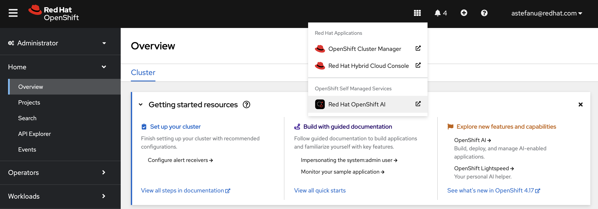
* Log in, then go to _Data Science Projects_ and create a project:
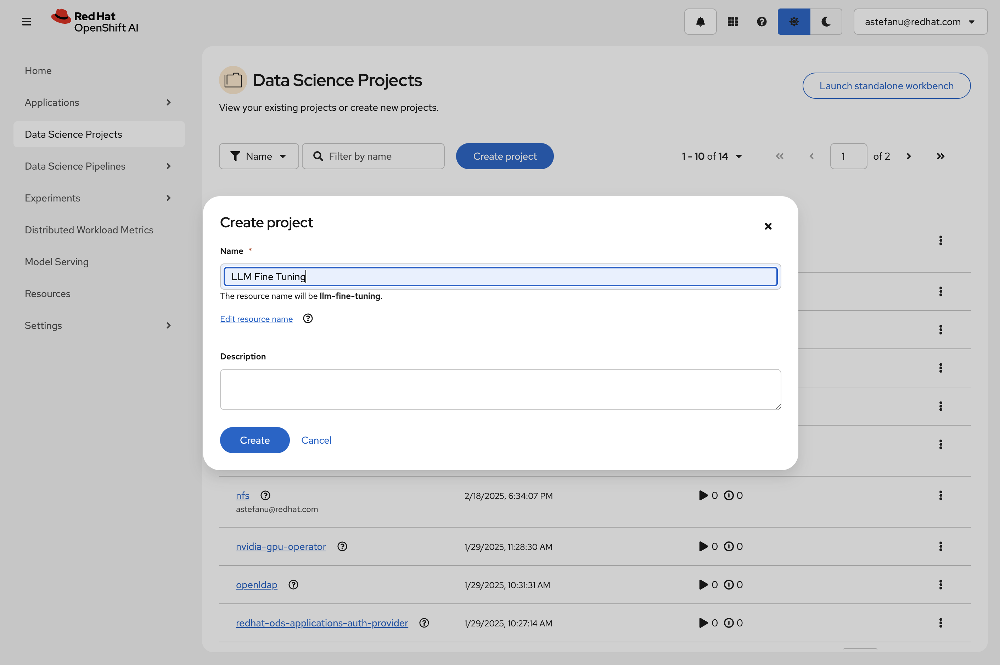
* Once the project is created, click on _Create a workbench_:
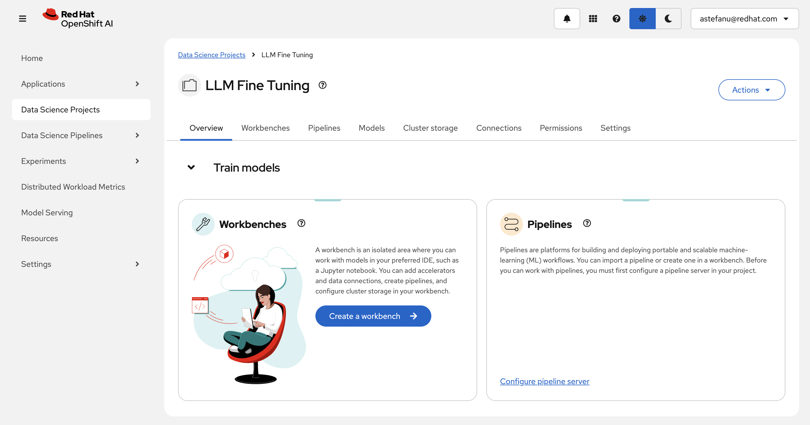
* Then create a workbench with the following settings:
    * Select the `PyTorch` (or the `ROCm-PyTorch`) notebook image:
    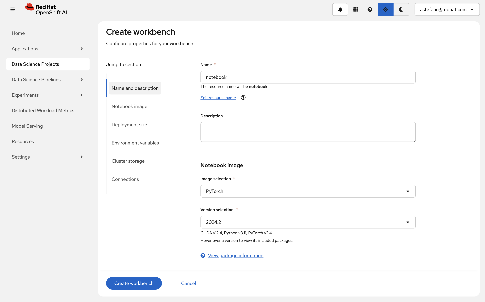
    * Select the `Medium` container size and add an accelerator:
    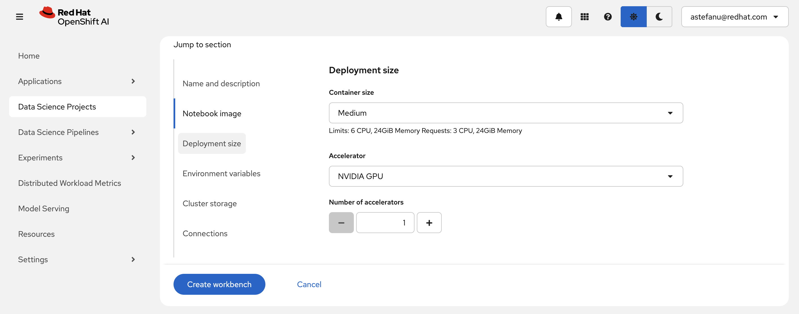
        > [!NOTE]
        > Adding an accelerator is only needed to test the fine-tuned model from within the workbench so you can spare an accelerator if needed.
    * Create a storage that'll be shared between the workbench and the fine-tuning runs.
    Make sure it uses a storage class with RWX capability and give it enough size according to the size of the model you want to fine-tune:
        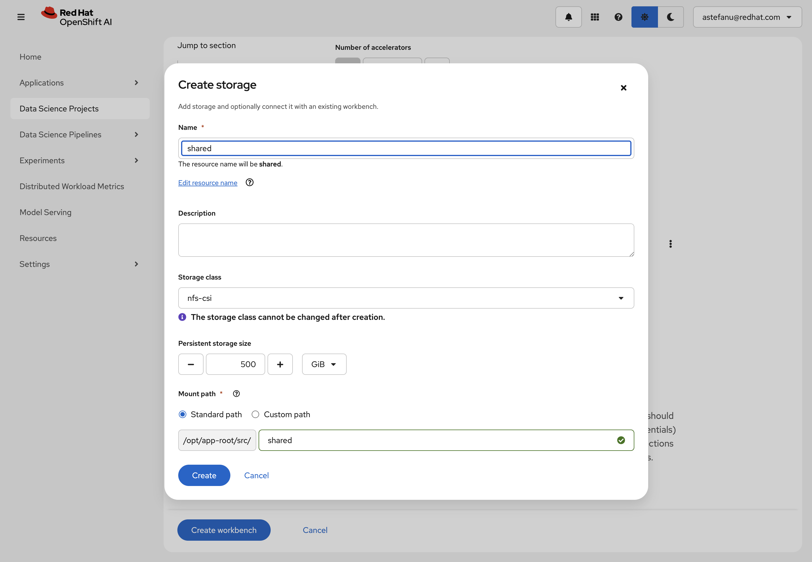
        > [!NOTE]
        > You can attach an existing shared storage if you already have one instead.
    * Review the storage configuration and click "Create workbench":
    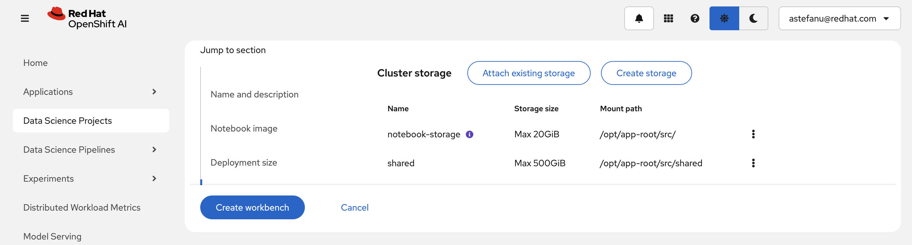
* From "Workbenches" page, click on _Open_ when the workbench you've just created becomes ready:
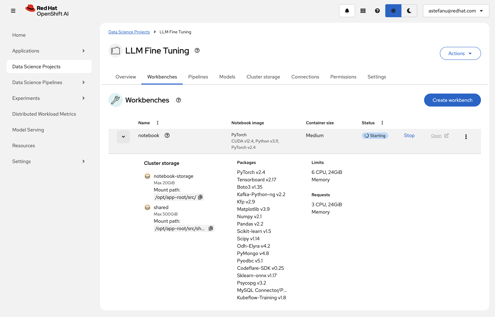
* From the workbench, clone this repository, i.e., `https://github.com/opendatahub-io/distributed-workloads.git`

* Navigate to the `distributed-workloads/examples/kfto-sft-llm` directory and open the `sft` notebook

> [!IMPORTANT]
> * You will need a Hugging Face token if using gated models:
>   * The examples use gated Llama models that require a token (e.g., https://huggingface.co/meta-llama/Llama-3.1-8B)
>   * Set the `HF_TOKEN` environment variable in your job configuration
>   * Note: You can skip the token if switching to non-gated models
> * If using RHOAI 2.21+, the example supports Kueue integration for workload management:
>   * When using Kueue:
>     * Follow the [Configure Kueue (Optional)](#configure-kueue-optional) section to set up required resources
>     * Add the local-queue name label to your job configuration to enforce workload management
>   * You can skip Kueue usage by:
>     > Note: Kueue Enablement via Validating Admission Policy was introduced in RHOAI 2.21. You can skip this section if using an earlier RHOAI release version.
>     * Disabling the existing `kueue-validating-admission-policy-binding`
>     * Omitting the local-queue-name label in your job configuration

You can now proceed with the instructions from the notebook. Enjoy!

### Configure Kueue (Optional)

> [!NOTE]
> This section is only required if you plan to use Kueue for workload management (RHOAI 2.21+) or Kueue is not already configured in your cluster.

* Update the `nodeLabels` in the `workshops/kueue/resources/resource_flavor.yaml` file to match your AI worker nodes
* Create the ResourceFlavor:
    ```console
    oc apply -f workshops/kueue/resources/resource_flavor.yaml
    ```
* Create the ClusterQueue:
    ```console
    oc apply -f workshops/kueue/resources/team1_cluster_queue.yaml
    ```
* Create a LocalQueue in your namespace:
    ```console
    oc apply -f workshops/kueue/resources/team1_local_queue.yaml -n <your-namespace>
    ```

## Validation

This example has been validated with the following configurations:

### Llama 3.1 8B Instruct - GSM8k Dataset - LoRA - 8x NVIDIA A100/80G

* Infrastructure:
  * OpenShift AI 2.19
  * 8x NVIDIA-A100-SXM4-80GB
* Configuration:
    ```yaml
    # Model
    model_name_or_path: Meta-Llama/Meta-Llama-3.1-8B-Instruct
    model_revision: main
    torch_dtype: bfloat16
    attn_implementation: flash_attention_2
    use_liger_kernel: true

    # PEFT / LoRA
    use_peft: true
    lora_r: 16
    lora_alpha: 8
    lora_dropout: 0.05
    lora_target_modules: ["q_proj", "v_proj", "k_proj", "o_proj", "gate_proj", "up_proj", "down_proj"]

    # QLoRA (BitsAndBytes)
    load_in_4bit: false
    load_in_8bit: false

    # Dataset
    dataset_name: gsm8k
    dataset_config: main

    # SFT
    max_length: 4096
    packing: false
    padding_free: true

    # Training
    per_device_train_batch_size: 128
    per_device_eval_batch_size: 128

    bf16: true
    tf32: false

    learning_rate: 1.0e-4
    warmup_steps: 10
    lr_scheduler_type: inverse_sqrt

    optim: adamw_torch_fused
    max_grad_norm: 1.0

    # FSDP
    fsdp: "full_shard auto_wrap offload"
    fsdp_config:
      activation_checkpointing: true
    ```
* Job:
    ```yaml
    num_workers: 8
    num_procs_per_worker: 1
    resources_per_worker:
      "nvidia.com/gpu": 1
      "memory": 96Gi
      "cpu": 8
    base_image: quay.io/modh/training:py311-cuda124-torch251
    env_vars:
      "PYTORCH_CUDA_ALLOC_CONF": "expandable_segments:True"
      "NCCL_DEBUG": "INFO"
    ```
* Metrics:
    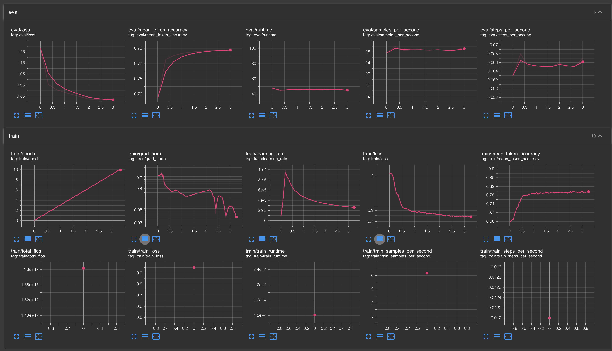

### Llama 3.3 70B Instruct - GSM8k Dataset - LoRA - 16x NVIDIA A100/80G

* Infrastructure:
  * OpenShift AI 2.17
  * 16x NVIDIA-A100-SXM4-80GB
* Configuration:
    ```yaml
    # Model
    model_name_or_path: meta-llama/Llama-3.3-70B-Instruct
    model_revision: main
    torch_dtype: bfloat16
    attn_implementation: flash_attention_2
    use_liger: true

    # PEFT / LoRA
    use_peft: true
    lora_r: 16
    lora_alpha: 8
    lora_dropout: 0.05
    lora_target_modules: ["q_proj", "v_proj", "k_proj", "o_proj", "gate_proj", "up_proj", "down_proj"]
    lora_modules_to_save: []

    # QLoRA (BitsAndBytes)
    load_in_4bit: false
    load_in_8bit: false

    # Dataset
    dataset_name: gsm8k
    dataset_config: main

    # SFT
    max_seq_length: 1024
    packing: false

    # Training
    per_device_train_batch_size: 64
    per_device_eval_batch_size: 64

    bf16: true
    tf32: false

    learning_rate: 2.0e-4
    warmup_steps: 10
    lr_scheduler_type: inverse_sqrt

    optim: adamw_torch_fused
    max_grad_norm: 1.0

    # FSDP
    fsdp: "full_shard auto_wrap"
    fsdp_config:
      activation_checkpointing: true
    ```
* Job:
    ```yaml
    num_workers: 16
    num_procs_per_worker: 1
    resources_per_worker:
      "nvidia.com/gpu": 1
      "memory": 192Gi
      "cpu": 4
    base_image: quay.io/modh/training:py311-cuda121-torch241
    env_vars:
      "PYTORCH_CUDA_ALLOC_CONF": "expandable_segments:True"
      "NCCL_DEBUG": "INFO"
    ```
* Metrics:
    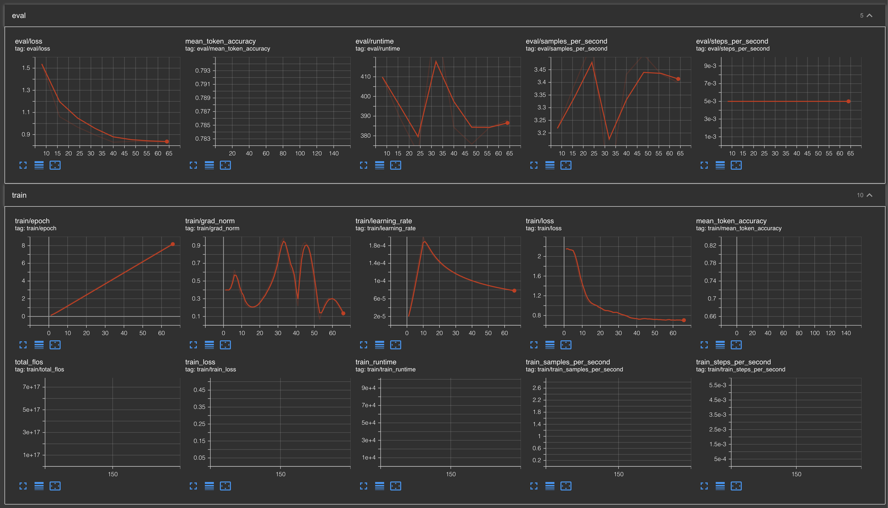

### Llama 3.1 8B Instruct - GSM8k Dataset - LoRA - 8x AMD Instinct MI300X

* Infrastructure:
  * OpenShift AI 2.19
  * 8x AMD Instinct MI300X
* Configuration:
    ```yaml
    # Model
    model_name_or_path: Meta-Llama/Meta-Llama-3.1-8B-Instruct
    model_revision: main
    torch_dtype: bfloat16
    attn_implementation: flash_attention_2
    use_liger_kernel: true

    # PEFT / LoRA
    use_peft: true
    lora_r: 16
    lora_alpha: 8
    lora_dropout: 0.05
    lora_target_modules: ["q_proj", "v_proj", "k_proj", "o_proj", "gate_proj", "up_proj", "down_proj"]

    # QLoRA (BitsAndBytes)
    load_in_4bit: false
    load_in_8bit: false

    # Dataset
    dataset_name: gsm8k
    dataset_config: main

    # SFT
    max_length: 8192
    packing: false
    padding_free: true

    # Training
    per_device_train_batch_size: 512
    per_device_eval_batch_size: 512

    bf16: true
    tf32: false

    learning_rate: 2.0e-4
    warmup_steps: 10
    lr_scheduler_type: inverse_sqrt

    optim: adamw_torch_fused
    max_grad_norm: 1.0

    # FSDP
    fsdp: "full_shard auto_wrap"
    fsdp_config:
      activation_checkpointing: true
    ```
* Job:
    ```yaml
    num_workers: 8
    num_procs_per_worker: 1
    resources_per_worker:
      "amd.com/gpu": 1
      "memory": 128Gi
      "cpu": 4
    base_image: quay.io/modh/training:py311-rocm62-torch251
    env_vars:
      "PYTORCH_HIP_ALLOC_CONF": "expandable_segments:True"
      "NCCL_DEBUG": "INFO"
    ```
* Metrics:
    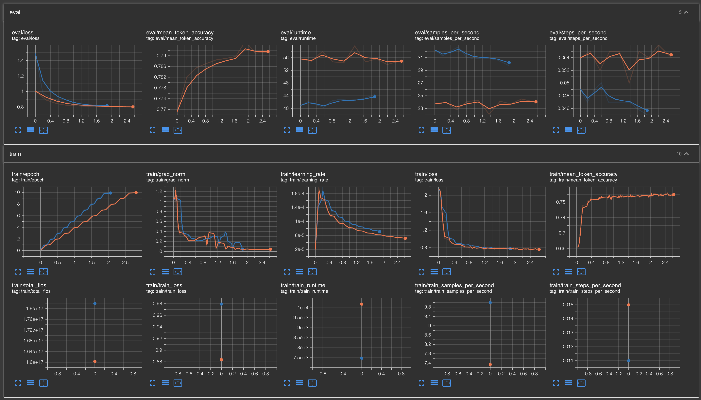

### Llama 3.3 70B Instruct - GSM8k Dataset - LoRA - 8x NVIDIA A100/80G

* Infrastructure:
  * OpenShift AI 2.17
  * 8x NVIDIA-A100-SXM4-80GB
* Configuration:
    ```yaml
    # Model
    model_name_or_path: meta-llama/Llama-3.3-70B-Instruct
    model_revision: main
    torch_dtype: bfloat16
    attn_implementation: flash_attention_2
    use_liger: true

    # PEFT / LoRA
    use_peft: true
    lora_r: 16
    lora_alpha: 8
    lora_dropout: 0.05
    lora_target_modules: ["q_proj", "v_proj", "k_proj", "o_proj", "gate_proj", "up_proj", "down_proj"]
    lora_modules_to_save: []

    # QLoRA (BitsAndBytes)
    load_in_4bit: false
    load_in_8bit: false

    # Dataset
    dataset_name: gsm8k
    dataset_config: main

    # SFT
    max_seq_length: 2048
    packing: false

    # Training
    per_device_train_batch_size: 32
    per_device_eval_batch_size: 32

    bf16: true
    tf32: false

    learning_rate: 2.0e-4
    warmup_steps: 10
    lr_scheduler_type: inverse_sqrt

    optim: adamw_torch_fused
    max_grad_norm: 1.0

    # FSDP
    fsdp: "full_shard auto_wrap"
    fsdp_config:
      activation_checkpointing: true
    ```
* Job:
    ```yaml
    num_workers: 8
    num_procs_per_worker: 1
    resources_per_worker:
      "nvidia.com/gpu": 1
      "memory": 256Gi
      "cpu": 4
    base_image: quay.io/modh/training:py311-cuda121-torch241
    env_vars:
      "PYTORCH_CUDA_ALLOC_CONF": "expandable_segments:True"
      "NCCL_DEBUG": "INFO"
    ```
* Metrics:
    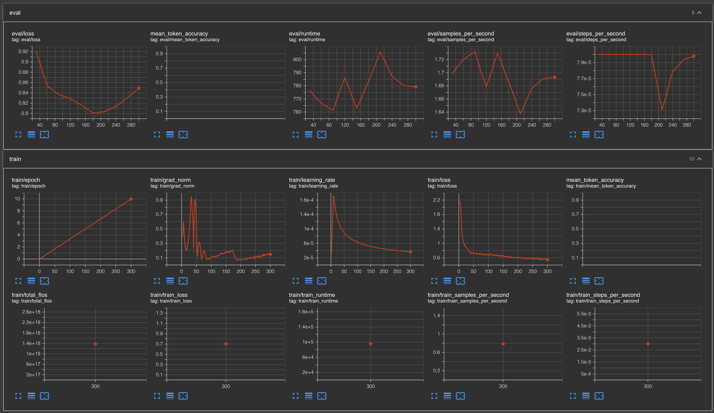
