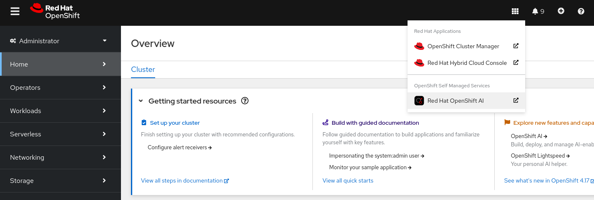
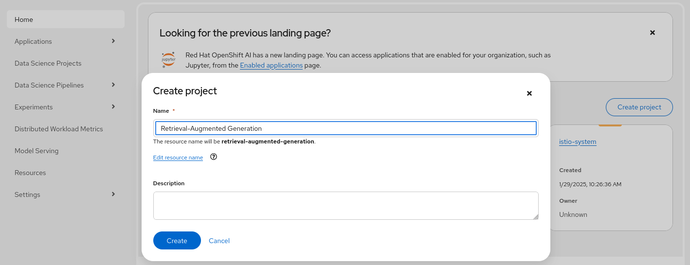
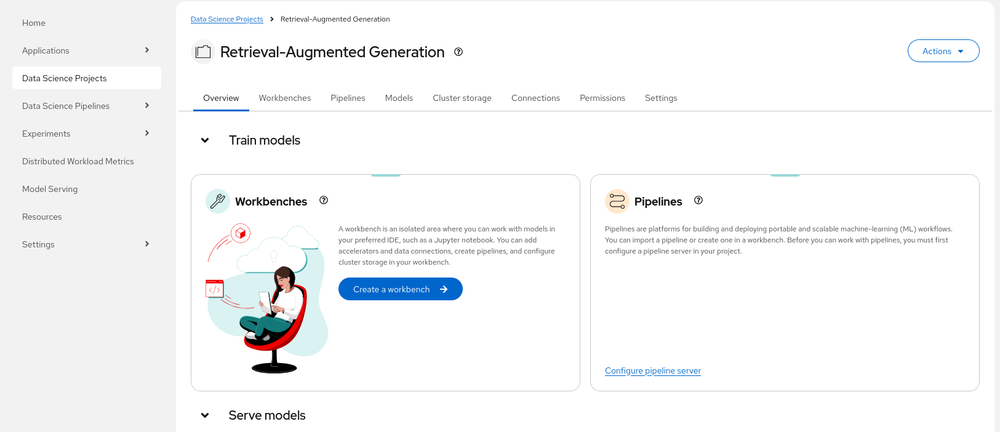
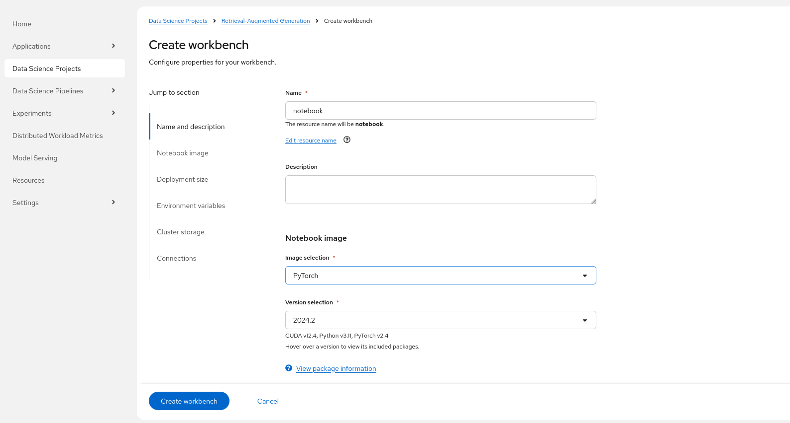
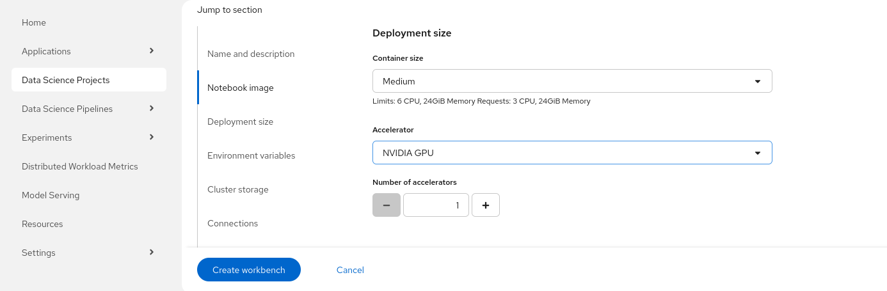
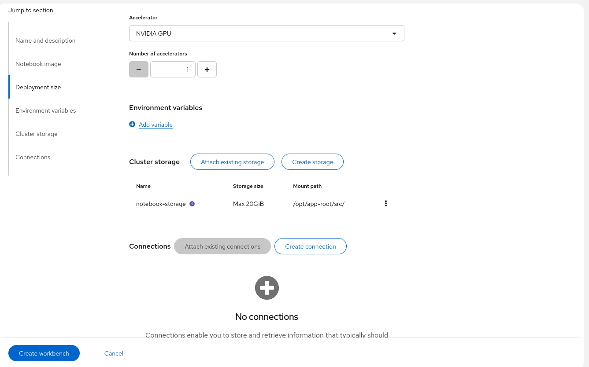
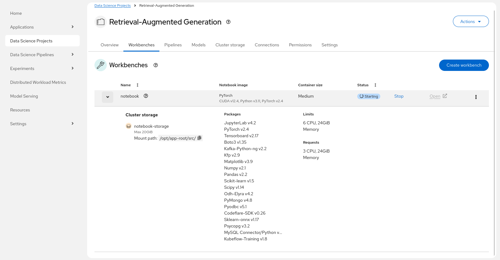

# Retrieval-Augmented Generation on OpenShift AI

These examples show how a user can run Retrieval-Augmented Generation using Jupyter Notebooks provided by OpenShift AI.

The huggingface_rag example is based on this HuggingFace blog post - https://huggingface.co/blog/ngxson/make-your-own-rag

## Requirements

* An OpenShift cluster with OpenShift AI (RHOAI) 2.17+ installed:
  * The `dashboard` and `workbenches` components enabled
* Sufficient worker node to run workbench with NVIDIA GPUs (Ampere-based or newer recommended) or AMD GPUs (AMD Instinct MI300X or newer recommended)

## Setup

* Access the OpenShift AI dashboard, for example from the top navigation bar menu:

* Log in, then go to _Data Science Projects_ and create a project:

* Once the project is created, click on _Create a workbench_:

* Then create a workbench with the following settings:
    * Select the `PyTorch` (or the `ROCm-PyTorch`) notebook image:
    
    * Select the `Medium` container size and add an accelerator:
    
    * Keep the default 20GB workbench storage, it is enough to run the inference from within the workbench:
    * Review the configuration and click "Create workbench":
    
* From "Workbenches" page, click on _Open_ when the workbench you've just created becomes ready:

* From the workbench, clone this repository, i.e., `https://github.com/opendatahub-io/distributed-workloads.git`
* Navigate to the `distributed-workloads/examples/rag-llm` directory and open one of available notebooks

You can now proceed with the instructions from the notebook. Enjoy!