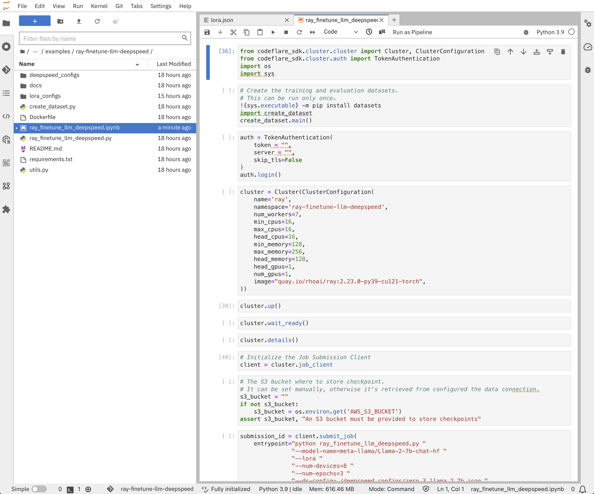

# Fine-Tune Llama 2 Models with Ray and DeepSpeed on OpenShift AI

This example demonstrates how to fine-tune LLMs with Ray on OpenShift AI, using HF Transformers, Accelerate, PEFT (LoRA), and DeepSpeed, for Llama 2 models.
It adapts the _Fine-tuning Llama-2 series models with Deepspeed, Accelerate, and Ray Train TorchTrainer_[^1] example from the Ray project, so it runs using the Distributed Workloads stack, on OpenShift AI.

> [!IMPORTANT]
> This example has been tested with the configurations listed in the [validation](#validation) section.
> Its configuration space is highly dimensional, with application configuration tighly coupled to runtime / hardware configuration.
> It is your responsibility to adapt it, and validate it works as expected, with your configuration(s), on your target environment(s).

## Requirements

* An OpenShift cluster with OpenShift AI (RHOAI) 2.10+ installed:
  * The `codeflare`, `dashboard`, `ray` and `workbenches` components enabled;
* Sufficient worker nodes for your configuration(s) with Nvidia GPUs (Ampere-based recommended);
* An AWS S3 bucket to store experimentation results.

## Setup

* Access the OpenShift AI dashboard, for example from the top navigation bar menu:

* Log in, then go to _Data Science Projects_ and create a project:

* Once the project is created, click on _Create a workbench_:

* Then create a workbench with the following settings:


> [!NOTE]
> You can reuse an existing data connection, if you have one already configured for S3.
* And click on _Open_ when it's ready:

* From the Notebook server, clone this repository, i.e., `https://github.com/opendatahub-io/distributed-workloads.git`:

* Navigate to the `distributed-workloads/examples/ray-finetune-llm-deepspeed` directory and open the `ray-finetune-llm-deepspeed` notebook:

* Finally, change the connection parameters for the CodeFlare SDK.

## Experimentation

Once you've reviewed your setup is correct, you can execute the notebook step-by-step.
It creates a Ray cluster, and submits the fine-tuning job to it.

Once you've run the `cluster.details()` command, it prints the Ray cluster dashboard URL, that you can click to access the UI:


You can also setup [TensorBoard](https://github.com/tensorflow/tensorboard) to visualise your training experiments, as you change hyper-parameters, by running the following commands from a terminal:

* Install TensorBoard in the Ray head node:
    ```console
    kubectl exec `kubectl get pod -l ray.io/node-type=head -o name` -- pip install tensorboard
    ```
* Start TensorBoard server:
    ```console
    kubectl exec `kubectl get pod -l ray.io/node-type=head -o name` -- tensorboard --logdir /tmp/ray --bind_all --port 6006"
    ```
    Note: You may need to install `tb-nightly` instead of `tensorboard` during the interim a version compatible with NumPy 2 is released.
    See https://github.com/tensorflow/tensorboard/issues/6869.
* Port-foward the TensorBoard UI endpoint:
    ```console
    kubectl port-forward `kubectl get pod -l ray.io/node-type=head -o name` 6006:6006
    ```

You can then access TensorBoard from your Web browser at http://localhost:6006.

Here is an example of a visualization, that compares experimentations with different combinations of context length and batch size:


> [!IMPORTANT]
> TensorBoard is not part of OpenShift AI.

By default, at the end of each epoch, the checkpoints are stored in the configured S3 bucket, e.g.:


## Validation

This example has been validated on the following configurations:

### Llama 2 7B - GSM8k - LoRA

* OpenShift cluster:
  * ROSA-hosted 4.14.20
  * 6 `g5.8xlarge` (A10 Nvidia GPU) worker nodes
* Ray cluster:
    ```python
    ClusterConfiguration(
        num_workers=5,
        min_cpus=8,
        max_cpus=8,
        head_cpus=16,
        min_memory=48,
        max_memory=48,
        head_memory=48,
        head_gpus=1,
        num_gpus=1,
    )
    ```
* Ray job:
    ```python
    ray_finetune_llm_deepspeed.py "
        "--model-name=meta-llama/Llama-2-7b-chat-hf "
        "--ds-config=./deepspeed_configs/zero_3_llama_2_7b.json "
        "--lora "
        "--num-devices=6 "
        "--batch-size-per-device=16 "
        "--eval-batch-size-per-device=32 "
    ```

### Llama 2 13B - GSM8k - LoRA

* OpenShift cluster:
  * ROSA-hosted 4.14.20
  * 6 `g5.8xlarge` (A10 Nvidia GPU) worker nodes
* Ray cluster:
    ```python
    ClusterConfiguration(
        num_workers=5,
        min_cpus=8,
        max_cpus=8,
        head_cpus=16,
        min_memory=48,
        max_memory=48,
        head_memory=48,
        head_gpus=1,
        num_gpus=1,
    )
    ```
* Ray job:
    ```python
    ray_finetune_llm_deepspeed.py "
        "--model-name=meta-llama/Llama-2-13b-chat-hf "
        "--ds-config=./deepspeed_configs/zero_3_llama_2_13b.json "
        "--lora "
        "--num-devices=6 "
        "--batch-size-per-device=16 "
        "--eval-batch-size-per-device=32 "
    ```

### Llama 2 70B - GSM8k - LoRA

* OpenShift cluster:
  * DGX A100 Server (8x A100 / 40GB HBM)
* Ray cluster:
    ```python
    ClusterConfiguration(
        num_workers=7,
        min_cpus=16,
        max_cpus=16,
        head_cpus=16,
        min_memory=128,
        max_memory=128,
        head_memory=128,
        head_gpus=1,
        num_gpus=1,
    )
    ```
* Ray job:
    ```python
    ray_finetune_llm_deepspeed.py "
        "--model-name=meta-llama/Llama-2-70b-chat-hf "
        "--ds-config=./deepspeed_configs/zero_3_llama_2_70b.json "
        "--lora "
        "--num-devices=8 "
        "--batch-size-per-device=8 "
        "--eval-batch-size-per-device=8 "
    ```


[^1]: https://github.com/ray-project/ray/tree/master/doc/source/templates/04_finetuning_llms_with_deepspeed
