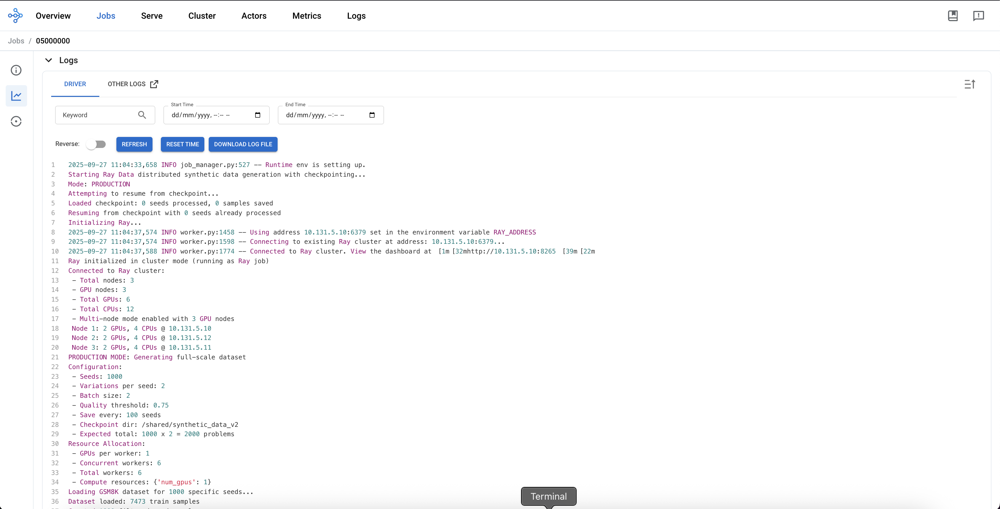

# Distributed ML Pipeline: Ray Data + Kubeflow Training

End-to-end distributed ML pipeline combining **Ray Data processing** with **Kubeflow Training** for scalable synthetic data generation and model fine-tuning.

## Pipeline Overview

**Phase 1: Ray Data Processing**

**Phase 2: Distributed Training**

**Phase 3: Monitoring & Evaluation**

**Phase 4: Inference Testing**

```
GSM8K Dataset --> Ray Cluster --> Synthetic Data Generation --> PyTorchJob -->  Model Finetuning --> Model monitoring and evaluation --> Inference Test
(7.5K samples)    (Qwen1.5B)          (300+ problems)        (Granite-3.1-2B)   (LoRA adapters)              (TensorBoard)                (Comparison)
```

```
┌─────────────────────────────────────────────────────────────────────────────────────┐
│              Distributed ML Pipeline: Ray Data + Kubeflow Training                  │
└─────────────────────────────────────────────────────────────────────────────────────┘
┌─────────────────┐
│   GSM8K Dataset │
│  7.5K Problems  │
└─────────┬───────┘
          ▼
┌─────────────────────────────────────────────────────────────────────────────────────┐
│                      PHASE 1: Ray Data Processing                                   │
│                            (CodeFlare SDK)                                          │
├─────────────────────────────────────────────────────────────────────────────────────┤
│                                                                                     │
│  ┌─────────────────┐    ┌─────────────────┐    ┌─────────────────────────────────┐  │
│  │  CodeFlare SDK  │───▶│   Ray Cluster   │───▶│    Ray Data Pipeline            │  │
│  │    Cluster      │    │  Head + Workers │    │   Qwen2.5-1.5B-Instruct         │  │
│  │   Management    │    │                 │    │  • map_batches inference        │  │
│  └─────────────────┘    └─────────────────┘    │  • quality filtering            │  │
│                                                │  • streaming processing         │  │
│                                                │  • fault tolerance              │  │
│                                                └─────────────┬───────────────────┘  │
│                                                              │                      │
└──────────────────────────────────────────────────────────────┼───────────────────-──┘
                                                               ▼
                                    ┌─────────────────────────────────────┐
                                    │      Shared PVC Storage             │
                                    │         /shared                     │
                                    │        RWX Access                   │
                                    │                                     │
                                    │  • Models & Datasets Cache          │
                                    │  • Synthetic Data (150+ samples)    │
                                    │  • Quality Metrics & Metadata       │
                                    │  • Training Checkpoints             │
                                    └─────────────┬───────────────────────┘
                                                  ▼
┌─────────────────────────────────────────────────────────────────────────────────────┐
│                      PHASE 2: Distributed Training                                  │
│                           (kubeflow-training SDK)                                   │
├─────────────────────────────────────────────────────────────────────────────────────┤
│                                                                                     │
│  ┌─────────────────┐    ┌─────────────────┐    ┌─────────────────────────────────┐  │
│  │ kubeflow-       │───▶│   PyTorchJob    │───▶│    IBM Granite 3.1-2B           │  │
│  │ training SDK    │    │   Multi-node    │    │     + LoRA Adapters             │  │
│  │ Job Management  │    │    Training     │    │   (Fine-tuning Process)         │  │
│  └─────────────────┘    └─────────────────┘    └─────────────-┬──────────────────┘  │
│                                                               │                     │
└───────────────────────────────────────────────────────────────┼─────────────────────┘
                                                                ▼
                                    ┌────────────────────────────────┐
                                    │       Fine-tuned Model         │
                                    │        Math Reasoning          │
                                    │         Capabilities           │
                                    └────────────────────────────────┘

Key Components:
━━━━━━━━━━━━━━━
• Data Flow: GSM8K → Ray Processing → Shared Storage → Training → Model
• Storage: Persistent Volume Claim with ReadWriteMany (RWX) access
• Phase 1: Distributed synthetic data generation using Ray workers
• Phase 2: Multi-node GPU training with PyTorchJob and LoRA fine-tuning
• Models: Qwen2.5-1.5B for generation, IBM Granite 3.1-2B for training
```
### Prerequisites
- Red Hat OpenShift AI 2.17+ installed
- NVIDIA and Node Feature Discovery Operator installed
- In Openshift AI's DataScienceCluster resource - CodeFlare and Kubeflow Training operator (KFTO-V1) enabled/managed
- A persistent shared storage with RWX(ReadWriteMany) access.
    - Workbench Notebook pod: `/opt/app-root/src/shared`
    - RayCluster pods : `/shared`
    - PyTorchJob pods : `/shared`
- Compute resources: 4+ CPU cores, 8GB+ RAM per worker node
- GPU support (optional): NVIDIA GPUs for accelerated training

## Pipeline Details

**Phase 1: Ray Data Processing**
- Uses CodeFlare SDK to deploy Ray cluster
- Loads GSM8K dataset as seed problems
- Generates synthetic math problems using Qwen2.5-1.5B-Instruct
- Quality filtering and deduplication
- Saves to `/shared/synthetic_data/`

**Phase 2: Distributed Training** 
- Uses kubeflow-training SDK to create PyTorchJob
- Fine-tunes IBM Granite-3.1-2B-Instruct with LoRA adapters
- Multi-node distributed training with FSDP
- Saves model to `/shared/models/`

**Phase 3: TensorBoard Monitoring**
- Real-time training metrics visualization
- Loss curves and learning rate tracking

**Phase 4: Model Testing**
- Loads both original and fine-tuned models
- Side-by-side comparison on test problems
- Performance metrics and accuracy analysis


## Files

| File | Description |
|------|-------------|
| `1_ray_sdg.ipynb` | **Phase 1**: Ray cluster setup and synthetic data generation |
| `2_kft_training.ipynb` | **Phase 2**: Distributed training with PyTorchJob |
| `3_tensorboard_monitoring.ipynb` | **Phase 3**: TensorBoard monitoring and training metrics |
| `4_test_inference.ipynb` | **Phase 4**: Model comparison and inference testing |
| `scripts/ray_sdg_job.py` | Ray Data pipeline for distributed synthetic data generation |
| `scripts/kft_granite_training.py` | Training function for IBM Granite model fine-tuning |

## Quick Start

1. **Run notebooks in sequence:**
   - `1_ray_sdg.ipynb` → Generate synthetic math problems using Ray Data
   - `2_kft_training.ipynb` → Fine-tune Granite model with PyTorchJob  
   - `3_tensorboard_monitoring.ipynb` → Monitor training progress with TensorBoard
   - `4_test_inference.ipynb` → Compare original vs fine-tuned model performance

2. **Standalone Ray Data generation:**
   ```bash
   # Test mode (2 problems, ~15s)
   python scripts/ray_sdg_job.py --test-mode
   
   # Production mode (150+ problems, ~30min)
   python scripts/ray_sdg_job.py --seeds 50 --variations 3
   ```

## Why Ray Data?

Ray Data is specifically designed for distributed ML inference workloads:
- **GPU Optimization**: Concurrent CPU preprocessing + GPU inference, maximizing resource utilization
- **Scalable Processing**: Handles thousands of samples across heterogeneous clusters with fault tolerance
- **Streaming Execution**: Memory-efficient processing of large datasets without loading everything into memory
- **ML-Native**: Built-in `map_batches()` API for distributed model inference with stateful operations
- **Production Ready**: Automatic retries, checkpointing, and monitoring capabilities

### Comparison with Alternatives

| Feature | Ray Data | Apache Spark | Dask |
|---------|----------|--------------|------|
| **GPU Support** | Native, optimized | Limited | Basic |
| **ML Integration** | Built-in | External libraries | External |
| **Streaming** | Native streaming | Micro-batching | Task-based |
| **Fault Tolerance** | Automatic retry | RDD lineage | Task retry |
| **Memory Efficiency** | Streaming execution | Memory-intensive | Memory-aware |

*References: [Ray Data Overview](https://docs.ray.io/en/latest/data/overview.html), [Performance Guide](https://docs.ray.io/en/latest/data/performance-tips.html)*

## Screenshots

### Ray Job Execution


*Ray cluster processing synthetic data generation*


*GPU utilization during Ray Data processing*


*Successful completion of Ray job*

### Training Monitoring


*Training loss and learning rate curves*


### References
- [CodeFlare SDK](https://github.com/project-codeflare/codeflare-sdk): Kubernetes-native distributed computing
- [Ray Documentation](https://docs.ray.io/): Distributed computing framework
- [kubeflow-training SDK](https://github.com/kubeflow/training-operator): Kubernetes-native ML training
- [IBM Granite Models](https://huggingface.co/ibm-granite/granite-3.1-2b-instruct): Enterprise LLM family