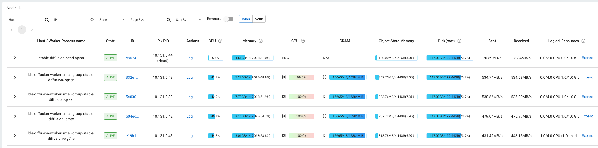
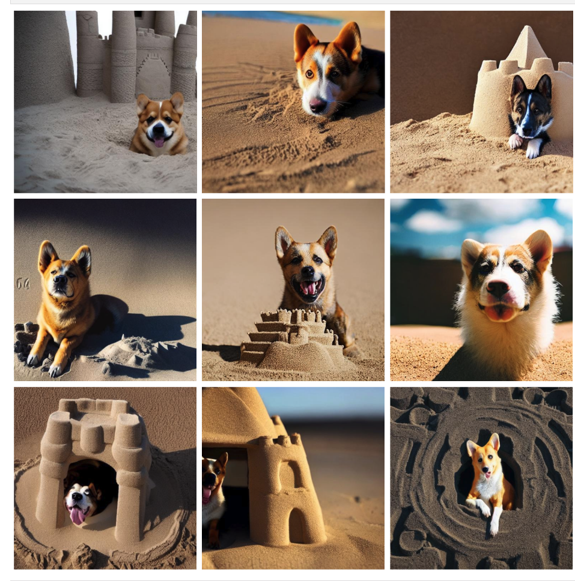
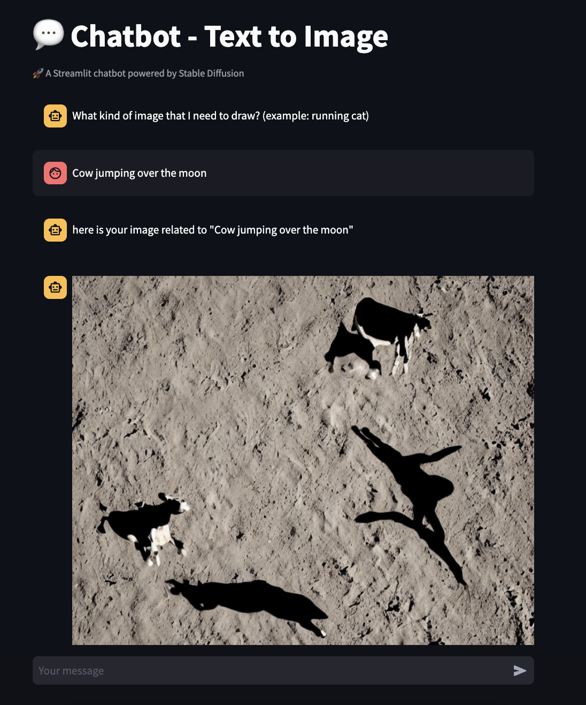

## Introduction

This example demostrate how to fine tune Stable Diffusion with DreamBooth and Ray Train using OpenShift AI.  

## Credits

The example codes are from:
1. [Ray dreambooth finetuning](https://docs.ray.io/en/latest/train/examples/pytorch/dreambooth_finetuning.html)
1. [Ray Train Stable Diffussion Notebook](https://github.com/GoogleCloudPlatform/ai-on-gke/blob/main/ray-on-gke/examples/notebooks/raytrain-stablediffusion.ipynb)

## Overview 

In this example, a workbench will be automatically created with a few notebooks to explore [Ray](https://docs.ray.io/en/latest/index.html). 

[Kueue](https://kueue.sigs.k8s.io/docs/overview/) is used in the example and has native integeration with RayJob and RayCluster.

| Name | Description |
| -------------------- | ----------- |
| [Introduction](notebook/00%20Intro.ipynb) | A simple demostration of the ray remote function         |
| [Ray Train with Stable Diffusion](notebook/01%20raytrain-stablediffusion.ipynb) | Using Ray Train to distribute training
| [Archiving and uploading model](notebook/02%20raytrain-stablediffusion-upload-model.ipynb) | Using Torch model archiver and upload to S3 bucket
| [Serving using KServe](notebook/03%20raytrain-stablediffusion-model-serving.ipynb) | Setting up KServe with PyTorch |
| [Text-to-Image Chatbot](notebook/04%20raytrain-stablediffusion-streamlit.ipynb) | Deploying Streamlit chat app 

## Prerequisite

* Ensure there is at least 1 worker node that has a GPU. On AWS, this can be a p3.8xlarge instance, otherwise you can run the makefile target to add a `machineset` for a single replica of p3.8xlarge.

> [!NOTE]  
> Not all p3 instances are available in every availabilty zones. You can run the following command to check:
> ```bash 
> aws ec2 describe-instance-type-offerings --location-type availability-zone --filters Name=instance-type,Values=p3.8xlarge --region <region>
> ```

  ```bash
  make add-gpu-machineset
  ```

  Taint the GPU node
  ```bash
  oc adm taint nodes <gpu-node> nvidia.com/gpu=Exists:NoSchedule
  ```

* Ensure there is a RWX available storage class, such as `
ocs-storagecluster-cephfs`. The `stable-diffusion-shared-storage` pvc uses cephfs otherwise update the PVC resource. 

  You can install OpenShift Data Foundation (ODF) to achieve this. ODF will require a minimum of 3 worker nodes to start with. 

  ```bash
  make deploy-odf
  ```

  The CSI plugin daemonset will have to be updated to tolerate the GPU taint. 

  ```bash
  oc apply -f yaml/operators/rook-ceph-operator-config.yaml
  ```

  ```yaml
  data:
    CSI_PLUGIN_TOLERATIONS: |-
      - key: nvidia.com/gpu
        operator: Exists
        effect: NoSchedule
  ```

## Setup
Install OpenShift AI using the OpenShift AI Operator. This install the latest version from the fast channel.

```bash
make install-openshift-ai
```

## Setting Up the Demo

Run the makefile target. This creates a Data Science Project called `distributed` with the following
* A CephFS RWX PVC
* A single workbench with the git repository already cloned inside
* Kueue will be configured. A `LocalQueue` in the project that uses the `distributed-cq` ClusterQueue

> [!WARNING]  
> The setup script will delete all clusterqueues and resourceflavors in the cluster.

```bash
make setup-ray-distributed-training
```

## Running the Examples

In the workbench, navigate to `distributed-workloads/examples/stable-diffusion-dreambooth/notebook` to begin exploring the notebooks.

### Fine-tune of Stable Diffusion with DreamBooth and Ray Train

The `01 raytrain-stablediffusion.ipynb` notebook provides various steps from the Ray docs [example](https://docs.ray.io/en/latest/train/examples/pytorch/dreambooth_finetuning.html#step-5-generate-images-of-the-subject) and will create a Ray cluster with 4 workers with 1 GPU each to run the jobs.

The Ray cluster is using a [yaml](notebook/raycluster.yaml) definition, instead of the CodeFlare SDK because of the current lack of [volume mount](https://github.com/project-codeflare/codeflare-sdk/pull/554) support in `ClusterConfiguration`.

Once a Ray cluster has been created, you can login with your user account to the dashboard to view the Ray job and Cluster details. The dashboard is integrated with OpenShift OAuth



Once the model hase been fine tuned, you can [generate](https://docs.ray.io/en/latest/train/examples/pytorch/dreambooth_finetuning.html#step-5-generate-images-of-the-subject) your images which is provided in the notebook.

```bash
  python generate.py \
    --model_dir=$TUNED_MODEL_DIR \
    --output_dir=$IMAGES_NEW_DIR \
    --prompts="$YOUR_PROMPT" \
    --num_samples_per_prompt=9 \
    --use_ray_data
```    

The images will be shown using `matplotlib`.



### Uploading and Serving the Model Using KServe

* `02 raytrain-stablediffusion-upload-model.ipynb` uploads the tuned model to a local S3 bucket.
* `03 raytrain-stablediffusion-model-serving.ipynb` sets up KServe with PyTorch

### Interacting with the Model with an App

Use `04 raytrain-stablediffusion-streamlit.ipynb` to build the [Streamlit app](app/app.py) using OpenShift. OpenShift provides several ways to build you app to integerate with the model serving.

The demo uses the oc [cli](https://docs.openshift.com/container-platform/4.15/applications/creating_applications/creating-applications-using-cli.html) with a source build strategy from a git repository to build the application. A [BuildConfig](https://docs.openshift.com/container-platform/4.15/cicd/builds/understanding-image-builds.html) is created. A BuildConfig object is the definition of the entire build process and defines the Source-to-Image (S2I) build. 

Once the app is deployed, you can access it via the route.

