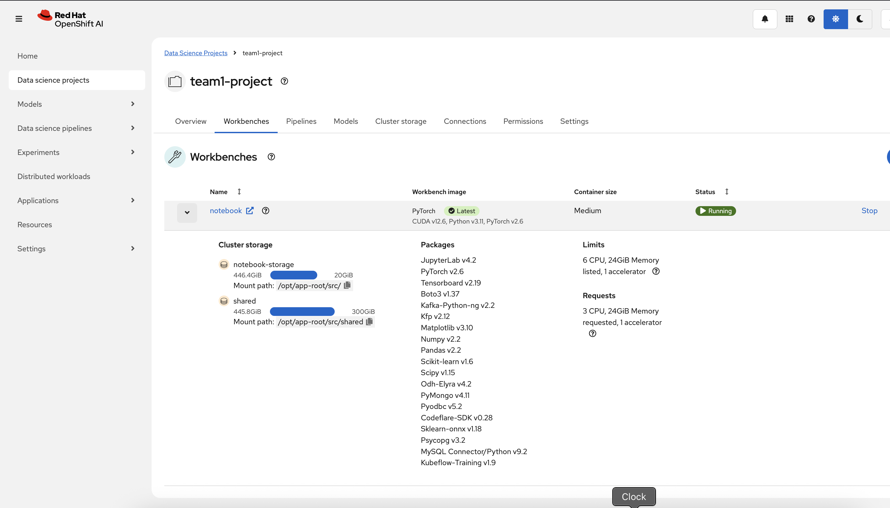
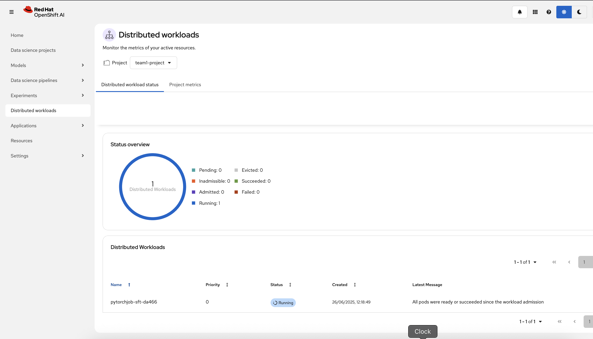
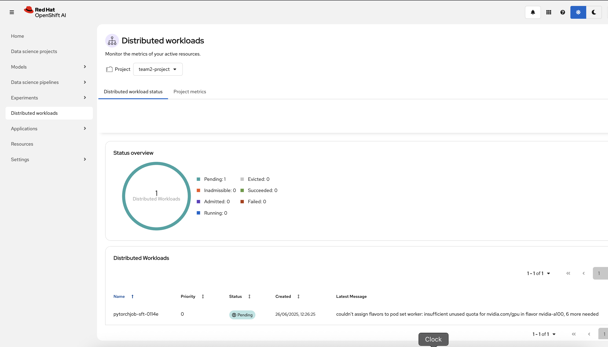
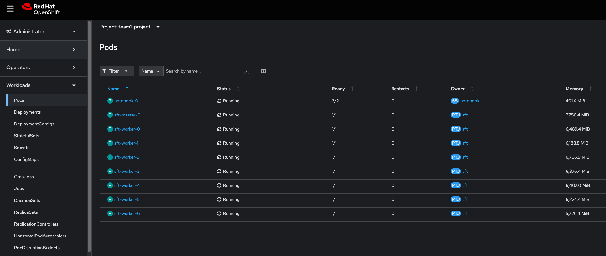
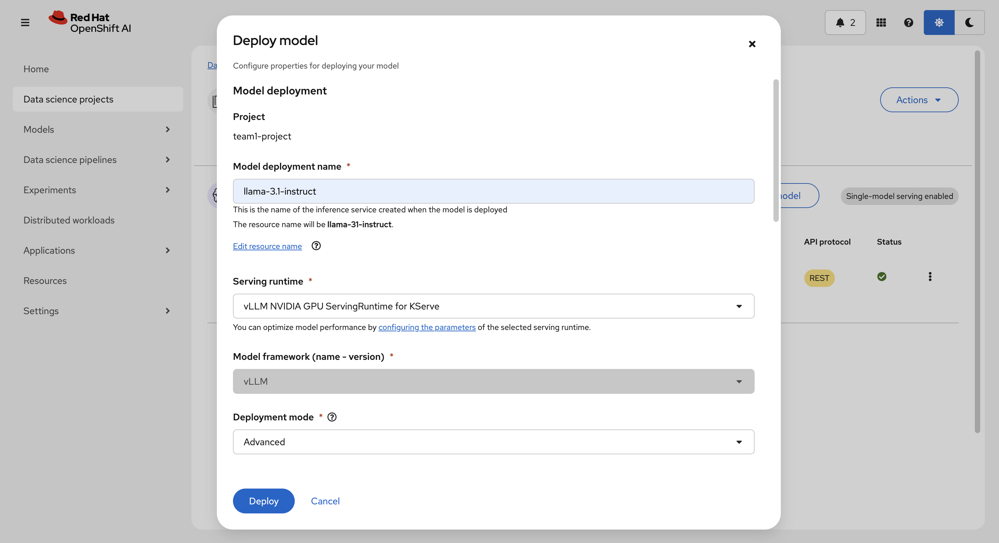
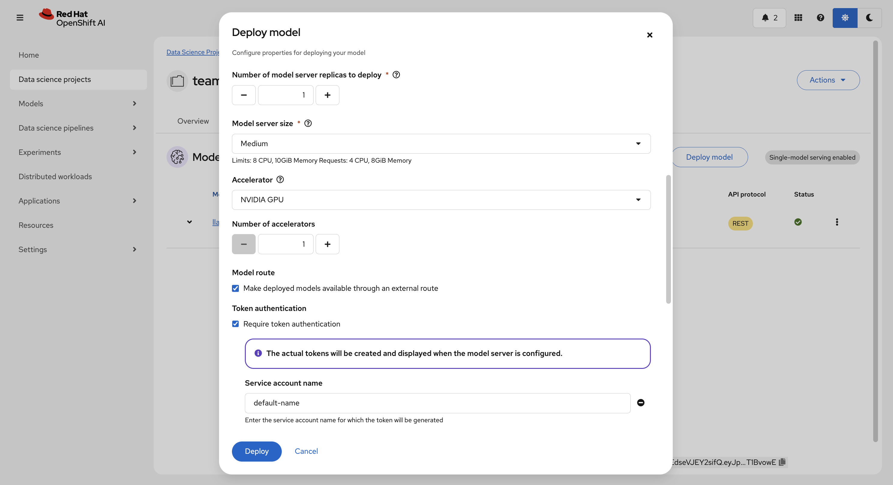
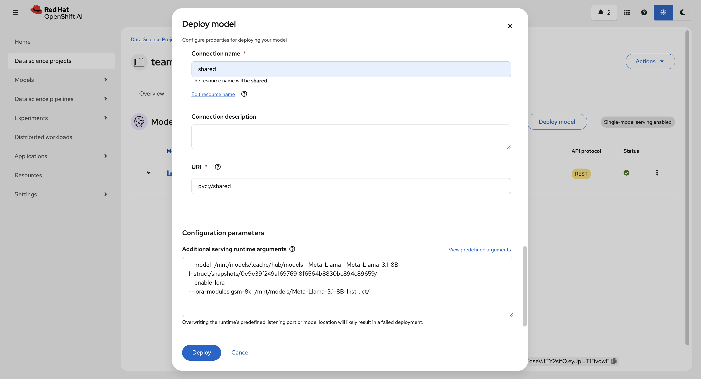
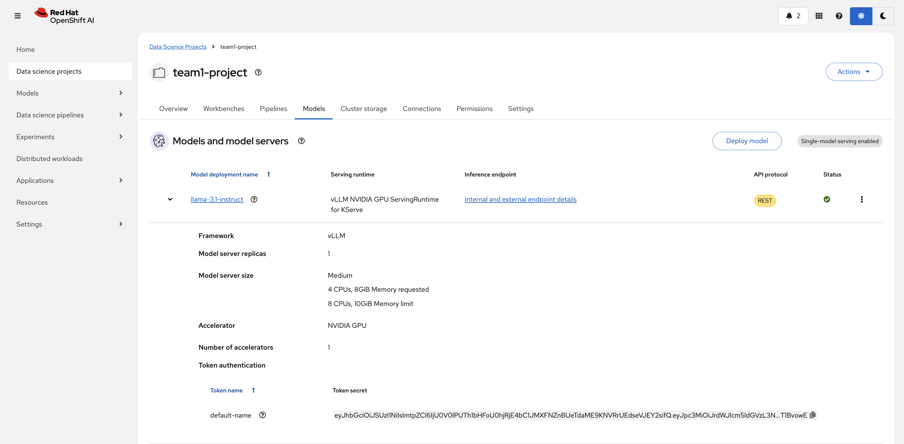

# Kueue Multi-Team Resource Management Workshop

This workshop demonstrates how to use Kueue for multi-team GPU resource management and workload scheduling on OpenShift AI. Using complete ML workflows as practical demonstrations, you'll learn how to:
- Configure Kueue for enterprise-grade resource sharing and quotas
- Set up teams with different resource quota allocation strategies but flexible GPU access
- Implement borrowing and preemption policies between teams
- Manage workload priorities and scheduling strategies for training and inference
- Monitor resource usage across teams using distributed ML workloads

The workshop uses Large Language Model fine-tuning with Kubeflow Training Operator to demonstrate real-world GPU-intensive workloads and resource contention scenarios.

## Kueue Resource Architecture

The following diagram illustrates ideal Kueue resource management for multi-team ML workflows with different allocation strategies:

```
Kueue Resource Hierarchy - Workshop Configuration
================================================

Resource Layer (Hardware Abstraction)
├── ResourceFlavor: nvidia-a100-80gb
│   └── Node Labels: NVIDIA-A100-SXM4-80GB
└── ResourceFlavor: nvidia-h100-80gb
    └── Node Labels: NVIDIA-H100-80GB-HBM3

Organization Layer (Cohort: "organization")
├── ClusterQueue: team1 (ML Team A)
│   ├── Quota: 8x A100 + 2x H100 GPUs, 80 CPU, 1280Gi Memory
│   ├── Preemption: Can reclaim from cohort
│   └── Borrowing: Can use unused team2 resources ←────────────┐
│                                                              │
└── ClusterQueue: team2 (ML Team B)                            │
    ├── Quota: 4x A100 + 6x H100 GPUs, 80 CPU, 1280Gi Memory   │
    ├── Preemption: Can reclaim from cohort                    │
    └── Borrowing: Can use unused team1 resources ←────────────┘

Organization
├── Team 1: (→ team1 ClusterQueue)
│   ├── team1-alpha (Project) → team1 (LocalQueue) → PyTorchJob: training
│   └── team1-beta (Project) → team1 (LocalQueue) → PyTorchJob: inference
│
└── Team 2: (→ team2 ClusterQueue)
    ├── team2-alpha (Project) → team2 (LocalQueue) → PyTorchJob: training
    └── team2-beta (Project) → team2 (LocalQueue) → PyTorchJob: inference


Queue Relationship:
==================
team1-alpha (Project) ─┐
team1-beta (Project)  ─┤─→ team1 (ClusterQueue) → nvidia-a100-80gb + nvidia-h100-80gb

team2-alpha (Project) ─┐
team2-beta (Project)  ─┤─→ team2 (ClusterQueue) → nvidia-a100-80gb + nvidia-h100-80gb

Note: Both teams have access to both GPU types based on:
- Team quota allocation (Team1: 8xA100+2xH100, Team2: 4xA100+6xH100)
- Job requirements (nodeSelector specification)
- Resource availability and borrowing policies


Key Concepts:
=============
┌────────────────────────────────────────────────────────────────────────────────────────┐
│                                Basic Components                                        │
├────────────────────────────────────────────────────────────────────────────────────────┤
│ ResourceFlavor │ Defines hardware characteristics and node labels                      │
│                │ (e.g., NVIDIA A100-80GB, NVIDIA H100-80GB)                            │
├────────────────┼───────────────────────────────────────────────────────────────────────┤
│ ClusterQueue   │ Team-level resource pool with quotas, policies, and                   │
│                │ scheduling strategies                                                 │
├────────────────┼───────────────────────────────────────────────────────────────────────┤
│ LocalQueue     │ Project-level proxy/access-point that connects to team's ClusterQueue │
├────────────────┼───────────────────────────────────────────────────────────────────────┤
│ Project        │ Kubernetes namespace for multi-tenancy within teams                   │
│                │ (main organizing principle for workload separation)                   │
├────────────────┼───────────────────────────────────────────────────────────────────────┤
│ Workload       │ Actual job submission (PyTorchJob, Job, etc.) that gets queued        │
│                │ and scheduled                                                         │
└────────────────────────────────────────────────────────────────────────────────────────┘

┌────────────────────────────────────────────────────────────────────────────────────────┐
│                              Resource Management                                       │
├────────────────────────────────────────────────────────────────────────────────────────┤
│ Cohort         │ Shared resource pool allowing multiple ClusterQueues to borrow        │
│                │ from each other                                                       │
├────────────────┼───────────────────────────────────────────────────────────────────────┤
│ Quota          │ Guaranteed resource allocation per ClusterQueue                       │
│                │ (e.g., Team1: 8 A100 + 2 H100, 80 CPU, 1280Gi Memory)                 │
├────────────────┼───────────────────────────────────────────────────────────────────────┤
│ Borrowing      │ Using unused resources from other ClusterQueues in the same           │
│                │ cohort                                                                │
├────────────────┼───────────────────────────────────────────────────────────────────────┤
│ Preemption     │ Forcefully stopping jobs to free up resources for higher              │
│                │ priority workloads                                                    │
└────────────────────────────────────────────────────────────────────────────────────────┘

┌────────────────────────────────────────────────────────────────────────────────────────┐
│                            Scheduling Policies                                         │
├────────────────────────────────────────────────────────────────────────────────────────┤
│ BestEffortFIFO              │ Fair scheduling strategy that processes jobs in order    │
│                             │ while considering resource availability                  │
├─────────────────────────────┼──────────────────────────────────────────────────────────┤
│ reclaimWithinCohort: Any    │ Can preempt any workload in the cohort to reclaim        │
│                             │ resources                                                │
├─────────────────────────────┼──────────────────────────────────────────────────────────┤
│ borrowWithinCohort: Never   │ Cannot preempt other teams' workloads to borrow          │
│                             │ resources                                                │
├─────────────────────────────┼──────────────────────────────────────────────────────────┤
│ withinClusterQueue:         │ Can preempt lower/equal priority jobs within the         │
│ LowerOrNewerEqualPriority   │ same team                                                │
└────────────────────────────────────────────────────────────────────────────────────────┘

┌────────────────────────────────────────────────────────────────────────────────────────┐
│                               Workload States                                          │
├────────────────────────────────────────────────────────────────────────────────────────┤
│ Pending   │ Job submitted but waiting for resources                                    │
├───────────┼────────────────────────────────────────────────────────────────────────────┤
│ Admitted  │ Job accepted and resources reserved                                        │
├───────────┼────────────────────────────────────────────────────────────────────────────┤
│ Running   │ Job actively executing on allocated resources                              │
├───────────┼────────────────────────────────────────────────────────────────────────────┤
│ Finished  │ Job completed successfully or failed                                       │
└────────────────────────────────────────────────────────────────────────────────────────┘


Resource Flavor Selection Flow:
==============================
┌─────────────────────────────┐
│ PyTorchJob                  │
│                             │
│ nodeSelector:               │
│   nvidia.com/gpu.product:   │────┐
│   "NVIDIA-A100-SXM4-80GB"   │    │
│                             │    │
│ tolerations:                │    │   ┌─────────────────────────────────┐
│   - key: nvidia.com/gpu     │    │   │        Kueue Scheduler          │
└─────────────────────────────┘    ├──>┤                                 │──> nvidia-a100-80gb flavor
                                       │ 1. Examines workload specs      │    (uses team quota)
┌─────────────────────────────┐        │ 2. Matches nodeSelector         │
│ PyTorchJob                  │        │ 3. Checks available quota       │
│                             │        │ 4. Schedules on matching nodes  │
│ nodeSelector:               │    │──>│                                 │──> nvidia-h100-80gb flavor
│   nvidia.com/gpu.product:   │    │   │                                 │    (uses team quota)
│   "NVIDIA-H100-80GB-HBM3"   │    |   └─────────────────────────────────┘
│                             │────┘
│ tolerations:                │
│   - key: nvidia.com/gpu     │
└─────────────────────────────┘

Note: Both team1-alpha and team1-beta projects can use either GPU type based on:
- Job requirements (nodeSelector)
- Available quota in team1 ClusterQueue
- Current resource availability

Multi-Project Scenarios:
=======================
Basic Multi-Tenant Resource Sharing:
1. Team1 runs training job in team1-alpha-project → Uses GPUs from team1 ClusterQueue quota
2. Team2 runs inference job in team2-beta-project → Uses GPUs from team2 ClusterQueue quota  
3. Team1 needs inference capacity in team1-beta-project → Uses available GPUs from team1 quota
4. Team2 needs training capacity in team2-alpha-project → Uses available GPUs from team2 quota
5. GPU type selection depends on job nodeSelector and availability within team quotas

Advanced Multi-Tenant Scenarios:
5. Full ML lifecycle per team: Each team uses alpha projects for training, beta projects for inference
6. Cross-team borrowing: Team1 training borrows Team2's unused resources during low activity periods
7. Project-level isolation: Teams separate workloads by project while sharing team ClusterQueue resources
8. Resource reclamation: Team resources are reclaimed from any project when needed by team owner
9. Priority-based scheduling: Teams can prioritize certain projects over others within their ClusterQueue
10. Hardware optimization: Teams route jobs to appropriate projects based on GPU requirements
11. Project-specific policies: Different resource patterns for training vs inference projects
12. Workshop scenarios: Teams demonstrate complete ML workflows with proper project-level organization

```

## Requirements

* An OpenShift cluster with admin permissions (for the setup steps)
* The `oc`, `curl`, and `git` (or equivalent) binaries installed locally
* Enough worker nodes with NVIDIA GPUs (Ampere-based or newer recommended) or AMD GPUs (AMD Instinct MI300X)
* The NFD operator and the NVIDIA GPU operator or AMD GPU operator installed and configured 
* A dynamic storage provisioner supporting RWX PVC provisioning (or see the NFS provisioner section)

## Workshop Flow

1. Set up the infrastructure (OpenShift AI, storage)
2. Configure Kueue for multi-team resource management
3. Create team projects and workbenches
4. Run fine-tuning jobs with Kubeflow Training
5. Monitor training progress with TensorBoard
6. Deploy and serve fine-tuned models

## Setup

### Install OpenShift AI

* Log into your OpenShift Web console
* Go to "Operators" > "OperatorHub" > "AI/Machine Learning"
* Select the "Red Hat OpenShift AI" operator
* Install the latest version and create a default DataScienceCluster resource

### Checkout the workshop

* Clone the following repository:
    ```console
    git clone https://github.com/opendatahub-io/distributed-workloads.git
    ```
* Change directory:
    ```console
    cd workshops/kueue
    ```

### NFS Provisioner (optional)

> [!NOTE]
> Skip this section if your cluster already has a PVC dynamic provisioner with RWX support.

* Install the NFS CSI driver:
    ```console
    curl -skSL https://raw.githubusercontent.com/kubernetes-csi/csi-driver-nfs/v4.9.0/deploy/install-driver.sh | bash -s v4.9.0 --
    ```
* Create a new project:
    ```console
    oc new-project nfs
    ```
* Deploy the in-cluster NFS server:
    ```console
    oc apply -f nfs/nfs_deployment.yaml
    ```
* Create the NFS StorageClass:
    ```console
    oc apply -f nfs/nfs_storage_class.yaml
    ```

### Configure RHOAI Storage

* Go to the OpenShift AI Dashboard (accessible from the applications menu in the top navigation bar)
* Go to "Settings" > "Storage classes"
* Check the storage class supporting RWX PVC provisioning you plan to use, or the `nfs-csi` one if created previously, is enabled

## Manage Quotas with Kueue

This workshop demonstrates how to manage resources between multiple teams using Kueue. We'll create two ClusterQueues that simulate two teams/projects with resource sharing capabilities through cohort configuration.

### Resource Flavor Setup

* Update the `nodeLabels` in the `resources/resource_flavors.yaml` file to match those of your AI worker nodes
* Apply the ResourceFlavor:
    ```console
    oc apply -f resources/resource_flavors.yaml
    ```

### Configure Team ClusterQueues

The workshop provides two pre-configured ClusterQueues (`team1` and `team2`) that demonstrate multi-team resource management with different allocation strategies:

* Team1 (ML Team A): Resource quota of 8x A100 + 2x H100 GPUs, 80 CPU, 1280Gi Memory
* Team2 (ML Team B): Resource quota of 4x A100 + 6x H100 GPUs, 80 CPU, 1280Gi Memory
* **Both teams can use either GPU type** based on job requirements (`nodeSelector`) and resource availability
* Resource quotas are calibrated for realistic kfto-sft-llm workloads (not over-provisioned)
* Both teams can perform full ML lifecycle: training, fine-tuning, inference, and serving
* Resources are managed within an organization cohort with borrowing capabilities
* Fair scheduling with BestEffortFIFO strategy

Create the ClusterQueues:
```console
oc apply -f resources/team1_cluster_queue.yaml
oc apply -f resources/team2_cluster_queue.yaml
```

### Understanding Workshop Queue Configuration

**Expected Behavior:**
* Team1 can borrow Team2's unused resources (and vice versa)
* Teams can reclaim their own resources from anywhere in the cohort
* Teams cannot use preemption to borrow beyond their nominal quota
* This balances job stability with fair resource access

**Resource Sharing Model:**
* Teams can borrow beyond their quota when other teams have unused resources
* Teams can reclaim their own resources from anywhere in the cohort when needed
* Total cluster resources: 12x A100 + 8x H100 GPUs shared within "organization" cohort
* Fair scheduling ensures no team is starved of resources

**Resource Quota Rationale:**
* **GPU Requirements**:
  * **Standard training**: kfto-sft-llm needs 8 workers × 1 GPU = 8 GPUs
  * **Large model training**: Some examples use 16 workers × 1 GPU = 16 GPUs
  * **Inference/serving**: Typically 1-6 GPUs per model instance
* **CPU/Memory Requirements**:
  * **Training jobs**: 8 workers × (4-8 CPU, 64-128Gi memory) = 32-64 CPU, 512-1024Gi
  * **Inference jobs**: 1-6 instances × (8 CPU, 128Gi memory) = 8-48 CPU, 128-768Gi
* **Team Allocations**:
  * **Team1**: 10 GPUs (8 A100 + 2 H100) can run one 8-GPU job + inference, or borrow for 16-GPU jobs
  * **Team2**: 10 GPUs (4 A100 + 6 H100) can run smaller training jobs + multiple inference instances
  * **CPU/Memory**: 80 CPU, 1280Gi provides realistic headroom without massive over-provisioning

## Set Up Team Environments

### Create Projects for Teams

Create multiple projects per team to demonstrate multi-tenancy within team resource pools:

**Team 1 Projects:**
1. Go to the OpenShift AI Dashboard
2. Go to "Data Science Projects"
3. Click "Create project"
4. Create `team1-alpha-project` (for training workloads)
5. Create `team1-beta-project` (for inference workloads)

**Team 2 Projects:**
1. Create `team2-alpha-project` (for training workloads)
2. Create `team2-beta-project` (for inference workloads)

### Create Local Queues

Create LocalQueues in each project to connect to their team's ClusterQueue. LocalQueues are simple proxies that route workloads to the appropriate team ClusterQueue:

* Team 1 Projects:
    ```console
    oc apply -f resources/team1_local_queue.yaml -n team1-alpha-project
    oc apply -f resources/team1_local_queue.yaml -n team1-beta-project
    ```

* Team 2 Projects:
    ```console
    oc apply -f resources/team2_local_queue.yaml -n team2-alpha-project
    oc apply -f resources/team2_local_queue.yaml -n team2-beta-project
    ```

> **Multi-Tenancy Architecture:**
> - **Projects = Multi-tenancy boundary**: Each team has separate projects for different workload types
> - **LocalQueues = Implementation detail**: Simple proxies that connect projects to team ClusterQueues
> - **ClusterQueues = Resource management**: Where quotas, borrowing, and scheduling policies are defined
> - **Benefits**: Project-level isolation with shared team resource pools

### Create Workbenches

For each team:

* In their project, click "Create workbench"
* Enter a name
* Select the "Pytorch" (or the `ROCm-PyTorch`) notebook image
* In "Cluster storage", click "Create storage"
* Enter `training-storage` as a name and select the storage class with RWX capability
* Enter a mount directory under `/opt/app-root/src/`
* Add one more mount directory under `/opt/app-root/src/shared` with 500GB storage size
* Click "Create workbench"
* Wait for the workbench to become ready and then open it



## Fine-Tune Llama 3.1 with Kubeflow Training

### Enable the Training Operator (if needed)

> [!NOTE]
> The Kubeflow Training Operator is enabled by default in Red Hat OpenShift AI v2.20 and later versions.

* If using an earlier version of RHOAI:
  1. In the OpenShift Web console, navigate to the DataScienceCluster resource
  2. Enable the training operator

### Create Fine-Tuning PyTorchJobs

In each team's workbench, follow these steps:

**Step 1: Clone and prepare the repository**
* Clone https://github.com/opendatahub-io/distributed-workloads.git
* Navigate to "distributed-workloads/examples/kfto-sft-llm"
* Open the "sft.ipynb" notebook

**Step 2: Configure authentication**
* Get your cluster API server URL and authorization token:
  * Option 1: Run `oc whoami -t` in your terminal
  * Option 2: In OpenShift Web console, click your username > "Copy login command"

**Step 3: Configure the training job**
* Review and adjust the training parameters:
  * Model configuration (Flash Attention 2, Liger kernels)
  * PEFT settings (adapter type, target modules)
  * Dataset settings (GSM8k for mathematical reasoning)
  * Training hyperparameters (batch size, learning rate, etc.)
  * **Customize `create_job()` arguments** based on your cluster's available GPU resources (e.g., adjust `num_workers`, `resources_per_worker`)
  * **Add `labels` argument** in `create_job()` with local-queue-name label - this enables Kueue workload management and is **required** for this workshop
  * Example configuration:
    ```python
    client.create_job(
        # ... other parameters ...
        labels={"kueue.x-k8s.io/queue-name": "team1"},  # For Team1 projects
        # ... rest of configuration ...
    )
    ```
* Add `HF_TOKEN` environment variable if using gated models (the examples use gated Llama models that require a token)
  > [!NOTE]
  > - This workshop requires Red Hat OpenShift AI v2.21+ with Kubeflow Training SDK v1.9.2+ for full Kueue integration support. 
  > - Ensure you have access to [Llama-3.1 model](https://huggingface.co/meta-llama/Llama-3.1-8B)

**Step 4: Submit the job**

After submitting your job, verify your Kueue setup by checking the resource status:

```
$ oc project team1-alpha-project && oc get resourceflavors,clusterqueues,localqueues,pytorchjobs,workloads -o wide

NAME                                           AGE
resourceflavor.kueue.x-k8s.io/nvidia-a100-80gb   51m
resourceflavor.kueue.x-k8s.io/nvidia-h100-80gb   142m

NAME                                        COHORT         STRATEGY         PENDING WORKLOADS   ADMITTED WORKLOADS
clusterqueue.kueue.x-k8s.io/team1           organization   BestEffortFIFO   0                   1
clusterqueue.kueue.x-k8s.io/team2           organization   BestEffortFIFO   1                   0

NAME                                    CLUSTERQUEUE   PENDING WORKLOADS   ADMITTED WORKLOADS
localqueue.kueue.x-k8s.io/team1         team1          0                   1

NAME                          STATE     AGE
pytorchjob.kubeflow.org/sft   Running   95m

NAME                                           QUEUE         RESERVED IN   ADMITTED   FINISHED   AGE
workload.kueue.x-k8s.io/pytorchjob-sft-da466   team1         team1         True                  95m
```

```
$ oc project team2-alpha-project && oc get localqueues,pytorchjobs,workloads -o wide

NAME                                    CLUSTERQUEUE   PENDING WORKLOADS   ADMITTED WORKLOADS
localqueue.kueue.x-k8s.io/team2         team2          1                   0

NAME                          STATE       AGE
pytorchjob.kubeflow.org/sft   Suspended   90m

NAME                                           QUEUE         RESERVED IN   ADMITTED   FINISHED   AGE
workload.kueue.x-k8s.io/pytorchjob-sft-0114e   team2                                             89m

```








### Monitor Job Scheduling with Kueue

**Monitor Resource Status:**

```console
# Check all Kueue resources for a team
oc get resourceflavors,clusterqueues,localqueues,pytorchjobs,workloads -o wide

# Check PyTorchJob status specifically
oc get pytorchjobs -n <team-namespace>

# Check Kueue workload status
oc get workloads -n <team-namespace>
```

**Check Detailed Information:**
```console
# Check admission status and details
oc describe workload <workload-name> -n <team-namespace>

# Check borrowing status for a cluster queue
oc get clusterqueue <queue-name> -o jsonpath='{.status.flavorsReservation[0].resources[2]}'
```

**Understanding the Monitoring Output:**
* **Pending vs Admitted**: Jobs exceeding team quotas will show as "Pending" until resources become available
* **Borrowing behavior**: See the "Understanding Workshop Queue Configuration" section above for detailed explanation of borrowing and preemption policies

### Monitor Training Progress

For each team's PyTorchJob, monitor training metrics directly from the workbench using TensorBoard:

**From the team's workbench notebook:**

1. Set up TensorBoard proxy environment:
    ```python
    import os
    os.environ["TENSORBOARD_PROXY_URL"] = os.environ["NB_PREFIX"] + "/proxy/6006/"
    ```

2. Load TensorBoard extension:
    ```python
    %load_ext tensorboard
    ```

3. Start TensorBoard:
    ```python
    %tensorboard --logdir /opt/app-root/src/shared
    ```

4. TensorBoard will be accessible directly within the notebook interface.

**What you can monitor:**
* Training loss and evaluation metrics
* Learning rate schedule
* GPU utilization and memory usage
* Training throughput (tokens/second)

## Deploy Fine-Tuned Models

After training completes, both teams can deploy their models for inference using their respective inference projects. Teams can choose deployment strategies based on their resource allocation and current workload demands.

1. In the OpenShift AI Dashboard, go to the team's project and then Models section
2. Click "Deploy model"
3. Configure the serving environment:
   * Select the appropriate serving runtime (e.g., vLLM, OpenVINO, ONNX)
     
   * Select model server deployment configuration, accelerators and route to make it accessible outside cluster
     
   * Connect PVC containing pretrained model using `URI-v1` connection type
   * Provide additional serving runtime arguments (e.g., model-path):
     ```example
     --model=/mnt/models/.cache/hub/models--Meta-Llama--Meta-Llama-3.1-8B-Instruct/snapshots/0e9e39f249a16976918f6564b8830bc894c89659/
     --enable-lora
     --lora-modules gsm-8k=/mnt/models/Meta-Llama-3.1-8B-Instruct/
     ```
     
   * Provide additional environment variables if needed

4. Click "Deploy"
   

The deployed models will be managed by the same Kueue resource quotas as the training jobs, ensuring fair resource allocation between teams.

Monitor model serving metrics and logs through the OpenShift AI Dashboard to ensure optimal performance within allocated resources.

## Verify Deployed Fine-Tuned Model

Test the deployed model with a sample GSM8k mathematical reasoning question:

```bash
# Set your model endpoint and token
export EXTERNAL_ENDPOINT="https://your-model-endpoint.apps.cluster.com"
export OPENAI_API_KEY="your-token-here"  # May not be required for vLLM

# Test the fine-tuned model
curl -k "$EXTERNAL_ENDPOINT/v1/chat/completions" \
    -H "Content-Type: application/json" \
    -H "Authorization: Bearer $OPENAI_API_KEY" \
    -d '{
        "model": "llama-31-instruct",
        "messages": [
            {
                "role": "user",
                "content": "Janets ducks lay 16 eggs per day. She eats three for breakfast every morning and bakes muffins for her friends every day with four. She sells the remainder at the farmers market daily for $2 per fresh duck egg. How much in dollars does she make every day at the farmers market?"
            }
        ]
    }' | jq '.'
```

**Expected Response:**
The fine-tuned model should demonstrate improved mathematical reasoning capabilities, providing step-by-step solutions to mathematical problems like the GSM8k dataset it was trained on.
