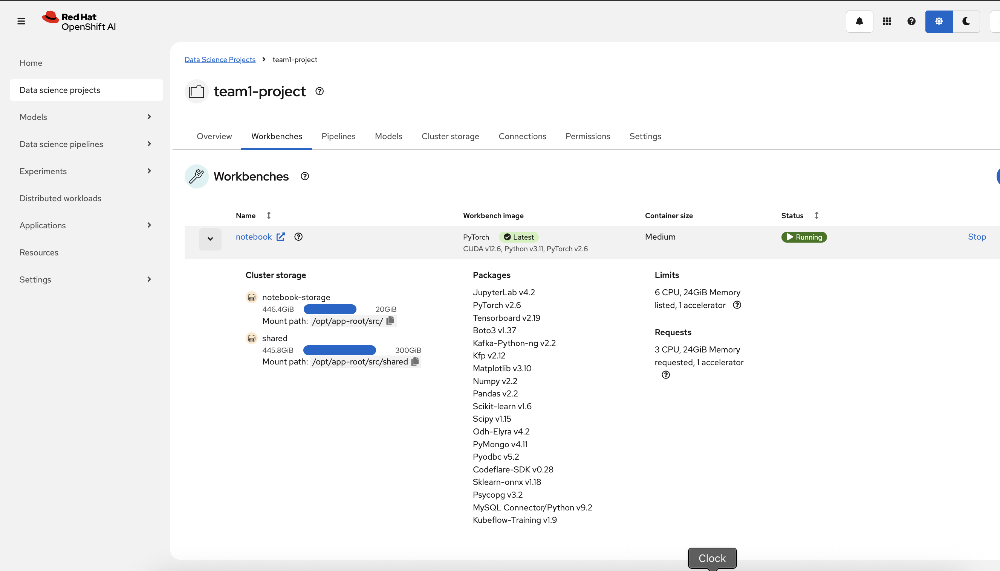
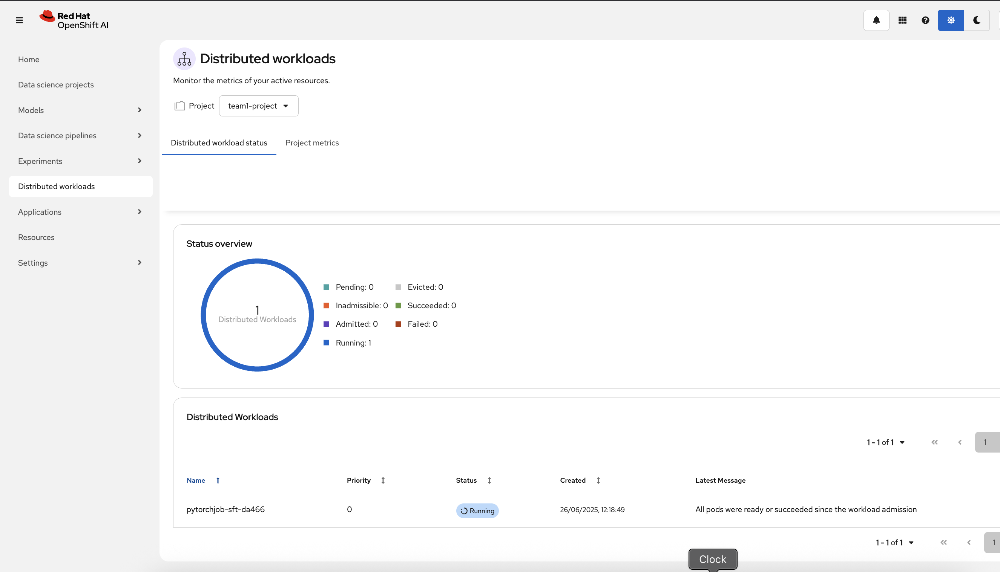
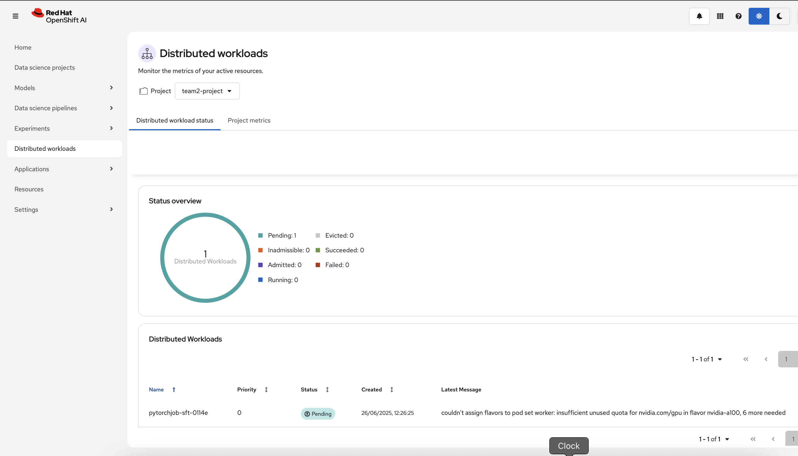
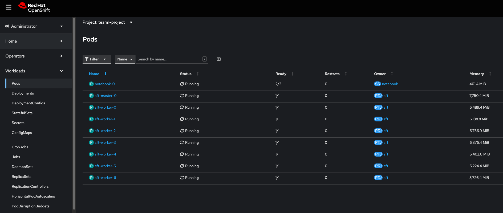
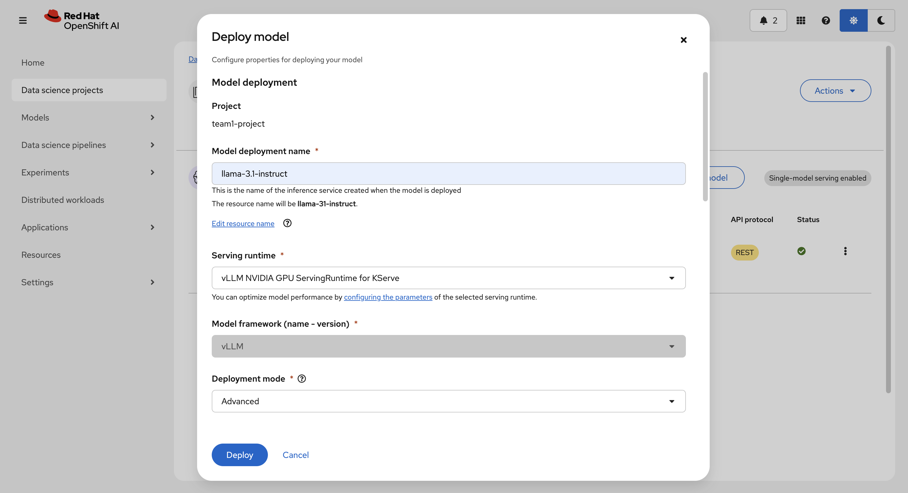
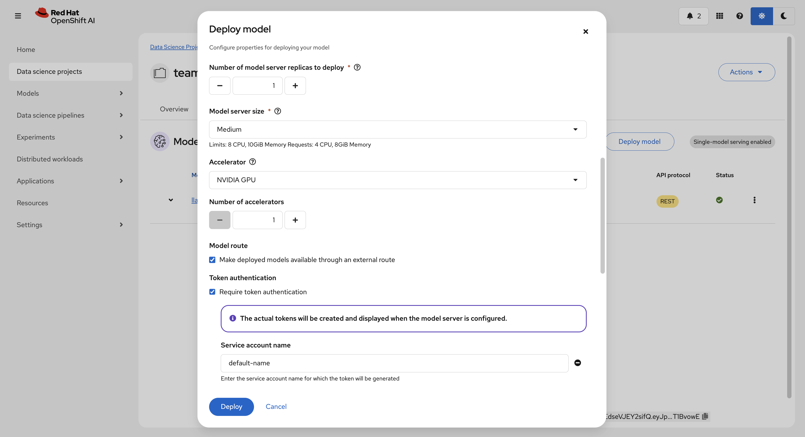
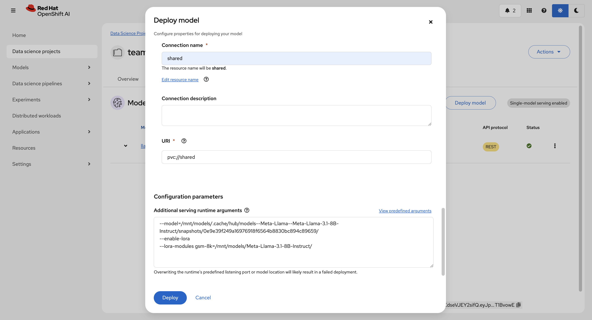
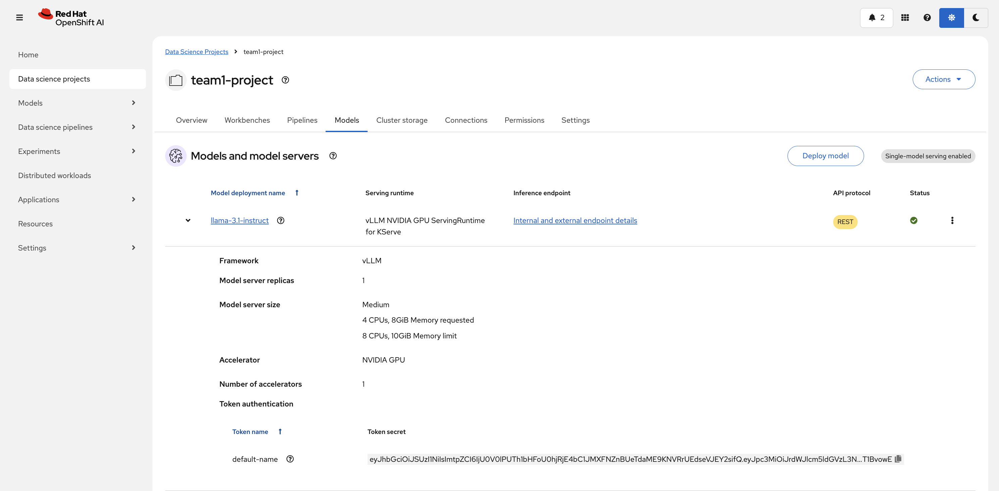

# Multi-Team LLM Fine-Tuning with Kueue Workshop

This workshop demonstrates how to fine-tune Large Language Models (LLMs) on OpenShift AI using Kubeflow Training Operator. You'll learn how to:
- Set up and configure a distributed training environment
- Fine-tune LLMs using efficient techniques like Parameter-Efficient Fine-Tuning (PEFT)
- Use advanced features like Flash Attention 2 and FSDP for efficient training
- Manage GPU resources effectively using Kueue
- Deploy and serve the fine-tuned models

The workshop includes a multi-team setup to demonstrate enterprise-grade resource management and collaboration features.

## Requirements

* An OpenShift cluster with admin permissions (for the setup steps)
* The `oc`, `curl`, and `git` (or equivalent) binaries installed locally
* Enough worker nodes with NVIDIA GPUs (Ampere-based or newer recommended) or AMD GPUs (AMD Instinct MI300X)
* The NFD operator and the NVIDIA GPU operator or AMD GPU operator installed and configured 
* A dynamic storage provisioner supporting RWX PVC provisioning (or see the NFS provisioner section)

## Workshop Flow

1. Set up the infrastructure (OpenShift AI, storage)
2. Configure Kueue for multi-team resource management
3. Create team projects and workbenches
4. Run fine-tuning jobs with Kubeflow Training
   - Use GSM8k dataset for mathematical reasoning
   - Configure distributed training with FSDP
   - Enable Flash Attention 2 for efficient training
5. Monitor training progress with TensorBoard
6. Deploy and serve fine-tuned models

## Setup

### Install OpenShift AI

* Log into your OpenShift Web console
* Go to "Operators" > "OperatorHub" > "AI/Machine Learning"
* Select the "Red Hat OpenShift AI" operator
* Install the latest version and Create a default DataScienceCluster resource

### Checkout the workshop

* Clone the following repository:
    ```console
    git clone https://github.com/opendatahub-io/distributed-workloads.git
    ```
* Change directory:
    ```console
    cd workshops/kueue
    ```

### NFS Provisioner (optional)

> [!NOTE]
> Skip this section if your cluster already has a PVC dynamic provisioner with RWX support.

* Install the NFS CSI driver:
    ```console
    curl -skSL https://raw.githubusercontent.com/kubernetes-csi/csi-driver-nfs/v4.9.0/deploy/install-driver.sh | bash -s v4.9.0 --
    ```
* Create a new project:
    ```console
    oc new-project nfs
    ```
* Deploy the in-cluster NFS server:
    ```console
    oc apply -f nfs/nfs_deployment.yaml
    ```
* Create the NFS StorageClass:
    ```console
    oc apply -f nfs/nfs_storage_class.yaml
    ```

### Configure RHOAI Storage

* Go to the OpenShift AI Dashboard (accessible from the applications menu in the top navigation bar)
* Go to "Settings" > "Storage classes"
* Check the storage class supporting RWX PVC provisioning you plan to use, or the `nfs-csi` one if created previously, is enabled

## Manage Quotas with Kueue

This workshop demonstrates how to manage resources between multiple teams using Kueue. We'll create two ClusterQueues that simulate two teams/projects with resource sharing capabilities through cohort configuration.

### Resource Flavor Setup

* Update the `nodeLabels` in the `resources/resource_flavor.yaml` file to match those of your AI worker nodes
* Apply the ResourceFlavor:
    ```console
    oc apply -f resources/resource_flavor.yaml
    ```

### Configure Team ClusterQueues

The workshop provides two pre-configured ClusterQueues (`team1` and `team2`) that demonstrate resource management between teams:

* Each team gets dedicated resource quotas
* Resources are managed within an organization cohort
* Fair scheduling with BestEffortFIFO strategy

Create the ClusterQueues:
```console
oc apply -f resources/team1_cluster_queue.yaml
oc apply -f resources/team2_cluster_queue.yaml
```

### Understanding Queue Behavior

**Basic Concepts:**
* **Cohort** - A shared resource pool (both teams use "organization" cohort)
* **Borrowing** - Teams can use unused resources from other teams in the same cohort
* **Preemption** - Forcefully stopping/pausing jobs to free up resources
* **Queue Strategy** - Uses BestEffortFIFO for fair job scheduling

**Resource Allocation:**
* Each team gets a guaranteed quota (5 GPUs each in this configuration)
* Teams can borrow beyond their quota when other teams have unused resources
* Total cluster resources are shared within the cohort

**Preemption Policies in This Workshop:**
* `borrowWithinCohort: Never` - Borrowed resources cannot be preempted by other teams
* `reclaimWithinCohort: Any` - Teams can reclaim their own resources from any queue
* `withinClusterQueue: LowerOrNewerEqualPriority` - Within a team, newer/higher priority jobs can preempt older/lower priority ones

**Expected Behavior:**
* Team1 can borrow Team2's unused resources
* If Team2 later needs resources, Team2 must wait until Team1's job completes (due to `borrowWithinCohort: Never`)
* This ensures job stability but may reduce resource efficiency

## Set Up Team Environments

### Create Projects for Teams

For each team/project:

1. Go to the OpenShift AI Dashboard
2. Go to "Data Science Projects"
3. Click "Create project"
4. Choose a name (e.g., `team1-project`, `team2-project`) and click "Create"

### Create Local Queues

Create LocalQueues to connect each team's project to their ClusterQueue:

* Team 1:
    ```console
    oc apply -f resources/team1_local_queue.yaml -n team1-project
    ```

* Team 2:
    ```console
    oc apply -f resources/team2_local_queue.yaml -n team2-project
    ```

### Create Workbenches

For each team:

* In their project, click "Create workbench"
* Enter a name
* Select the "Pytorch" (or the `ROCm-PyTorch`) notebook image
* In "Cluster storage", click "Create storage"
* Enter `training-storage` as a name and select the storage class with RWX capability
* Enter a mount directory under `/opt/app-root/src/`
* Add one more mount directory under `/opt/app-root/src/shared` with 500GB storage size
* Click "Create workbench"
* Wait for the workbench to become ready and then open it



## Fine-Tune LLama 3.1 with Kubeflow Training

### Enable the Training Operator (if needed)

> [!NOTE]
> The Kubeflow Training Operator is enabled by default in Red Hat OpenShift AI v2.20 and later versions.

* If using an earlier version of RHOAI:
  1. In the OpenShift Web console, navigate to the DataScienceCluster resource
  2. Enable the training operator

### Create Fine-Tuning PyTorchJobs

In each team's workbench, follow these steps:

**Step 1: Clone and prepare the repository**
* Clone https://github.com/opendatahub-io/distributed-workloads.git
* Navigate to "distributed-workloads/examples/kfto-sft-llm"
* Open the "sft.ipynb" notebook

**Step 2: Configure authentication**
* Get your cluster API server URL and authorization token:
  * Option 1: Run `oc whoami -t` in your terminal
  * Option 2: In OpenShift Web console, click your username > "Copy login command"

**Step 3: Configure the training job**
* Review and adjust the training parameters:
  * Model configuration (Flash Attention 2, Liger kernels)
  * PEFT settings (adapter type, target modules)
  * Dataset settings (GSM8k for mathematical reasoning)
  * Training hyperparameters (batch size, learning rate, etc.)
  * **Customize `create_job()` arguments** based on your cluster's available GPU resources (e.g., adjust `num_workers`, `resources_per_worker`)
  * **Add `labels` argument** in `create_job()` with local-queue-name label - this enables Kueue workload management and is **required** for this workshop
* Add `HF_TOKEN` environment variable with your Hugging Face token
  > [!NOTE]
  > - This workshop requires Red Hat OpenShift AI v2.21+ with Kubeflow Training SDK v1.9.2+ for full Kueue integration support. 
  > - Ensure you have access to [Llama-3.1 model](https://huggingface.co/meta-llama/Llama-3.1-8B)

**Step 4: Submit the job**

```
$ oc project team1-project && oc get resourceflavors,clusterqueues,localqueues,pytorchjobs,workloads -o wide

NAME                                           AGE
resourceflavor.kueue.x-k8s.io/default-flavor   51d
resourceflavor.kueue.x-k8s.io/nvidia-a100      142m

NAME                                        COHORT         STRATEGY         PENDING WORKLOADS   ADMITTED WORKLOADS
clusterqueue.kueue.x-k8s.io/team1           organization   BestEffortFIFO   0                   1
clusterqueue.kueue.x-k8s.io/team2           organization   BestEffortFIFO   1                   0

NAME                                    CLUSTERQUEUE   PENDING WORKLOADS   ADMITTED WORKLOADS
localqueue.kueue.x-k8s.io/nvidia-a100   team1          0                   1

NAME                          STATE     AGE
pytorchjob.kubeflow.org/sft   Running   95m

NAME                                           QUEUE         RESERVED IN   ADMITTED   FINISHED   AGE
workload.kueue.x-k8s.io/pytorchjob-sft-da466   nvidia-a100   team1         True                  95m
```

```
$ oc project team2-project && oc get localqueues,pytorchjobs,workloads -o wide

NAME                                    CLUSTERQUEUE   PENDING WORKLOADS   ADMITTED WORKLOADS
localqueue.kueue.x-k8s.io/nvidia-a100   team2          1                   0

NAME                          STATE       AGE
pytorchjob.kubeflow.org/sft   Suspended   90m

NAME                                           QUEUE         RESERVED IN   ADMITTED   FINISHED   AGE
workload.kueue.x-k8s.io/pytorchjob-sft-0114e   nvidia-a100                                       89m

```








### Monitor Job Scheduling with Kueue

**Monitor Resource Status:**

```console
# Check all Kueue resources for a team
oc get resourceflavors,clusterqueues,localqueues,pytorchjobs,workloads -o wide

# Check PyTorchJob status specifically
oc get pytorchjobs -n <team-namespace>

# Check Kueue workload status
oc get workloads -n <team-namespace>
```

```example
$ oc project team1-project && oc get clusterqueues,resourceflavors,localqueues,pytorchjobs,workloads -o wide
NAME                                        COHORT         STRATEGY         PENDING WORKLOADS   ADMITTED WORKLOADS
clusterqueue.kueue.x-k8s.io/cluster-queue                  BestEffortFIFO   0                   0
clusterqueue.kueue.x-k8s.io/team1           organization   BestEffortFIFO   0                   1
clusterqueue.kueue.x-k8s.io/team2           organization   BestEffortFIFO   1                   0

NAME                                           AGE
resourceflavor.kueue.x-k8s.io/default-flavor   51d
resourceflavor.kueue.x-k8s.io/nvidia-a100      142m

NAME                                    CLUSTERQUEUE   PENDING WORKLOADS   ADMITTED WORKLOADS
localqueue.kueue.x-k8s.io/nvidia-a100   team1          0                   1

NAME                          STATE     AGE
pytorchjob.kubeflow.org/sft   Running   95m

NAME                                           QUEUE         RESERVED IN   ADMITTED   FINISHED   AGE
workload.kueue.x-k8s.io/pytorchjob-sft-da466   nvidia-a100   team1         True                  95m
```

**Check Detailed Information:**
```console
# Check admission status and details
oc describe workload <workload-name> -n <team-namespace>

# Check borrowing status for a cluster queue
oc get clusterqueue <queue-name> -o jsonpath='{.status.flavorsReservation[0].resources[2]}'
```

**Understanding the Monitoring Output:**
* **Pending vs Admitted**: Jobs exceeding team quotas will show as "Pending" until resources become available
* **Borrowing behavior**: Teams can use unused resources from other teams in the same cohort
* **Current configuration impact** (`borrowWithinCohort: Never`):
  * First submitted job starts running immediately if resources are available
  * Second job may remain pending if it requires resources that would need preemption
  * Jobs will only start when resources are truly available or can be borrowed without preemption

### Monitor Training Progress

For each team's PyTorchJob:

* Start TensorBoard server in the respective namespace:
    ```console
    oc exec -n <team-namespace> `oc get pod -l training.kubeflow.org/job-role=master -o name` -- tensorboard --logdir /opt/app-root/src/shared --bind_all --port 6006
    ```
* Port-forward TensorBoard (use different local ports for each team):
    ```console
    # Team 1
    oc port-forward -n team1-project `oc get pod -l training.kubeflow.org/job-role=master -o name` 6006:6006
    # Team 2 (in a different terminal)
    oc port-forward -n team2-project `oc get pod -l training.kubeflow.org/job-role=master -o name` 6007:6006
    ```
* Access TensorBoard at:
  * Team 1: http://localhost:6006
  * Team 2: http://localhost:6007

You can monitor:
* Training loss and evaluation metrics
* Learning rate schedule
* GPU utilization and memory usage
* Training throughput (tokens/second)

## Deploy Fine-Tuned Models

After training completes, each team can deploy their models:

1. In the OpenShift AI Dashboard, go to the team's project and then Models section
2. Click "Deploy model"
3. Configure the serving environment:
   * Select the appropriate serving runtime (e.g., vLLM, OpenVINO, ONNX)
     
   * Select model server deployment configuration, accelerators and route to make it accessible outside cluster
     
   * Connect PVC containing pretrained model using `URI-v1` connection type
   * Provide additional serving runtime arguments (e.g., model-path):
     ```example
     --model=/mnt/models/.cache/hub/models--Meta-Llama--Meta-Llama-3.1-8B-Instruct/snapshots/0e9e39f249a16976918f6564b8830bc894c89659/
     --enable-lora
     --lora-modules gsm-8k=/mnt/models/Meta-Llama-3.1-8B-Instruct/
     ```
     
   * Provide additional environment variables if needed

4. Click "Deploy"
   

The deployed models will be managed by the same Kueue resource quotas as the training jobs, ensuring fair resource allocation between teams.

Monitor model serving metrics and logs through the OpenShift AI Dashboard to ensure optimal performance within allocated resources.

## Verify Deployed Fine-Tuned Model

Test the deployed model with a sample GSM8k mathematical reasoning question:

```bash
# Set your model endpoint and token
export EXTERNAL_ENDPOINT="https://your-model-endpoint.apps.cluster.com"
export OPENAI_API_KEY="your-token-here"  # May not be required for vLLM

# Test the fine-tuned model
curl -k "$EXTERNAL_ENDPOINT/v1/chat/completions" \
    -H "Content-Type: application/json" \
    -H "Authorization: Bearer $OPENAI_API_KEY" \
    -d '{
        "model": "llama-31-instruct",
        "messages": [
            {
                "role": "user",
                "content": "Janets ducks lay 16 eggs per day. She eats three for breakfast every morning and bakes muffins for her friends every day with four. She sells the remainder at the farmers market daily for $2 per fresh duck egg. How much in dollars does she make every day at the farmers market?"
            }
        ]
    }' | jq '.'
```

**Expected Response:**
The fine-tuned model should demonstrate improved mathematical reasoning capabilities, providing step-by-step solutions to mathematical problems like the GSM8k dataset it was trained on.
